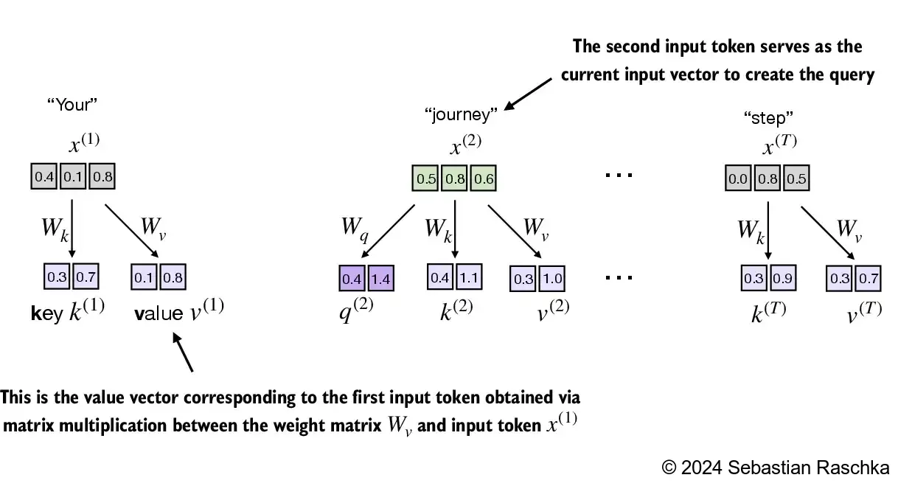
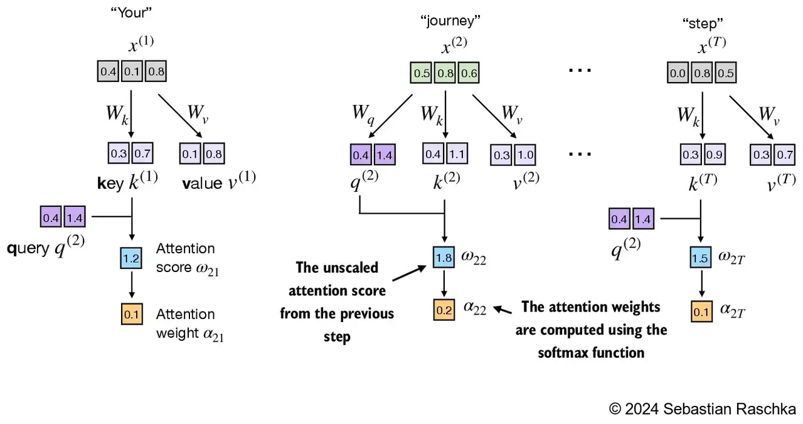
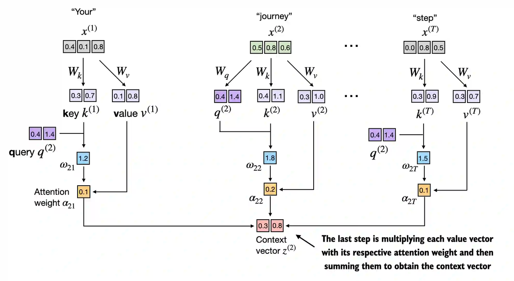
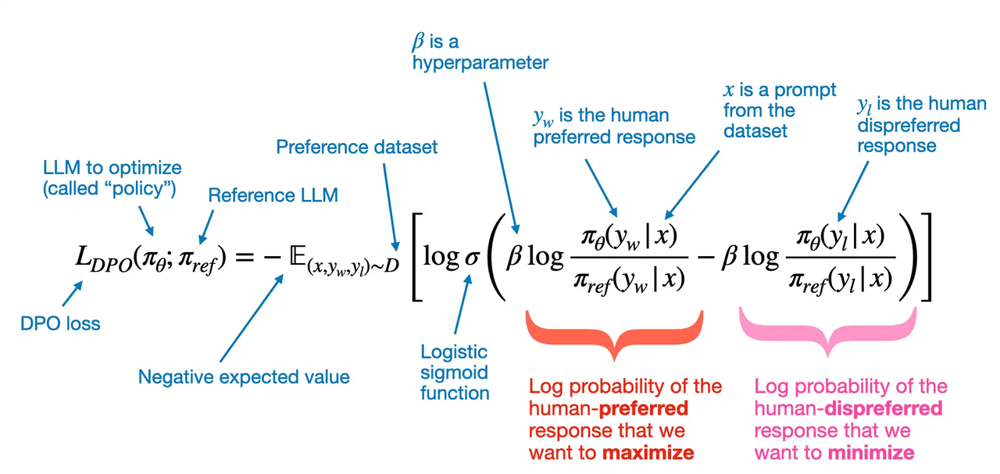

整个项目会带读者从零开始构建大模型，如下图所示，项目主要分为三个阶段：

1. 阶段一：数据预处理和模型结构设计。

   1. 数据预处理；

   2. 详解注意力（Attention）机制；

   3. 从零开始构建GPT模型。

2. 阶段二：模型预训练（pre-training）。

   1. 模型评估指标；

   2. 训练流程设计；

   3. 保存和加载训练；

   4. GPT2LLaMA。

3. 阶段三：模型后训练（post-training）。

   1. 文本分类的微调（fine-tuning）；

   2. 聊天机器人的指令微调。


# 一、数据预处理

## 1.1 理解文本的Embedding（嵌入）

Embedding可以理解为使用多维向量对视频、音频、文本进行表示的技术。以下图为例，可视化二维的Embedding，可以发现两个特点：

1. “具有相似特征”的实体间具有较小的距离，也就是说，在空间在**距离越近**的实体，**相似性越高**。

2. “具有相似关系的实体对间的距离相近”，如图中的实体对(Germany, Berlin)和(England, London)，具有关系（国家，首都），在图中实体对间的距离相近，也就是说，Embedding可以**表示实体间的差异和关系**。


## 1.2 文本标签化（tokenize）

文本的tokenize，可以理解为分词操作，指将长文本拆分为更小的单元，如单个字、单个词、单个字母、字节对等。


### **代码实现：文本划分**

````python
# 按照常用符号，对文本进行划分
text = "Hello, world. Is this-- a test?"

# 常用字符划分
result = re.split(r'([,.:;?_!"()\']|--|\s)', text)
# 去除空格
result = [item.strip() for item in result if item.strip()]
print(result)

```
运行结果：
['Hello', ',', 'world', '.', 'Is', 'this', '--', 'a', 'test', '?']
```
````

## 1.3 给token编号

如下图所示，可以通过字典对所有分词后的单元进行编号，方便后续处理。


### 代码实现：token编号

````python
# 去重并进行编号
all_words = sorted(set(preprocessed))
vocab_size = len(all_words)

vocab = {token:integer for integer,token in enumerate(all_words)}

# 查看部分结果
for i, item in enumerate(vocab.items()):
    print(item)
    if i >= 50:
        break
 ```
 运行结果：
('!', 0)
('"', 1)
("'", 2)
('(', 3)
(')', 4)
(',', 5)
('--', 6)
('.', 7)
(':', 8)
(';', 9)
('?', 10)
 ```
````

### 代码实现：简单分词器v1

````python
class SimpleTokenizerV1:
    def __init__(self, vocab):
        self.str_to_int = vocab
        self.int_to_str = {i : s for s, i in vocab.items()}
    
    # 根据常用标点符号和空格分割字符串，并去除空格后，再进行编码
    def encode(self, text):
        preprocessed = re.split(r"([,.:;?_!\"()']|--|\s)", text)

        preprocessed = [
            item.strip() for item in preprocessed if item.strip()
        ]
        # 处理未知词
        preprocessed = [
            item if item in self.str_to_int 
            else "<|unk|>" for item in preprocessed
        ]
        
        ids = [self.str_to_int[s] for s in preprocessed]
        return ids
    
    # 根据编码后的ids，解码为原始字符串，并去除标点前的空格
    # 由于当前的分词和重组方式，可能会存在这样的文本"Hello , world ."，因此需要进行空格的移除。
    def decode(self, ids):
        text = " ".join([self.int_to_str[i] for i in ids])
        text = re.sub(r'\s+([,.?!"()\'])', r'\1', text)
        return text

# 测试tokenize
tokenizer = SimpleTokenizerV1(vocab)

text = """"It's the last he painted, you know," 
           Mrs. Gisburn said with pardonable pride."""
ids = tokenizer.encode(text)
print(ids)
print(tokenizer.decode(ids))

```
运行结果一：
[1, 56, 2, 850, 988, 602, 533, 746, 5, 1126, 596, 5, 1, 67, 7, 38, 851, 1108, 754, 793, 7]

运行结果二：
'" It\' s the last he painted, you know," Mrs. Gisburn said with pardonable pride.'
```
````

## 1.4 添加特殊标记

在模型中，常会用一些特殊的标记，来帮助模型获取额外的上下文信息。如：

* \[BOS] 表示文本的开始；

* \[EOS] 表示文本的结束；

* \[PAD] 用于填充文本，对齐序列长度，以进行训练；

* \[UNK] 用于表示词汇表中没有的词；

* <|endoftext|> 类似于上述的\[EOS]标记，在GPT模型中使用。

  * 另外由于在GPT模型中，采用了字节对编码，理论上不会遇到未知词，因此不需要使用\[UNK]标记。


## 1.5 字节对编码（BPE，Byte Pair Encoder）

如下图所示，BPE tokenizer可以将未知词汇分解为子词和单个字符。


在BPE算法前，先尝试进行字节编码，也是对每个字符进行单独编码。该方法主要的问题是，会产生大量的ID，编码效率较低。

````python
text = "This is some text"
byte_ary = bytearray(text, "utf-8")
print(byte_ary)

ids = list(byte_ary)
print(ids)

```
运行结果一：
bytearray(b'This is some text')

运行结果二：
[84, 104, 105, 115, 32, 105, 115, 32, 115, 111, 109, 101, 32, 116, 101, 120, 116]
```

````

### BPE算法流程

1. 识别出现次数最多的字节对。

   1. 在每次迭代中，扫描文本，找到最常出现的字节对（或字符对）。

2. 替换并记录。

   1. 用一个新的占位符ID替换该字节对（该ID尚未被使用，例如，如果我们从0...255开始，每个占位符将是256）。

   2. 将该映射记录在查找表中。

   3. 查找表的大小是一个超参数，称为“词汇表大小”（对于GPT-2，这个值为50257）。

3. 重复直到没有进一步优化。

   1. 持续执行步骤1和2，反复合并最频繁的字节对。

   2. 当无法再进行压缩时停止（例如，没有字节对出现超过一次，或达到词汇表大小）。

4. 解码

   1. 为恢复原始文本，通过查找表将每个ID替换为其对应的字节对，逆向执行此过程。

### BPE算法示例

假设训练数据集为"the cat in the hat"。

第一次迭代：

1. 识别出现次数最多的字节对。

   1. 在这段文本中，"th"出现了两次（分别位于开头和第二个"e"前）。

2. 替换并记录。

   1. 将"th"替换为一个尚未使用的新的token id，例如256。

   2. 将的文本变为："<256>e cat in <256>e hat"。

   3. 新的词汇表如下：" 0:...256:'th' "

第二次迭代：

1. 识别出现次数最多的字节对。

   1. 在新的文本中"<256>e cat in <256>e hat"，字节对"<256>e"出现了两次。

2. 替换并记录。

   1. 将"<256>e"替换为一个尚未使用的新的token ID，分别257。

   2. 更新后的文本为："<257> cat in <257> hat"。

   3. 新的词汇表如下：" 0:...256:'th', 257:'<256>e' "

第三次迭代：

1. 识别出现次数最多的字节对。

   1. 在新的文本中"<257> cat in <257> hat"，字节对"<257> "(后面接了空格)出现了两次。

2. 替换并记录。

   1. 将"<257> "替换为一个尚未使用的新的token ID，分别258。

   2. 更新后的文本为："<258>cat in <258>hat"。

   3. 新的词汇表如下：" 0:...256:'th', 257:'<256>e', 258:'<257> ' "

重复上述步骤，完成训练。

解码过程：

1. 假设最终压缩后的文本为："<258>cat in <258>hat"。

2. 替换"<258>"-->"<257> "："<257> cat in <257> hat"。

3. 替换"<257>"-->"<256>e"："<256>e cat in <256>e hat"。

4. 替换"<256>"-->"th"："the cat in the hat"。

### BPE实现代码

1. 将输入文本拆分为单个字节。

2. 根据学习到的BPE合并中的匹配对（即按他们被学习的顺序，从最高到最低的“排名”），反复查找并替换（合并）相邻的token（字节对）。

3. 持续合并，直到不能再应用任何合并。

4. 最终的token ID列表就是编码后的输出。

#### 代码实现：BPE训练部分

1. 预处理和初始化

   1. 将空格替换为 'Ġ'。

   2. 初始化词汇表，以包含ASC II、文本中的所有字符、特殊字符。（在python里中文也视为单个字符，如'中'等）。

2. 反复迭代，查找并替换“出现次数最多”的字节对。

```python
...

class BPETokenizerSimple:
    ...

    def train(self, text, vocab_size, allowed_special={"<|endoftext|>"}):
        """
        从头开始训练 BPE 分词器。

        参数：
            text (str): 训练文本。
            vocab_size (int): 目标词汇表大小。
            allowed_special (set): 要包含的特殊令牌集。
        """

        # 预处理：将空格替换为 'Ġ'
        # 注意，Ġ 是 GPT-2 BPE 实现的一个特性
        # 例如，"Hello world" 可能被标记为 ["Hello", "Ġworld"]
        # （GPT-4 BPE 会将其标记为 ["Hello", " world"]）
        processed_text = []
        for i, char in enumerate(text):
            if char == " " and i != 0:
                processed_text.append("Ġ")
            if char != " ":
                processed_text.append(char)
        processed_text = "".join(processed_text)

        # 初始化词汇表
        unique_chars = [chr(i) for i in range(256)]

        # 扩展 unique_chars，包含文本中未包含的字符
        unique_chars.extend([char for char in sorted(set(processed_text)]) if char not in unique_chars)
        
        # 可选：确保 'Ġ' 包含在内
        if 'Ġ' not in unique_chars:
            unique_chars.append('Ġ')

        # 创建词汇表和逆词汇表
        self.vocab = {i: char for i, char in enumerate(unique_chars)}
        self.inverse_vocab = {char: i for i, char in self.vocab.items()}

        # 添加允许的特殊token
        if allowed_special:
            for token in allowed_special:
                if token not in self.inverse_vocab:
                    new_id = len(self.vocab)
                    self.vocab[new_id] = token
                    self.inverse_vocab[token] = new_id

        # 将文本转化为token ID
        token_ids = [self.inverse_vocab[char] for char in processed_text]

        # BPE 步骤 1-3：反复查找并替换“出现次数最多”的字节对
        for new_id in range(len(self.vocab), vocab_size):
            pair_id = self.find_freq_pair(token_ids, mode="most")
            if pair_id is None:
                break
            token_ids = self.replace_pair(token_ids, pair_id, new_id)
            self.bpe_merges[pair_id] = new_id
        
        # 使用合并后的token更新词汇表
        for (p0, p1), new_id in self.bpe_merges.items():
            merged_token = self.vocab[p0] + self.vocab[p1]
            self.vocab[new_id] = merged_token
            self.inverse_vocab[merged_token] = new_id
    
    ...

    @staticmethod
    def find_freq_pair(token_ids, mode="most"):
        pairs = Counter(zip(token_ids, token_ids[1:]))

        if mode == "most":
            return max(pairs.items(), key=lambda x: x[1])[0]
        elif mode == "least":
            return min(pairs.items(), key=lambda x: x[1])[0]
        else:
            raise ValueError("无效模式。选择 'most' 或 'least'。")

    @staticmethod
    def replace_pair(token_ids, pair_id, new_id):
        dq = deque(token_ids)
        replaced = []

        while dq:
            current = dq.popleft()
            if dq and (current, dq[0]) == pair_id:
                replaced.append(new_id)
                dq.popleft()
            else:
                replaced.append(current)

        return replaced
        
```

#### 代码实现：BPE编码操作

1. 拆分。将文本按"特殊token"拆分，确保对特殊字符的正确处理。

2. 将文本按"\n"和空格拆分为token，并处理换行和空格。

3. 若是已在训练时见过的token，则直接编码；若不是，则拆分后，结合bpe\_ranks进行合并和编码。

   1. 注意：需要特别注意，在有无bpe\_ranks的情况下，**未登录词的编码**操作不同：

      1. 无bpe\_ranks时，贪婪编码。在编码时，此处采用了一种实用且相对简单的实现BPE合并的方法。它通过反复的、从左到右的贪婪扫描来应用学习到的合并规则，直到序列不能再被这种方式压缩。这种迭代确保了根据其特定逻辑的“局部最优”合并被执行完毕。

      2. 有bpe\_ranks时，GPT-2的实现，按优先级编码（训练时的出现数据）。依赖于一个有序的合并规则列表，每一步都寻找并应用全局最高优先级合并规则。

```python
...

class BPETokenizerSimple:
    ...

    def encode(self, text, allowed_special=None):
        """
        将输入文本编码为token ID 列表。

        参数：
            text (str): 要编码的文本。
            allowed_special (set or None): 要包含的特殊token集。如果为None，则禁用特殊处理。

        返回：
            List[int]: token ID 列表。
        """
        token_ids = []

        # 如果允许特殊token处理，则构建一个正则表达式来匹配允许的特殊token
        if allowed_special is not None and len(allowed_special) > 0:
            # 构建一个正则表达式来匹配允许的特殊token
            special_pattern = (
                "(" + "|".join(re.escape(tok) for tok in sorted(allowed_special, key=len, reverse=True)) + ")"
            )
    
            # 将文本根据特殊token进行分割，分别进行编码
            last_index = 0
            for match in re.finditer(special_pattern, text):
                prefix = text[last_index:match.start()]
                token_ids.extend(self.encode(prefix, allowed_special=None))  # 按正常处理编码前缀
    
                special_token = match.group(0)
                if special_token in self.inverse_vocab:
                    token_ids.append(self.inverse_vocab[special_token])
                else:
                    raise ValueError(f"Special token {special_token} not found in vocabulary.")
                last_index = match.end()
    
            text = text[last_index:]  # 剩余部分按正常处理
    
            # 检查剩余部分是否包含不允许的特殊token
            disallowed = [
                tok for tok in self.inverse_vocab
                if tok.startswith("<|") and tok.endswith("|>") and tok in text and tok not in allowed_special
            ]
            if disallowed:
                raise ValueError(f"Disallowed special tokens encountered in text: {disallowed}")

        # 如果没有任何特殊token，或者剩余文本在特殊token分割后：
        tokens = []
        # 将文本"\n"拆分为token，并处理空格
        lines = text.split("\n")
        for i, line in enumerate(lines):
            if i > 0:
                tokens.append("\n")
            words = line.split()
            for j, word in enumerate(words):
                if j == 0 and i > 0:
                    tokens.append("Ġ" + word)
                elif j == 0:
                    tokens.append(word)
                else:
                    tokens.append("Ġ" + word)
    
        for token in tokens:
            if token in self.inverse_vocab:
                # token 已经存在于词汇表中
                token_ids.append(self.inverse_vocab[token])
            else:
                # 尝试通过 BPE 处理未登录词
                token_ids.extend(self.tokenize_with_bpe(token))
    
        return token_ids

    def tokenize_with_bpe(self, token):
        """
        使用 BPE 合并对单个token进行分词。

        参数：
            token (str): 要分词的token。

        返回：
            List[int]: 应用 BPE 后的token ID 列表。
        """
        # 将token分词为单个字符（作为初始token ID）
        token_ids = [self.inverse_vocab.get(char, None) for char in token]
        if None in token_ids:
            missing_chars = [char for char, tid in zip(token, token_ids) if tid is None]
            raise ValueError(f"Characters not found in vocab: {missing_chars}")

        # 若没有ranks信息，则使用下面的处理方法
        # 从左到右，依次合并token_ids中相邻的token，直到无法继续合并
        if not self.bpe_ranks:
            can_merge = True
            while can_merge and len(token_ids) > 1:
                can_merge = False
                new_tokens = []
                i = 0
                while i < len(token_ids) - 1:
                    pair = (token_ids[i], token_ids[i + 1])
                    if pair in self.bpe_merges:
                        merged_token_id = self.bpe_merges[pair]
                        new_tokens.append(merged_token_id)
                        # Uncomment for educational purposes:
                        # print(f"Merged pair {pair} -> {merged_token_id} ('{self.vocab[merged_token_id]}')")
                        i += 2  # 跳过下一个token，因为它已经被合并
                        can_merge = True
                    else:
                        new_tokens.append(token_ids[i])
                        i += 1
                if i < len(token_ids):
                    new_tokens.append(token_ids[i])
                token_ids = new_tokens
            return token_ids

        # 若有ranks信息，则采用GPT-2-style的合并方法
        # 1) 将token_ids转换为字符串（为了适配bpe_ranks通过字符串存储key的形式）
        symbols = [self.vocab[id_num] for id_num in token_ids]

        # 重复合并所有出现rank最低（优先级最高）的pair
        while True:
            # 收集所有相邻的pair
            pairs = set(zip(symbols, symbols[1:]))
            if not pairs:
                break

            # 找到出现次数最多的pair
            min_rank = float("inf")
            bigram = None
            for p in pairs:
                r = self.bpe_ranks.get(p, float("inf"))
                if r < min_rank:
                    min_rank = r
                    bigram = p

            # 如果没有任何有效的合并pair，则结束
            if bigram is None or bigram not in self.bpe_ranks:
                break

            # 合并所有出现的该pair
            first, second = bigram
            new_symbols = []
            i = 0
            while i < len(symbols):
                # 位置i的pair，如果匹配(frist, second)，则进行合并
                if i < len(symbols) - 1 and symbols[i] == first and symbols[i+1] == second:
                    new_symbols.append(first + second)  # 合并
                    i += 2
                else:
                    new_symbols.append(symbols[i])
                    i += 1
            symbols = new_symbols

            if len(symbols) == 1:
                break

        # 最后，将合并后的symbols转换成token IDs
        merged_ids = [self.inverse_vocab[sym] for sym in symbols]
        return merged_ids

    ...
        
```

#### 代码实现：BPE解码操作

1. 根据字典将token id映射成字符串。

2. 特殊处理。需要特殊处理的换行和空格。

```python
...

class BPETokenizerSimple:
    ...

    def decode(self, token_ids):
        """
        将token ID 列表解码回字符串。

        参数：
            token_ids (List[int]): 要解码的token ID 列表。

        返回：
            str: 解码后的字符串。
        """
        decoded_string = ""
        for i, token_id in enumerate(token_ids):
            if token_id not in self.vocab:
                raise ValueError(f"Token ID {token_id} not found in vocab.")
            token = self.vocab[token_id]
            if token == "\n":
                if decoded_string and not decoded_string.endswith(" "):
                    decoded_string += " "  # 如果行尾没有空格，则添加一个空格
                decoded_string += token
            elif token.startswith("Ġ"):
                # 用空格替换 'Ġ'
                decoded_string += " " + token[1:]
            else:
                decoded_string += token
        return decoded_string

    ...
        
```

#### 代码实现：BPE完整实现

* 值得一提是的bpe\_ranks的构造方式，根据bpe\_merges的顺序从小到大构建pair的rank。

```python
from collections import Counter, deque
from functools import lru_cache
import json
import re

class BPETokenizerSimple:
    def __init__(self):
        # 映射 token_id 到 token_str（例如：{11246: "some"}）
        self.vocab = {}
        # 映射 token_str 到 token_id（例如：{"some": 11246}）
        self.inverse_vocab = {}
        # BPE 合并字典：{(token_id1, token_id2): merged_token_id}
        self.bpe_merges = {}
        # GPT-2 用于合并的rank字典：{(string_A, string_B): rank}，其中较低的rank = 较高的优先级
        self.bpe_ranks = {}

    def train(self, text, vocab_size, allowed_special={"<|endoftext|>"}):
        """
        从头开始训练 BPE 分词器。

        参数：
            text (str): 训练文本。
            vocab_size (int): 目标词汇表大小。
            allowed_special (set): 要包含的特殊令牌集。
        """

        # 预处理：将空格替换为 'Ġ'
        # 注意，Ġ 是 GPT-2 BPE 实现的一个特性
        # 例如，"Hello world" 可能被标记为 ["Hello", "Ġworld"]
        # （GPT-4 BPE 会将其标记为 ["Hello", " world"]）
        processed_text = []
        for i, char in enumerate(text):
            if char == " " and i != 0:
                processed_text.append("Ġ")
            if char != " ":
                processed_text.append(char)
        processed_text = "".join(processed_text)

        # 初始化词汇表
        unique_chars = [chr(i) for i in range(256)]

        # 扩展 unique_chars，包含处理后的文本中未包含的字符
        unique_chars.extend([char for char in sorted(set(processed_text)) if char not in unique_chars])
        
        # 可选：确保 'Ġ' 包含在内
        if 'Ġ' not in unique_chars:
            unique_chars.append('Ġ')

        # 创建词汇表和逆词汇表
        self.vocab = {i: char for i, char in enumerate(unique_chars)}
        self.inverse_vocab = {char: i for i, char in self.vocab.items()}

        # 添加允许的特殊token
        if allowed_special:
            for token in allowed_special:
                if token not in self.inverse_vocab:
                    new_id = len(self.vocab)
                    self.vocab[new_id] = token
                    self.inverse_vocab[token] = new_id

        # 将文本转化为token ID
        token_ids = [self.inverse_vocab[char] for char in processed_text]

        # BPE 步骤 1-3：反复查找并替换“出现次数最多”的字节对
        for new_id in range(len(self.vocab), vocab_size):
            pair_id = self.find_freq_pair(token_ids, mode="most")
            if pair_id is None:
                break
            token_ids = self.replace_pair(token_ids, pair_id, new_id)
            self.bpe_merges[pair_id] = new_id
        
        # 使用合并后的token更新词汇表
        for (p0, p1), new_id in self.bpe_merges.items():
            merged_token = self.vocab[p0] + self.vocab[p1]
            self.vocab[new_id] = merged_token
            self.inverse_vocab[merged_token] = new_id
    
    def load_vocab_and_merges_from_openai(self, vocab_path, bpe_merges_path):
        """
        从 OpenAI 的 GPT-2 文件加载预训练的词汇表和 BPE 合并。

        参数：
            vocab_path (str): 词汇文件路径（GPT-2 称其为 'encoder.json'）。
            bpe_merges_path (str): BPE 合并文件路径（GPT-2 称其为 'vocab.bpe'）。
        """
        # 加载词汇表
        with open(vocab_path, "r", encoding="utf-8") as file:
            loaded_vocab = json.load(file)
            # loaded_vocab 将 token_str 映射到 token_id
            self.vocab = {int(v): k for k, v in loaded_vocab.items()}
            self.inverse_vocab = {k: int(v) for k, v in loaded_vocab.items()}

        # 如果词汇表中没有'\n'，则使用一个已有的token ID作为'\n'的占位符
        # 选择的这几个token ID都是在encode时不会被处理为子词的token
        if "\n" not in self.inverse_vocab:
            # 如果词汇表中存在"<|endoftext|>"，则使用它作为'\n'的占位符
            # 否则，使用"Ġ"或""作为'\n'的占位符
            fallback_token = next((token for token in ["<|endoftext|>", "Ġ", ""] if token in self.inverse_vocab), None)
            if fallback_token is not None:
                newline_token_id = self.inverse_vocab[fallback_token]
            else:
                # If no fallback token is available, raise an error
                raise KeyError("No suitable token found in vocabulary to map '\\n'.")

            self.inverse_vocab["\n"] = newline_token_id
            self.vocab[newline_token_id] = "\n"

        # 加载BPE合并，并存储它们，并分配一个"rank"
        self.bpe_ranks = {}  # reset ranks
        with open(bpe_merges_path, "r", encoding="utf-8") as file:
            lines = file.readlines()
            if lines and lines[0].startswith("#"):
                lines = lines[1:]

            rank = 0
            for line in lines:
                pair = tuple(line.strip().split())
                if len(pair) == 2:
                    token1, token2 = pair
                    # 如果token1或token2不在词汇表中，则跳过
                    if token1 in self.inverse_vocab and token2 in self.inverse_vocab:
                        self.bpe_ranks[(token1, token2)] = rank
                        rank += 1
                    else:
                        print(f"Skipping pair {pair} as one token is not in the vocabulary.")

        # 加载词汇表
        with open(vocab_path, "r", encoding="utf-8") as file:
            loaded_vocab = json.load(file)
            # loaded_vocab 将 token_str 映射到 token_id
            self.vocab = {int(v): k for k, v in loaded_vocab.items()}
            self.inverse_vocab = {k: int(v) for k, v in loaded_vocab.items()}
        # 加载BPE合并
        with open(bpe_merges_path, "r", encoding="utf-8") as file:
            lines = file.readlines()
            # 如果有头部注释行，跳过它
            if lines and lines[0].startswith("#"):
                lines = lines[1:]

            for rank, line in enumerate(lines):
                pair = tuple(line.strip().split())
                if len(pair) != 2:
                    print(f"第 {rank+1} 行有超过 2 个条目：{line.strip()}")
                    continue
                token1, token2 = pair
                if token1 in self.inverse_vocab and token2 in self.inverse_vocab:
                    token_id1 = self.inverse_vocab[token1]
                    token_id2 = self.inverse_vocab[token2]
                    merged_token = token1 + token2
                    if merged_token in self.inverse_vocab:
                        merged_token_id = self.inverse_vocab[merged_token]
                        self.bpe_merges[(token_id1, token_id2)] = merged_token_id
                    else:
                        print(f"合并的token '{merged_token}' 未在词汇表中找到，跳过。")
                else:
                    print(f"跳过配对 {pair}，因为其中一个token不在词汇表中。")

    def encode(self, text, allowed_special=None):
        """
        将输入文本编码为token ID 列表。

        参数：
            text (str): 要编码的文本。
            allowed_special (set or None): 要包含的特殊token集。如果为None，则禁用特殊处理。

        返回：
            List[int]: token ID 列表。
        """
        token_ids = []

        # 如果允许特殊token处理，则构建一个正则表达式来匹配允许的特殊token
        if allowed_special is not None and len(allowed_special) > 0:
            # 构建一个正则表达式来匹配允许的特殊token
            special_pattern = (
                "(" + "|".join(re.escape(tok) for tok in sorted(allowed_special, key=len, reverse=True)) + ")"
            )
    
            # 将文本根据特殊token进行分割，分别进行编码
            last_index = 0
            for match in re.finditer(special_pattern, text):
                prefix = text[last_index:match.start()]
                token_ids.extend(self.encode(prefix, allowed_special=None))  # 按正常处理编码前缀
    
                special_token = match.group(0)
                if special_token in self.inverse_vocab:
                    token_ids.append(self.inverse_vocab[special_token])
                else:
                    raise ValueError(f"Special token {special_token} not found in vocabulary.")
                last_index = match.end()
    
            text = text[last_index:]  # 剩余部分按正常处理
    
            # 检查剩余部分是否包含不允许的特殊token
            disallowed = [
                tok for tok in self.inverse_vocab
                if tok.startswith("<|") and tok.endswith("|>") and tok in text and tok not in allowed_special
            ]
            if disallowed:
                raise ValueError(f"Disallowed special tokens encountered in text: {disallowed}")

        # 如果没有任何特殊token，或者剩余文本在特殊token分割后：
        tokens = []
        # 将文本"\n"拆分为token，并处理空格
        lines = text.split("\n")
        for i, line in enumerate(lines):
            if i > 0:
                tokens.append("\n")
            words = line.split()
            for j, word in enumerate(words):
                if j == 0 and i > 0:
                    tokens.append("Ġ" + word)
                elif j == 0:
                    tokens.append(word)
                else:
                    tokens.append("Ġ" + word)
    
        for token in tokens:
            if token in self.inverse_vocab:
                # token 已经存在于词汇表中
                token_ids.append(self.inverse_vocab[token])
            else:
                # 尝试通过 BPE 处理未登录词
                token_ids.extend(self.tokenize_with_bpe(token))
    
        return token_ids

    def tokenize_with_bpe(self, token):
        """
        使用 BPE 合并对单个token进行分词。

        参数：
            token (str): 要分词的token。

        返回：
            List[int]: 应用 BPE 后的token ID 列表。
        """
        # 将token分词为单个字符（作为初始token ID）
        token_ids = [self.inverse_vocab.get(char, None) for char in token]
        if None in token_ids:
            missing_chars = [char for char, tid in zip(token, token_ids) if tid is None]
            raise ValueError(f"Characters not found in vocab: {missing_chars}")

        # 若没有ranks信息，则使用下面的处理方法
        # 从左到右，依次合并token_ids中相邻的token，直到无法继续合并
        if not self.bpe_ranks:
            can_merge = True
            while can_merge and len(token_ids) > 1:
                can_merge = False
                new_tokens = []
                i = 0
                while i < len(token_ids) - 1:
                    pair = (token_ids[i], token_ids[i + 1])
                    if pair in self.bpe_merges:
                        merged_token_id = self.bpe_merges[pair]
                        new_tokens.append(merged_token_id)
                        # Uncomment for educational purposes:
                        # print(f"Merged pair {pair} -> {merged_token_id} ('{self.vocab[merged_token_id]}')")
                        i += 2  # 跳过下一个token，因为它已经被合并
                        can_merge = True
                    else:
                        new_tokens.append(token_ids[i])
                        i += 1
                if i < len(token_ids):
                    new_tokens.append(token_ids[i])
                token_ids = new_tokens
            return token_ids

        # 若有ranks信息，则采用GPT-2-style的合并方法
        # 1) 将token_ids转换为字符串（为了适配bpe_ranks通过字符串存储key的形式）
        symbols = [self.vocab[id_num] for id_num in token_ids]

        # 重复合并所有出现rank最低（优先级最高）的pair
        while True:
            # 收集所有相邻的pair
            pairs = set(zip(symbols, symbols[1:]))
            if not pairs:
                break

            # 找到出现次数最多的pair
            min_rank = float("inf")
            bigram = None
            for p in pairs:
                r = self.bpe_ranks.get(p, float("inf"))
                if r < min_rank:
                    min_rank = r
                    bigram = p

            # 如果没有任何有效的合并pair，则结束
            if bigram is None or bigram not in self.bpe_ranks:
                break

            # 合并所有出现的该pair
            first, second = bigram
            new_symbols = []
            i = 0
            while i < len(symbols):
                # 位置i的pair，如果匹配(frist, second)，则进行合并
                if i < len(symbols) - 1 and symbols[i] == first and symbols[i+1] == second:
                    new_symbols.append(first + second)  # 合并
                    i += 2
                else:
                    new_symbols.append(symbols[i])
                    i += 1
            symbols = new_symbols

            if len(symbols) == 1:
                break

        # 最后，将合并后的symbols转换成token IDs
        merged_ids = [self.inverse_vocab[sym] for sym in symbols]
        return merged_ids

    def decode(self, token_ids):
        """
        将token ID 列表解码回字符串。

        参数：
            token_ids (List[int]): 要解码的token ID 列表。

        返回：
            str: 解码后的字符串。
        """
        decoded_string = ""
        for i, token_id in enumerate(token_ids):
            if token_id not in self.vocab:
                raise ValueError(f"Token ID {token_id} not found in vocab.")
            token = self.vocab[token_id]
            if token == "\n":
                if decoded_string and not decoded_string.endswith(" "):
                    decoded_string += " "  # 如果行尾没有空格，则添加一个空格
                decoded_string += token
            elif token.startswith("Ġ"):
                # 用空格替换 'Ġ'
                decoded_string += " " + token[1:]
            else:
                decoded_string += token
        return decoded_string

    def save_vocab_and_merges(self, vocab_path, bpe_merges_path):
        """
        将词汇表和 BPE 合并保存到 JSON 文件。

        参数：
            vocab_path (str): 保存词汇表的路径。
            bpe_merges_path (str): 保存 BPE 合并的路径。
        """
        # 保存词汇表
        with open(vocab_path, "w", encoding="utf-8") as file:
            json.dump({k: v for k, v in self.vocab.items()}, file, ensure_ascii=False, indent=2)

        # 保存 BPE 合并作为字典列表
        with open(bpe_merges_path, "w", encoding="utf-8") as file:
            merges_list = [{"pair": list(pair), "new_id": new_id}
                           for pair, new_id in self.bpe_merges.items()]
            json.dump(merges_list, file, ensure_ascii=False, indent=2)

    def load_vocab_and_merges(self, vocab_path, bpe_merges_path):
        """
        从 JSON 文件加载词汇表和 BPE 合并。

        参数：
            vocab_path (str): 词汇表文件路径。
            bpe_merges_path (str): BPE 合并文件路径。
        """
        # 加载词汇表
        with open(vocab_path, "r", encoding="utf-8") as file:
            loaded_vocab = json.load(file)
            self.vocab = {int(k): v for k, v in loaded_vocab.items()}
            self.inverse_vocab = {v: int(k) for k, v in loaded_vocab.items()}

        # 加载 BPE 合并
        with open(bpe_merges_path, "r", encoding="utf-8") as file:
            merges_list = json.load(file)
            for merge in merges_list:
                pair = tuple(merge['pair'])
                new_id = merge['new_id']
                self.bpe_merges[pair] = new_id

    @lru_cache(maxsize=None)
    def get_special_token_id(self, token):
        return self.inverse_vocab.get(token, None)

    @staticmethod
    def find_freq_pair(token_ids, mode="most"):
        pairs = Counter(zip(token_ids, token_ids[1:]))

        if mode == "most":
            return max(pairs.items(), key=lambda x: x[1])[0]
        elif mode == "least":
            return min(pairs.items(), key=lambda x: x[1])[0]
        else:
            raise ValueError("无效模式。选择 'most' 或 'least'。")

    @staticmethod
    def replace_pair(token_ids, pair_id, new_id):
        dq = deque(token_ids)
        replaced = []

        while dq:
            current = dq.popleft()
            if dq and (current, dq[0]) == pair_id:
                replaced.append(new_id)
                dq.popleft()
            else:
                replaced.append(current)

        return replaced
```

### 测试BPE实现

````python
# 下载训练数据
import os
import urllib.request

def download_file_if_absent(url, filename):
    if not os.path.exists(filename):
        try:
            with urllib.request.urlopen(url) as response, open(filename, 'wb') as out_file:
                out_file.write(response.read())
            print(f"Downloaded {filename}")
        except Exception as e:
            print(f"Failed to download {filename}. Error: {e}")
    else:
        print(f"{filename} already exists")

files_to_download = {
    "https://openaipublic.blob.core.windows.net/gpt-2/models/124M/vocab.bpe": "vocab.bpe",
    "https://openaipublic.blob.core.windows.net/gpt-2/models/124M/encoder.json": "encoder.json"
}

for url, filename in files_to_download.items():
    download_file_if_absent(url, filename)
# 训练
tokenizer = BPETokenizerSimple()
tokenizer.train(text, vocab_size=1000, allowed_special={"<|endoftext|>"})

# 测试
input_text = "Jack embraced beauty through art and life."
token_ids = tokenizer.encode(input_text)
print(token_ids)

for token_id in token_ids:
    print(f"{token_id} -> '{tokenizer.decode([token_id])}'")

```
运行结果一：
[424, 256, 654, 531, 302, 311, 256, 296, 97, 465, 121, 595, 841, 116, 287, 466, 256, 326, 972, 46]

运行结果二：
424 -> 'Jack'
256 -> ' '
654 -> 'em'
531 -> 'br'
302 -> 'ac'
311 -> 'ed'
256 -> ' '
296 -> 'be'
97 -> 'a'
465 -> 'ut'
121 -> 'y'
595 -> ' through'
841 -> ' ar'
116 -> 't'
287 -> ' a'
466 -> 'nd'
256 -> ' '
326 -> 'li'
972 -> 'fe'
46 -> '.'
```
````

## 1.6 利用滑动窗口进行数据采样

我们将要训练的大语言模型（LLMs）是预测下一个词，因此需要根据训练数据的要求进行准备，使得序列中的下一个单词作为预测目标。

如下右图所示，对于每个文本块，我们需要构建对应的输入和目标，因此我们可以将目标设置为输入右移一个位置后的词。


### 代码实现：GPT数据集v1

```python
from torch.utils.data import Dataset, DataLoader

class GPTDatasetV1(Dataset):
    def __init__(self, txt, tokenizer, max_length, stride):
        self.input_ids = []
        self.target_ids = []

        token_ids = tokenizer.encode(txt, allowed_special={"<|endoftext|>"})

        # 使用滑动窗口法构造样本
        for i in range(0, len(token_ids) - max_length, stride):
            input_chunk = token_ids[i : i + max_length]
            target_chunk = token_ids[i + 1 : i + max_length + 1]
            self.input_ids.append(torch.tensor(input_chunk))
            self.target_ids.append(torch.tensor(target_chunk))

    def __len__(self):
        return len(self.input_ids)
    
    def __getitem__(self, idx):
        return self.input_ids[idx], self.target_ids[idx]
 
 def create_dataloader_v1(txt, batch_size, max_length=256,
                         stride=128, shuffle=True, drop_last=True,
                         num_workers=0):
    tokenizer = tiktoken.get_encoding("gpt2")

    dataset = GPTDatasetV1(txt, tokenizer, max_length, stride)

    dataloader = DataLoader(
        dataset,
        batch_size=batch_size,
        shuffle=shuffle,
        drop_last=drop_last,
        num_workers=num_workers,
    )

    return dataloader

```

下图分别展示了batch\_size=1，上下文长度=4，步长=1和4两种情况下，输入样本的构建情况，需要注意的是，过小的步长会导致输入样本的重叠，会使模型过拟合，因此这里使用了较大的步长。


## 1.7 构造Token Embedding + Position Embedding

经过上述的操作，已经完成了对文本的编码，将文本转换为整数数组（token IDs），下面我们要使用嵌入层，将token IDs进一步转换为连续的向量表示。

嵌入层是神经网络常见的组成部分，会在训练的过程中进行更新。事实上，嵌入层是独热编码（one-hot encoding）和权重矩阵相乘的高效实现，因此可以将其视为一个神经网络层，并通过反向传播进行优化。

如下图右所示，嵌入层的实现了根据token IDs的查找操作，通过token IDs查找对应的向量。


经过上述的操作，如下图左所示，Token Embedding层会将相同的token ID转换为相同的向量，为了区分不同位置的相同token，需要引入位置信息进行区分，这里我们先采用GPT-2的绝对位置编码方案（后续会在模型结构的部分进一步介绍其它方案，如RoPE）。

绝对位置编码的构建方法是，生成与上下文长度相同个数的Position Embedding，并通过相加的方式与Token Embedding进行融合。（在不同的模型中，会采用不同的融合方案，如相乘、拼接等）


### 代码实现：Embedding

```python
# token embedding
vocab_size = 50257
output_dim = 256
token_embedding_layer = torch.nn.Embedding(vocab_size, output_dim)

# position embedding
context_length = 4
pos_embedding_layer = torch.nn.Embedding(context_length, output_dim)

# 融合
input_embeddings = token_embeddings + pos_embeddings
```

# 二、注意力机制（Attention）

在典型的seq2sep（序列到序列）的翻译任务上，如下图左，德语到英语的翻译任务，逐字进行文本翻译文本通常不太可行，因为源语音和目标语言在语法结构上存在差异，会导致最终的翻译质量较低。

在Transformer模型出现之前，机器翻译任务主要依赖于编码器-解码器架构（encoder-decoder）的循环神经网络（RNNs）。如下图右，在这种架构中，编码器逐词处理源语言序列，并通过隐状态（神经网络的中间层）生成输入序列的表示。


作为Transformer中的关键技术，注意力机制可以高效捕获数据关系，如下图所示，借助注意力机制，文本生成解码器能够选择性地关注所有输入token，从而在生成特定输出token时，动态分配不同输入token的重要性系数。


下面会从简到繁，依次讲解注意力机制，如下图所示：

* 简化自注意力机制

* 可调整参数的自注意力机制

* 因果自注意力机制

* 多头自注意力机制


## 2.1 简化自注意力机制

本部分先介绍一种简化的自注意力机制，不包含任何可训练的权重。

假设输入是文本是一个句子，如“Your journey starts with one step”，经过上一部分的token Embedding处理后，得到对应的向量表示为序列$$x^{(1)}$$到$$x^{(7)}$$，其中$$x^{(i)}$$表示对应token的d维向量。

任务目标是为输入序列中每个元素$$x^{(i)}$$计算d维的上下文向量$$z^{(i)}$$。上下文向量是针对特定输入的“上下文”表示，具体来讲，上下文向量$$z^{(i)}$$是对输入$$x^{(1)}$$到$$x^{(7)}$$的加权求和。可以这么理解，$$z^{(i)}$$是$$x^{(i)}$$的增强版本，融合了与当前任务相关的所有其他输入元素的信息。如下图所示，$$z^{(2)}$$是对所有输入$$x^{(1)}$$到$$x^{(7)}$$的加权求和，权重由$$x^{(2)}$$相对于其它输入的注意力权重$$w^{(i)}$$决定（例如通过$$x^{(i)}$$和$$x^{(j)}$$的点积计算），该权重决定了每个输入元素对$$z^{(2)}$$的贡献程度。

按照惯例，未归一化的注意力值称为“注意力得分”（attention score），而归一化后总和为1的注意力得分称为“注意力权重”（attention weight）。


#### 代码实现：简化注意力机制-单token

1. 计算注意力得分。

2. 计算注意力权重（归一化）。

3. 计算上下文向量。

值得一提的是：torch内置的softmax，能避免数值不稳定的问题。


````python
import torch

# 将输入文本映射到向量空间
inputs = torch.tensor(
    [[0.43, 0.15, 0.89],  # Your     (x^1)
     [0.55, 0.87, 0.66],  # journey  (x^2)
     [0.57, 0.85, 0.64],  # starts   (x^3)
     [0.22, 0.58, 0.33],  # with     (x^4)
     [0.77, 0.25, 0.10],  # one      (x^5)
     [0.05, 0.80, 0.55]]  # step     (x^6)
)

# 计算特定token的attn score
query = inputs[1]  # 2nd input token is the query

attn_scores_2 = torch.empty(inputs.shape[0])
for i, x_i in enumerate(inputs):
    # 计算点积作为attn score
    attn_scores_2[i] = torch.dot(x_i, query)

print(attn_scores_2)

```
运行结果：
tensor([0.9544, 1.4950, 1.4754, 0.8434, 0.7070, 1.0865])
```

# 注意力得分 --softmax归一化--> 注意力权重
def softmax_naive(x):
    return torch.exp(x) / torch.exp(x).sum(dim=0)

attn_weights_2_naive = softmax_naive(attn_scores_2)
# attn_weights_2 = torch.softmax(attn_scores_2, dim=0)

print("Attention weights:", attn_weights_2_naive)
print("Sum:", attn_weights_2_naive.sum())

```
运行结果：
Attention weights: tensor([0.1385, 0.2379, 0.2333, 0.1240, 0.1082, 0.1581])
Sum: tensor(1.)
```

# 通过attn weight进行加权求和，得到上下文向量
query = inputs[1]

context_vec_2 = torch.zeros(query.shape)
for i, x_i in enumerate(inputs):
    context_vec_2 += attn_weights_2[i] * x_i

print(context_vec_2)

```
运行结果：
tensor([0.4419, 0.6515, 0.5683])
```
````

#### 代码实现：简化注意力机制-所有token

````python
# 逐token计算自注意力得分
attn_scores = torch.empty(6, 6)

for i, x_i in enumerate(inputs):
    for j, x_j in enumerate(inputs):
        attn_scores[i, j] = torch.dot(x_i, x_j)
# 矩阵相乘计算自注意力得分
# attn_scores = inputs @ inputs.T
print(attn_scores)

```
运行结果：
tensor([[0.9995, 0.9544, 0.9422, 0.4753, 0.4576, 0.6310],
        [0.9544, 1.4950, 1.4754, 0.8434, 0.7070, 1.0865],
        [0.9422, 1.4754, 1.4570, 0.8296, 0.7154, 1.0605],
        [0.4753, 0.8434, 0.8296, 0.4937, 0.3474, 0.6565],
        [0.4576, 0.7070, 0.7154, 0.3474, 0.6654, 0.2935],
        [0.6310, 1.0865, 1.0605, 0.6565, 0.2935, 0.9450]])
```

# 归一化
attn_weights = torch.softmax(attn_scores, dim=-1)
print(attn_weights)

```
运行结果：
tensor([[0.2098, 0.2006, 0.1981, 0.1242, 0.1220, 0.1452],
        [0.1385, 0.2379, 0.2333, 0.1240, 0.1082, 0.1581],
        [0.1390, 0.2369, 0.2326, 0.1242, 0.1108, 0.1565],
        [0.1435, 0.2074, 0.2046, 0.1462, 0.1263, 0.1720],
        [0.1526, 0.1958, 0.1975, 0.1367, 0.1879, 0.1295],
        [0.1385, 0.2184, 0.2128, 0.1420, 0.0988, 0.1896]])
```

# 计算上下文向量
all_context_vecs = attn_weights @ inputs
print(all_context_vecs)

```
运行结果：
tensor([[0.4421, 0.5931, 0.5790],
        [0.4419, 0.6515, 0.5683],
        [0.4431, 0.6496, 0.5671],
        [0.4304, 0.6298, 0.5510],
        [0.4671, 0.5910, 0.5266],
        [0.4177, 0.6503, 0.5645]])
```
````

## 2.2 可调整参数的自注意力机制

本部分介绍的自注意机制，是原始Transformer架构、GPT模型以及大多数流行LLM中使用的自注意力机制，也被称为“缩放点积注意力”（scaled dot-product attention）。相比之前，这部分的注意力引入了在模型训练中可更新的权重矩阵，使模型可以通过训练，生成“更优质”的上下文向量。

### 2.2.1 引入权重矩阵QKV

首先，介绍三个可训练权重矩阵$$W_{q}$$、$$W_{k}$$、$$W_{v}$$。这三个矩阵用于通过矩阵乘法将嵌入的输入向量$$x^{(i)}$$映射到Query向量（$$q^{(i)}=W_{q}x^{(i)}$$）、Key向量（$$k^{(i)}=W_{k}x^{(i)}$$）、Value向量（$$v^{(i)}=W_{v}x^{(i)}$$）。输入向量和映射后向量的维度可以相同，也可以不同。在GPT模型中，输入和输出维度通常是相同的，但为了便于更好地理解计算过程，后续的示例选择了不同的输入输出维度。

#### 代码示例：加入权重矩阵的注意力机制-单token

1. 输入向量映射到QKV向量。

   1. 在下面的示例中，将输入向量由维度3，变换到维度2。

2. 计算注意力得分。

   1. 通过点积的方式计算注意力得分（与名字中的dot-product对应）。

3. 计算注意力权重（归一化）。

   1. 在softmax归一化的基础上除以根号d\_out，保证方差不变（与名字中的scaled对应），避免注意力机制中的数值不稳定问题。

4. 计算上下文向量。








````python
# 取出第2个token
x_2 = inputs[1]
d_in = inputs.shape[1]
d_out = 2

# 初始化Q、K、V矩阵，并设置requires_grad=False，表示这些参数不需要梯度更新
torch.manual_seed(123)

W_query = torch.nn.Parameter(torch.rand(d_in, d_out), requires_grad=False)
W_key = torch.nn.Parameter(torch.rand(d_in, d_out), requires_grad=False)
W_value = torch.nn.Parameter(torch.rand(d_in, d_out), requires_grad=False)

# 计算第2个token的query, key, value
query_2 = x_2 @ W_query
key_2 = x_2 @ W_key
value_2 = x_2 @ W_value
print(query_2)

```
运行结果：
tensor([0.4306, 1.4551])
```

# 计算所有token的key, value
keys = inputs @ W_key
values = inputs @ W_value

print("keys.shape:", keys.shape)
print("values.shape:", values.shape)

```
运行结果：
keys.shape: torch.Size([6, 2])
values.shape: torch.Size([6, 2])
```

# 计算第2个token的attn scores
attn_scores_2 = query_2 @ keys.T
print(attn_scores_2)

```
运行结果：
tensor([1.2705, 1.8524, 1.8111, 1.0795, 0.5577, 1.5440])
```

# 归一化，在softmax的基础上除以根号d_out，保证方差不变
d_k = keys.shape[1]
attn_weights_2 = torch.softmax(attn_scores_2 / (d_k ** 0.5), dim=-1)
print(attn_weights_2)

```
运行结果：
tensor([0.1500, 0.2264, 0.2199, 0.1311, 0.0906, 0.1820])
```

# 计算第2个token的上下文向量
context_vec_2 = attn_weights_2 @ values
print(context_vec_2)

```
运行结果：
tensor([0.3061, 0.8210])
```
````

### 2.2.2 可调整参数的自注意力机制

将上述逻辑整合进一个模块SelfAttention\_v2()，主要的改动如下：&#x20;

1. 使用线性层替换原本的权重矩阵定义，优势是nn.Linear具有推荐的权重初始化方案，会使模型训练更加稳定。

2. 去掉了‘requires\_grad=False’的设置，表示该模块后续可进行参数更新。

````python
class SelfAttention_v2(nn.Module):

    def __init__(self, d_in, d_out, qkv_bias=False):
        super().__init__()
        # v1 实现
        # self.W_query = nn.Parameter(torch.rand(d_in, d_out))
        # self.W_key   = nn.Parameter(torch.rand(d_in, d_out))
        # self.W_value = nn.Parameter(torch.rand(d_in, d_out))
        # v2 实现：使用Linear层替换权重矩阵
        self.W_query = nn.Linear(d_in, d_out, bias=qkv_bias)
        self.W_key   = nn.Linear(d_in, d_out, bias=qkv_bias)
        self.W_value = nn.Linear(d_in, d_out, bias=qkv_bias)
        #权重初始化

    def forward(self, x):
        keys = self.W_key(x)
        queries = self.W_query(x)
        values = self.W_value(x)
        
        attn_scores = queries @ keys.T 
        #Query跟Key的计算 得出初始的分数传递到后面进行归一化操作
        attn_weights = torch.softmax(attn_scores / keys.shape[-1]**0.5, dim=-1)

        context_vec = attn_weights @ values
        #直接基于注意力对于文本计算
        return context_vec

torch.manual_seed(789)
sa_v2 = SelfAttention_v2(d_in, d_out)
print(sa_v2(inputs))

```
运行结果：
tensor([[-0.0739,  0.0713],
        [-0.0748,  0.0703],
        [-0.0749,  0.0702],
        [-0.0760,  0.0685],
        [-0.0763,  0.0679],
        [-0.0754,  0.0693]], grad_fn=<MmBackward0>)
```
````

## 2.3 因果自注意力机制

### 2.3.1 因果自注意力

在因果注意机制（casual attention）中，如下图所示，对角线以上的注意力权重被掩蔽，确保在计算上下文向量时，LLM无法利用未来的未知信息来调整注意力权重。

在这一部分中，我们将把之前的自注意力机制转换为因果自注意力机制。因果自注意力确保模型在预测序列中某个位置的值时，仅依赖于前面已知的输出，而不依赖于后续位置。换句话说，这确保了在进行“下一个词预测”时，仅依赖于前面的词。为了实现这一点，对于每个给定的token，我们会将“未知的信息”（即输入文本中当前token之后的toekn）进行掩蔽。


#### 代码示例：因果注意力的实现方式一

1. 输入向量映射到QKV向量。

2. 计算注意力得分。

3. 计算注意力权重（归一化）。

4. **掩蔽注意力权重，并重新归一化**。


````python
# 复用sa v2的参数，计算attn weights
queries = sa_v2.W_query(inputs)
keys = sa_v2.W_key(inputs)
attn_scores = queries @ keys.T

attn_weights = torch.softmax(attn_scores / (keys.shape[-1] ** 0.5), dim=-1)
print(attn_weights)

```
运行结果：
tensor([[0.1921, 0.1646, 0.1652, 0.1550, 0.1721, 0.1510],
        [0.2041, 0.1659, 0.1662, 0.1496, 0.1665, 0.1477],
        [0.2036, 0.1659, 0.1662, 0.1498, 0.1664, 0.1480],
        [0.1869, 0.1667, 0.1668, 0.1571, 0.1661, 0.1564],
        [0.1830, 0.1669, 0.1670, 0.1588, 0.1658, 0.1585],
        [0.1935, 0.1663, 0.1666, 0.1542, 0.1666, 0.1529]],
       grad_fn=<SoftmaxBackward0>)
```

# 使用tril函数mask主对角线以上的部分
context_length = attn_scores.shape[0]
mask_simple = torch.tril(torch.ones(context_length, context_length))
masked_simple = attn_weights * mask_simple
print(masked_simple)

```
运行结果：
tensor([[0.1921, 0.0000, 0.0000, 0.0000, 0.0000, 0.0000],
        [0.2041, 0.1659, 0.0000, 0.0000, 0.0000, 0.0000],
        [0.2036, 0.1659, 0.1662, 0.0000, 0.0000, 0.0000],
        [0.1869, 0.1667, 0.1668, 0.1571, 0.0000, 0.0000],
        [0.1830, 0.1669, 0.1670, 0.1588, 0.1658, 0.0000],
        [0.1935, 0.1663, 0.1666, 0.1542, 0.1666, 0.1529]],
       grad_fn=<MulBackward0>)
```

# 重新归一化
row_sums = masked_simple.sum(dim=-1, keepdim=True)
masked_simple_norm = masked_simple / row_sums
print(masked_simple_norm)

```
运行结果：
tensor([[1.0000, 0.0000, 0.0000, 0.0000, 0.0000, 0.0000],
        [0.5517, 0.4483, 0.0000, 0.0000, 0.0000, 0.0000],
        [0.3800, 0.3097, 0.3103, 0.0000, 0.0000, 0.0000],
        [0.2758, 0.2460, 0.2462, 0.2319, 0.0000, 0.0000],
        [0.2175, 0.1983, 0.1984, 0.1888, 0.1971, 0.0000],
        [0.1935, 0.1663, 0.1666, 0.1542, 0.1666, 0.1529]],
       grad_fn=<DivBackward0>)
```
````

#### 代码示例：因果注意力的实现方式二

这里会介绍一种效果相同但更高效的实现方法。为了避免进行两次归一化，前置掩蔽操作，在注意力得分进入softmax函数之前，我们可以将对角线以上的未归一化**注意得分用负无穷大进行掩蔽**。

1. 输入向量映射到QKV向量。

2. 计算注意力得分。

3. **使用负无穷大的值，掩蔽注意力得分**。

4. 计算注意力权重（归一化）。


````python
...（以上逻辑同方法一）

# 前置mask的位置，避免重复归一化
# 在softmax之前，将上三角矩阵的值设置为-inf
mask = torch.triu(torch.ones(context_length, context_length), diagonal=1)
masked = attn_scores.masked_fill(mask.bool(), -torch.inf)
print(masked)

# 计算mask后的attn weights
attn_weights = torch.softmax(masked / (keys.shape[-1] ** 0.5), dim=-1)
print(attn_weights)

```
运行结果：
tensor([[1.0000, 0.0000, 0.0000, 0.0000, 0.0000, 0.0000],
        [0.5517, 0.4483, 0.0000, 0.0000, 0.0000, 0.0000],
        [0.3800, 0.3097, 0.3103, 0.0000, 0.0000, 0.0000],
        [0.2758, 0.2460, 0.2462, 0.2319, 0.0000, 0.0000],
        [0.2175, 0.1983, 0.1984, 0.1888, 0.1971, 0.0000],
        [0.1935, 0.1663, 0.1666, 0.1542, 0.1666, 0.1529]],
       grad_fn=<SoftmaxBackward0>)
```
````

### 2.3.2 使用Dropout防止过拟合

为了防止模型训练过程中的过拟合，可以在模型中的多个位置使用Dropout技术，如在计算注意力权重之后，或在将注意力权重与Value向量相量相乘之后。后续的实现会采用较为常见的方案“**在计算注意力权重之后**”应用Dropout。另外，在此示例中，我们使用了50%的丢弃率，这意味着随机屏蔽掉一半的注意力权重。（在后续训练GPT模型时，我们会使用更低的丢弃率，例如0.1或0.2。）

对于Dropout来讲，如果我们应用0.5的丢弃率，未被丢弃的值将相应地乘以缩放因子， $$1/\text{dropoutRate}=1/0.5=2$$。

#### 代码实现：Dropout

````python
# 使用dropout=0.5进行测试
torch.manual_seed(123)
torch.manual_seed(123)
print(dropout(attn_weights))

```
运行结果：
tensor([[2.0000, 0.0000, 0.0000, 0.0000, 0.0000, 0.0000],
        [0.0000, 0.0000, 0.0000, 0.0000, 0.0000, 0.0000],
        [0.7599, 0.6194, 0.6206, 0.0000, 0.0000, 0.0000],
        [0.0000, 0.4921, 0.4925, 0.0000, 0.0000, 0.0000],
        [0.0000, 0.3966, 0.0000, 0.3775, 0.0000, 0.0000],
        [0.0000, 0.3327, 0.3331, 0.3084, 0.3331, 0.0000]],
       grad_fn=<MulBackward0>)
```
````

### 2.3.3 实现一个简洁的因果自注意力

现在，我们将整合上述的内容，完成一个完整的因果自注意力的实现。

1. 输入向量映射到QKV向量。

2. 计算注意力得分。

3. 使用负无穷大的值，掩蔽注意力得分。&#x20;

4. 计算注意力权重（归一化）。

5. **增加Dropout防止过拟合。**

6. 计算上下文向量。

值得一提的是：Dropout仅在训练时生效，测试和预测时不生效。

````python
# 实现因果自注意力
class CausalAttention(nn.Module):
    def __init__(self, d_in, d_out, context_length, 
                 dropout, qkv_bias=False):
        # 根据输入、输出维度初始化参数
        super().__init__()
        self.d_out = d_out
        self.W_query = nn.Linear(d_in, d_out, bias=qkv_bias)
        self.W_key = nn.Linear(d_in, d_out, bias=qkv_bias)
        self.W_value = nn.Linear(d_in, d_out, bias=qkv_bias)
        # 新增加的dropout层
        self.dropout = nn.Dropout(dropout)
        # 创建mask，并注册为缓存，不参与梯度更新
        self.register_buffer('mask', torch.triu(torch.ones(context_length, context_length), diagonal=1))
    
    def forward(self, x):
        # 计算keys, queries, values
        b, num_tokens, d_in = x.shape
        keys = self.W_key(x)
        queries = self.W_query(x)
        values = self.W_value(x)

        # 增加mask逻辑计算attn weights
        attn_scores = queries @ keys.transpose(1, 2)
        attn_scores.masked_fill_(self.mask.bool()[:num_tokens, :num_tokens], -torch.inf)
        attn_weights = torch.softmax(attn_scores / (keys.shape[-1] ** 0.5), dim=-1)
        
        # 使用dropout防止过拟合
        attn_weights = self.dropout(attn_weights)

        # 计算上下文向量
        context_vec = attn_weights @ values
        
        return context_vec

# 通过复制构造测试输入数据
batch = torch.stack((inputs, inputs), dim=0)
print(batch.shape)

```
运行结果：
torch.Size([2, 6, 3])
```

# 测试因果注意力
torch.manual_seed(123)
context_length = batch.shape[1]
ca = CausalAttention(d_in, d_out, context_length, 0.0)

context_vecs = ca(batch)

print(context_vecs)
print("context_vecs.shape:", context_vecs.shape)

```
运行结果：
tensor([[[-0.4519,  0.2216],
         [-0.5874,  0.0058],
         [-0.6300, -0.0632],
         [-0.5675, -0.0843],
         [-0.5526, -0.0981],
         [-0.5299, -0.1081]],

        [[-0.4519,  0.2216],
         [-0.5874,  0.0058],
         [-0.6300, -0.0632],
         [-0.5675, -0.0843],
         [-0.5526, -0.0981],
         [-0.5299, -0.1081]]], grad_fn=<UnsafeViewBackward0>)
context_vecs.shape: torch.Size([2, 6, 2])
```
````

## 2.4 多头自注意力机制

上述的实现，也可以称为单头注意力模块，在这部分，我们将通过堆叠多个单头注意力模块来构建多头注意力模块。多头注意力的核心思路是使用不同的学习到的线性投影，并行地多次运行注意力机制，这使得模型能够在不同位置同时关注来自**不同表示子空间的信息**。


### 2.4.1 简单的多头注意力

#### 代码示例：简单的多头注意力

1. 堆叠多个单头注意力模块。

2. 拼接各个模块的输出。

   1. 在单头模块下，最终输出的上下文向量shape=(batch\_size, seq\_len, emb\_len=2)，相对的，多头注意力的输出上下文向量shape=(batch\_size, seq\_len, emb\_len\*num\_heads=2\*2=4)

````python
# 通过堆叠多个单头注意力层，实现多头注意力
class MultiHeadAttentionWrapper(nn.Module):
    def __init__(self, d_in, d_out, context_length, dropout, num_heads, qkv_bias=False):
        super().__init__()
        # 根据num_heads初始化多个单头注意力层
        self.heads = nn.ModuleList(
            [CausalAttention(d_in, d_out, context_length, dropout, qkv_bias)
             for _ in range(num_heads)]
        )

    def forward(self, x):
        # 将每个head的输出拼接起来
        return torch.cat([head(x) for head in self.heads], dim=-1)

# 测试多头注意力
torch.manual_seed(123)

context_length = batch.shape[1]
d_in, d_out = 3, 2
mha = MultiHeadAttentionWrapper(
    d_in, d_out, context_length, 0.0, num_heads=2
)

context_vecs = mha(batch)

print(context_vecs)
print("context_vecs.shape:", context_vecs.shape)
        
```
运行结果：
tensor([[[-0.4519,  0.2216,  0.4772,  0.1063],
         [-0.5874,  0.0058,  0.5891,  0.3257],
         [-0.6300, -0.0632,  0.6202,  0.3860],
         [-0.5675, -0.0843,  0.5478,  0.3589],
         [-0.5526, -0.0981,  0.5321,  0.3428],
         [-0.5299, -0.1081,  0.5077,  0.3493]],

        [[-0.4519,  0.2216,  0.4772,  0.1063],
         [-0.5874,  0.0058,  0.5891,  0.3257],
         [-0.6300, -0.0632,  0.6202,  0.3860],
         [-0.5675, -0.0843,  0.5478,  0.3589],
         [-0.5526, -0.0981,  0.5321,  0.3428],
         [-0.5299, -0.1081,  0.5077,  0.3493]]], grad_fn=<CatBackward0>)
context_vecs.shape: torch.Size([2, 6, 4])
```
````

### 2.4.2 利用权重拆分实现多头注意力

尽管上述已经实现了一种直观且功能完整的多头注意力机制（通过封闭之前的单头注意力实现），在该部分，我们创建多个头共享的权重矩阵，并通过对转换后的QKV向量的拆分，实现多头注意力。


#### 代码示例：利用权重拆分实现多头注意力模块

1. 输入向量映射到QKV向量。

   1. 此时的QKV向量shape=(batch\_size, num\_tokens, num\_heads\*head\_dim)

2. **拆分QKV向量，并进行维度变换。**

   1. 拆分的QKV向量shape=(batch\_size, num\_tokens, num\_heads, head\_dim)。

   2. 维度变换后的QKV向量shape=(batch\_size, num\_heads, num\_tokens,  head\_dim)。

3. 计算注意力得分。

4. 使用负无穷大的值，掩蔽注意力得分。&#x20;

5. 计算注意力权重（归一化）。

   1. 注意力权重向量的shape=(batch\_size, num\_heads, num\_tokens,  num\_tokens)。

6. 增加Dropout防止过拟合。

7. 计算上下文向量，**并进行维度变换，然后合并多头输出**。

   1. 上下文向量的shape=(batch\_size, num\_heads, num\_tokens,  head\_dim)。

   2. 维度变换后的上下文向量的shape=(batch\_size, num\_tokens, num\_heads,  head\_dim)。

   3. 合并多头的上下文向量的shape=(batch\_size, num\_tokens, out\_dim=num\_heads\*head\_dim)。

8. **增加线性变换层**。

   1. 此处在输出前增加了一个线性变换层，不改变输出维度。在LLM的实现中，这是标准做法，但它并非严格必要（近期的研究表明，去除该层不会影响模型的表现）。

````python
# 利用权重拆分实现多头注意力，更高效
class MultiHeadAttention(nn.Module):
    def __init__(self, d_in, d_out, context_length, dropout, num_heads, qkv_bias=False):
        super().__init__()

        # 确保d_out是否能被num_heads整除
        assert (d_out % num_heads == 0), "d_out must be divisible by num_heads"

        # 参数初始化
        self.d_out = d_out
        self.num_heads = num_heads
        self.head_dim = d_out // num_heads
        self.W_query = nn.Linear(d_in, d_out, bias=qkv_bias)
        self.W_key = nn.Linear(d_in, d_out, bias=qkv_bias)
        self.W_value = nn.Linear(d_in, d_out, bias=qkv_bias)

        # 增加线性层，不改变维度
        self.out_proj = nn.Linear(d_out, d_out)

        self.dropout = nn.Dropout(dropout)
        self.register_buffer("mask", torch.triu(torch.ones(context_length, context_length), diagonal=1))
    
    def forward(self, x):
        b, num_tokens, d_in = x.shape

        # 计算keys, queries, values
        keys = self.W_key(x)
        queries = self.W_query(x)
        values = self.W_value(x)

        # 将keys, queries, values拆分成多个head
        keys = keys.view(b, num_tokens, self.num_heads, self.head_dim)
        values = values.view(b, num_tokens, self.num_heads, self.head_dim)
        queries = queries.view(b, num_tokens, self.num_heads, self.head_dim)
        # 转置，将num_heads移到前面，方便后续计算
        # shape = b, num_heads, num_tokens, head_dim
        keys = keys.transpose(1, 2)
        queries = queries.transpose(1, 2)
        values = values.transpose(1, 2)

        # 计算attn weights
        # shape = b, num_heads, num_tokens, num_tokens
        attn_scores = queries @ keys.transpose(2, 3)
        # mask未来信息, 避免信息泄露，同时适配不同token长度
        mask_bool = self.mask.bool()[:num_tokens, :num_tokens]
        attn_scores.masked_fill_(mask_bool, -torch.inf)

        # 归一化
        attn_weights = torch.softmax(attn_scores / (keys.shape[-1] ** 0.5), dim=-1)

        # 使用dropout防止过拟合
        attn_weights = self.dropout(attn_weights)
        
        # 计算上下文向量
        # shape = b, num_tokens, num_heads, head_dim
        context_vec = (attn_weights @ values).transpose(1, 2)
        # 调整上下文形状
        # shape = b, num_tokens, d_out(=num_heads * head_dim)
        # 在进行view之前，需要先进行contiguous()，否则会报错
        context_vec = context_vec.contiguous().view(b, num_tokens, self.d_out)
        # 线性层，增加一次变换
        context_vec = self.out_proj(context_vec)

        return context_vec

torch.manual_seed(123)

batch_size, context_length, d_in = batch.shape
d_out = 4
mha = MultiHeadAttention(d_in, d_out, context_length, 0.0, num_heads=2)

context_vecs = mha(batch)

print(context_vecs)
print("context_vecs.shape:", context_vecs.shape)

```
运行结果：
tensor([[[ 0.1184,  0.3120, -0.0847, -0.5774],
         [ 0.0178,  0.3221, -0.0763, -0.4225],
         [-0.0147,  0.3259, -0.0734, -0.3721],
         [-0.0116,  0.3138, -0.0708, -0.3624],
         [-0.0117,  0.2973, -0.0698, -0.3543],
         [-0.0132,  0.2990, -0.0689, -0.3490]],

        [[ 0.1184,  0.3120, -0.0847, -0.5774],
         [ 0.0178,  0.3221, -0.0763, -0.4225],
         [-0.0147,  0.3259, -0.0734, -0.3721],
         [-0.0116,  0.3138, -0.0708, -0.3624],
         [-0.0117,  0.2973, -0.0698, -0.3543],
         [-0.0132,  0.2990, -0.0689, -0.3490]]], grad_fn=<ViewBackward0>)
context_vecs.shape: torch.Size([2, 6, 4])
```
````

# 三、从零开始构建GPT模型

## 3.1 LLM架构

在这部分，我们将要构建的LLM模型，是类GPT的模型，一般称为“Decoder-like”的LLM，这是因为这些模型基于原始Transformer架构的解码器部分来构建。与传统的深度学习模型相比，LLM的规模更大，这主要是由于其参数数量庞大，而非代码量的增加。后面，我们将会看到，在LLM的架构中，许多模块是重复的。


我们将具体实现最小的GPT-2模型架构（包含有1.24亿可训练参数），模型的设置参数如下：

* `"vocab_size"` 表示词汇表大小，共 50,257 个单词，由之前介绍的BPE分词器支持。

* `"context_length"` 表示模型的最大输入token数，依赖于位置信息嵌入。

* `"emb_dim"` 是token输入的嵌入维度，将每个token转换为 768 维向量。

* `"n_heads"` 是多头注意力机制中的注意力头数量。

* `"n_layers"` 是模型中Transformer块的数量，**后续会详细实现**。

* `"drop_rate"` 是 dropout 机制的比例，使用0.1（ 10%） 的丢弃率来防止过拟合。

* `"qkv_bias"` 决定多头注意力机制中的 `Linear` 层是否包含偏置向量。现在的 LLM 通常禁用此选项，但我们复现的GPT-2会启用此项。

```yaml
GPT_CONFIG_124M = {
    "vocab_size": 50257,    # Vocabulary size
    "context_length": 1024, # Context length
    "emb_dim": 768,         # Embedding dimension
    "n_heads": 12,          # Number of attention heads
    "n_layers": 12,         # Number of layers
    "drop_rate": 0.1,       # Dropout rate
    "qkv_bias": False       # Query-Key-Value bias
}
```

### 代码示例：LLM的架构（忽略具体实现）

包含的主要模块有如下几个，后续会依次完成具体实现：

1. 层归一化模块（Layer Normalization）。

2. GELU激活层（GELU activation）。

3. 前向网络（Feed Forward Network）。

4. 快捷连接（Shortcut connections）。

5. Transformer模块（由上述多头注意力模块+部分上述模块组成）。

备注：当前的运行结果并无实际意义，只是为了展示整体的处理流程是正确的。


````python
import torch
import torch.nn as nn

class DummyGPTModel(nn.Module):
    def __init__(self, cfg):
        super().__init__()
        # 词嵌入层，将输入索引转换为词向量，词表大小由字典大小和特征维度决定。
        self.tok_emb = nn.Embedding(cfg["vocab_size"], cfg["emb_dim"])
        # 位置信息嵌入层，基于文本长度和特征维度生成位置信息。
        self.pos_emb = nn.Embedding(cfg["context_length"], cfg["emb_dim"])
        # Dropout 层，用于随机丢弃一部分嵌入信息以减少过拟合。
        self.drop_emb = nn.Dropout(cfg["drop_rate"])

        # 使用多个 Transformer 块（占位符）
        # Transformer 模块的堆叠，模型核心部分。
        self.trf_blocks = nn.Sequential(
            *[DummyTransformerBlock(cfg) for _ in range(cfg["n_layers"])]
        )

        # 使用归一化层（占位符）
        # 最终归一化层，用于调整特征分布。
        self.final_norm = DummyLayerNorm(cfg["emb_dim"])

        # 输出层，将特征映射到词表分布，最终预测输出单词。
        self.out_head = nn.Linear(
            cfg["emb_dim"], cfg["vocab_size"], bias=False
        )

    def forward(self, in_idx):
        # 获取批次大小和序列长度。
        batch_size, seq_len = in_idx.shape

        # 根据输入索引生成词嵌入。
        tok_embeds = self.tok_emb(in_idx)
        # 生成对应的位置信息嵌入。
        # arange 生成一个从0到seq_len-1的序列，device=in_idx.device 指定设备。
        pos_embeds = self.pos_emb(torch.arange(seq_len, device=in_idx.device))

        # 将词嵌入和位置信息嵌入相加。
        x = tok_embeds + pos_embeds
        # 应用 Dropout 随机丢弃部分信息。
        x = self.drop_emb(x)
        # 通过多个 Transformer 块处理特征。
        x = self.trf_blocks(x)
        # 应用最终的归一化层。
        x = self.final_norm(x)
        # 将隐藏状态映射到词表分布，生成预测结果。
        logits = self.out_head(x)

        return logits
    
class DummyTransformerBlock(nn.Module):
    # Transformer 块的占位类。
    def __init__(self, cfg):
        super().__init__()
        # 占位，实际模型应实现注意力机制和前馈网络。
    
    def forward(self, x):
        # 此块不执行任何操作，仅返回输入。
        return x

class DummyLayerNorm(nn.Module):
    # 归一化层的占位类。
    def __init__(self, normalized_shape, eps=1e-5):
        super().__init__()
        # 参数用于模拟 LayerNorm 的接口。
    
    def forward(self, x):
        # 此层不执行任何操作，仅返回输入。
        return x

import tiktoken

# 使用gpt2的分词器
tokenizer = tiktoken.get_encoding("gpt2")

batch = []

txt1 = "Every effort moves you"
txt2 = "Every day holds a"

# tokenize
batch.append(torch.tensor(tokenizer.encode(txt1)))
batch.append(torch.tensor(tokenizer.encode(txt2)))

# 构成batch
batch = torch.stack(batch, dim=0)

print(batch)
```
运行结果：
tensor([[6109, 3626, 6100,  345],
        [6109, 1110, 6622,  257]])
```


# 试运行一下模型
torch.manual_seed(123)
model = DummyGPTModel(GPT_CONFIG_124M)

logits = model(batch)
print("Output shape:", logits.shape)
print(logits)

```
运行结果：
Output shape: torch.Size([2, 4, 50257])
tensor([[[-1.2034,  0.3201, -0.7130,  ..., -1.5548, -0.2390, -0.4667],
         [-0.1192,  0.4539, -0.4432,  ...,  0.2392,  1.3469,  1.2430],
         [ 0.5307,  1.6720, -0.4695,  ...,  1.1966,  0.0111,  0.5835],
         [ 0.0139,  1.6754, -0.3388,  ...,  1.1586, -0.0435, -1.0400]],

        [[-1.0908,  0.1798, -0.9484,  ..., -1.6047,  0.2439, -0.4530],
         [-0.7860,  0.5581, -0.0610,  ...,  0.4835, -0.0077,  1.6621],
         [ 0.3567,  1.2698, -0.6398,  ..., -0.0162, -0.1296,  0.3717],
         [-0.2407, -0.7349, -0.5102,  ...,  2.0057, -0.3694,  0.1814]]],
       grad_fn=<UnsafeViewBackward0>)
```
````

## 3.2 层归一化模块（Layer Normalization）

层归一化（LayerNorm），也称为称标准化，将神经网络层的激活值中心化为均值为0，方差为1的分布。层归一化可以稳定训练过种，并加速权重的高效收敛。在Transformer块中，层归一化会在多头注意力模块的前后应用，并在最终输出层前再次应用。


### 代码示例：层归一化模块

除了通过减去均值并除以方差来执行归一化操作外，归一化模块还引入了两个可训练参数：scale（缩放参数）和 shift（平移参数）。初始时，scale值为1，shift值为0，不会对结果产生影响，但在训练过程中，LLM会自动调整这两个参数，以提升模型在任务中的表现。这样的广场，使模型能够学习到最适合其数据的缩放和平移方式。此外，在计算方差的平方根时，我们会添加一个较小的值（eps），以避免方差为0时出现错误。

1. 标准化操作，减去均值，除以方差。

   1. 这里使用的是方差的偏差估计（即分母为n而非n-1）。

2. 增加可训练的缩放和平移参数。

````python
# 基于上述的思路，实现层归一化
# 与batch归一化不同，层归一化是沿着emb维度进行归一化
class LayerNorm(nn.Module):
    def __init__(self, emb_dim):
        super().__init__()
        # 避免分母为0
        self.eps = 1e-5
        # 每一个emb的维度都有独立的scale和shift
        self.scale = nn.Parameter(torch.ones(emb_dim))
        self.shift = nn.Parameter(torch.zeros(emb_dim))

    def forward(self, x):
        # 层归一化
        # 一般的输入shape是[batch_size, num_token, emb_dim]
        # 沿着emb维度进行归一化
        mean = x.mean(dim=-1, keepdim=True)
        # unbiased=False，表示使用的是方差的偏差估计（即分母为n而非n-1）。
        var = x.var(dim=-1, keepdim=True, unbiased=False)
        norm_x = (x - mean) / torch.sqrt(var + self.eps)
        # 缩放和平移
        return self.scale * norm_x + self.shift

torch.manual_seed(123)

# 构建随机样本
batch_example = torch.randn(2, 5)

ln = LayerNorm(emb_dim=5)
out_ln = ln(batch_example)

mean = out_ln.mean(dim=-1, keepdim=True)
var = out_ln.var(dim=-1, unbiased=False, keepdim=True)

print("Mean:\n", mean)
print("Variance:\n", var)

```
运行结果：
Mean:
 tensor([[    -0.0000],
        [     0.0000]], grad_fn=<MeanBackward1>)
Variance:
 tensor([[1.0000],
        [1.0000]], grad_fn=<VarBackward0>)
```
````

## 3.3 GELU激活层（GELU activation）

在深度学习中，ReLU（线性整流单元）激活函数因其简单性和各种神经网络架构中的高效性而被广泛使用。在LLM中，除了传统的ReLU，还使用了其他类型的激活函数，其中两个典型的例子是GELU（高斯误差线性单元）和SwiGLU（Swish门控线性单元）。GELU和SwiGLU是更复杂的平滑激活函数，分别结合了高期函数和sigmoid门控线性单元，提供了比ReLU这种简单分段线性函数更好的性能，尤其适用于深度学习模型。

GELU可以通过多种方式实现，其精确定义为$$\text{GELU}(x) = x \cdot \Phi(x)$$，其中， $$\Phi(x)$$ 是标准高斯分布的累积分布函数。在实际应用中，通常会使用一种计算成本更低的近似形式（与GPT-2模型保持一致）：$$\text{GELU}(x) \approx 0.5 \cdot x \cdot \left(1 + \tanh\left[\sqrt{\frac{2}{\pi}} \cdot \left(x + 0.044715 \cdot x^3\right)\right]\right)$$

### 代码示例：GELU激活层

```python
class GELU(nn.Module):
    def __init__(self):
        super().__init__()
    
    def forward(self, x):
        # 近似函数
        return 0.5 * x * (1 + torch.tanh(
            torch.sqrt(torch.tensor(2.0 / torch.pi)) * 
            (x + 0.044715 * torch.pow(x, 3))
        ))

import matplotlib.pyplot as plt

# 绘制GELU和ReLU的图像
gelu, relu = GELU(), nn.ReLU()

x = torch.linspace(-3, 3, 100)
y_gelu, y_relu = gelu(x), relu(x)

plt.figure(figsize=(8, 3))
for i, (y, label) in enumerate(zip([y_gelu, y_relu], ["GELU", "ReLU"]), 1):
    plt.subplot(1, 2, i)
    plt.plot(x, y)
    plt.title(f"{label} activation function")
    plt.xlabel("x")
    plt.ylabel(f"{label}(x)")
    plt.grid(True)

plt.tight_layout()
plt.show()
```


从上述代码的运行结果，可以看出，ReLU是一种分段线性函数，对于正值直接给出输入值，对于负值输出零。GELU是一种平滑的非线性函数，它近似ReLU，但在负值时具有非零梯度（除了大约在-0.75处为零）。

## 3.4 前向网络（Feed Forward Network）

完成激活函数的设计后，我们将基于此，实现前向网络。如下右图所示，前向网络层有一个特殊的设计，先扩大维度然后再缩小回原来的维度。这种“**瓶颈结构**”在Transformer架构中被实践证明非常有效，它在保持计算效率的同时提供了强大的特征提取和变换能力。论文《Attention is All You Need》首次提出这种设计，后续几乎所有Transformer变体（包括GPT系列）都保留了这一结构。本质上，这是一种在参数量与表达能力之间寻找平衡的设计。主要的作用：

1. 信息容量的增加：首先将维度从emb\_dim扩大到4 \* emb\_dim，维度扩大提供了更丰富的表示空间，可以捕获更多数据中的模式和关系。

2. 非线性变换：在扩大维度后应用GELU激活函数，引入非线性变换。如果没有这个扩展+激活函数的步骤，整个前馈网络就只能进行线性变换了。

3. 信息过滤与压缩：第二个线性层将维度重新压缩回emb\_dim，可以看作是对扩展维度中学到的特征进行过滤和提炼。

4. 计算效率与参数共享：维度扩展后的计算虽然增加了计算量，但在实践中证明这种“先扩展后压缩”的设计对于学习复杂特征很有效。同时保持了外部接口的一致性。


### 代码示例：前向网络

1. 输出维度增加到原本的4倍。

2. 经过激活函数GELU。

3. 输出维度缩小到原本的大小。

````python
# 前馈层
class FeedForward(nn.Module):
    def __init__(self, cfg):
        super().__init__()
        self.layers = nn.Sequential(
            nn.Linear(cfg["emb_dim"], 4 * cfg["emb_dim"]),
            GELU(),
            nn.Linear(4 * cfg["emb_dim"], cfg["emb_dim"]),
        )
    
    def forward(self, x):
        return self.layers(x)

ffn = FeedForward(GPT_CONFIG_124M)

# input shape: [batch_size, num_token, emb_size]
x = torch.rand(2, 3, 768)
out = ffn(x)
print(out.shape)

```
运行结果：
torch.Size([2, 3, 768])
```
````

## 3.5 快捷连接（Shortcut connections）

在这部分，我们将讨论快捷连接（shortcut connections）的概念，也称为跳跃连接（skip connections）或残差连接（residual connections）。残差连接最初是在深度中提出的，主要应用于计算机视觉中的残差网络（ResNet），以**缓解梯度消失问题**。残差连接通过为梯度提供一条更短的替代路径，使其能够更顺畅地通过网络传递。具体实现是将某一层的输出与后续某一层的输出相加，通常会跳过中间的一层或多层，如下图所示。


### 代码示例：快捷连接

1. 保留各层的原始输入。

2. 各层处理后的输出，与原始输入相加后输出，实现快捷连接。

````python
import torch
import torch.nn as nn

class ExampleDeepNeuralNetwork(nn.Module):
    def __init__(self, layer_sizes, use_shortcut):
        super().__init__()
        self.use_shortcut = use_shortcut
        # 定义多层网络
        self.layers = nn.ModuleList([
            nn.Sequential(nn.Linear(layer_sizes[0], layer_sizes[1]), GELU()),
            nn.Sequential(nn.Linear(layer_sizes[1], layer_sizes[2]), GELU()),
            nn.Sequential(nn.Linear(layer_sizes[2], layer_sizes[3]), GELU()),
            nn.Sequential(nn.Linear(layer_sizes[3], layer_sizes[4]), GELU()),
            nn.Sequential(nn.Linear(layer_sizes[4], layer_sizes[5]), GELU()),
        ])
    
    def forward(self, x):
        # 前向传播
        for layer in self.layers:
            layer_output = layer(x)
            # 快捷连接
            if self.use_shortcut and x.shape == layer_output.shape:
                x = x + layer_output
            else:
                x = layer_output
        return x

def print_gradients(model, x):
    # 前向传播
    output = model(x)
    target = torch.tensor([[0.]])
    # 损失函数
    loss = nn.MSELoss()
    loss = loss(output, target)

    # 反向传播
    loss.backward()

    # 打印梯度
    for name, param in model.named_parameters():
        if "weight" in name:
            print(f"{name} has gradient mean of {param.grad.abs().mean().item()}")

# 没有残差连接时
layer_sizes = [3, 3, 3, 3, 3, 1]

sample_input = torch.tensor([[1., 0., -1.]])

torch.manual_seed(123)
model_without_shortcut = ExampleDeepNeuralNetwork(
    layer_sizes, use_shortcut=False
)
print_gradients(model_without_shortcut, sample_input)

```
运行结果：
layers.0.0.weight has gradient mean of 0.00020173587836325169
layers.1.0.weight has gradient mean of 0.0001201116101583466
layers.2.0.weight has gradient mean of 0.0007152041071094573
layers.3.0.weight has gradient mean of 0.0013988735154271126
layers.4.0.weight has gradient mean of 0.005049645435065031
```

# 有残差连接时
torch.manual_seed(123)
model_without_shortcut = ExampleDeepNeuralNetwork(
    layer_sizes, use_shortcut=True
)
print_gradients(model_without_shortcut, sample_input)
            
```
运行结果：
layers.0.0.weight has gradient mean of 0.22169791162014008
layers.1.0.weight has gradient mean of 0.20694106817245483
layers.2.0.weight has gradient mean of 0.32896995544433594
layers.3.0.weight has gradient mean of 0.2665732204914093
layers.4.0.weight has gradient mean of 1.3258540630340576
```
````

从上述输出中可以看到，残差连接有效地防止了梯度在早期层（靠近layer.0，在反向传播时，这是最靠后的层）中消失。

## 3.6 Transformer模块

在该部分，我们将把前面介绍的各个模块，结合因果多头注意力模块，整合成Transformer模块。


### 代码示例：Transformer模块

1. 输入归一化。

2. 多头注意力层处理。

   1. 包括快捷连接、归一化、多头注意力、dropout。

3. 前向网络层处理。

   1. 包括快捷连接、归一化、前向网络层、dropout。

值得一提的是：**Transformer模块的输入输出维度是保持不变的**，这样的设计，方便后续多个模块的重复堆叠。

````python
class TransformerBlock(nn.Module):
    def __init__(self, cfg):
        super().__init__()
        # 多头注意力层
        self.att = MultiHeadAttention(
            d_in=cfg["emb_dim"],
            d_out=cfg["emb_dim"],
            context_length=cfg["context_length"],
            num_heads=cfg["n_heads"],
            dropout=cfg["drop_rate"],
            qkv_bias=cfg["qkv_bias"],
        )
        # 前馈层
        self.ff = FeedForward(cfg)
        # 归一化层
        self.norm1 = LayerNorm(cfg["emb_dim"])
        self.norm2 = LayerNorm(cfg["emb_dim"])
        # dropout
        self.drop_shortcut = nn.Dropout(cfg["drop_rate"])
    
    def forward(self, x):
        # attn+shortcut
        shortcut = x
        x = self.norm1(x)
        # attn里的dropout是对attn_weights
        x = self.att(x)
        # 这里的dropout是对context_vecs
        x = self.drop_shortcut(x)
        x = x + shortcut

        # ffn+shortcut
        shortcut = x
        x = self.norm2(x)
        x = self.ff(x)
        x = self.drop_shortcut(x)
        x = x + shortcut

        return x

torch.manual_seed(123)

x = torch.rand(2, 4, 768)
block = TransformerBlock(GPT_CONFIG_124M)
output = block(x)

print("Input shape:", x.shape)
print("Output shape:", output.shape)

```
运行结果：
Input shape: torch.Size([2, 4, 768])
Output shape: torch.Size([2, 4, 768])
```
````

## 3.7 GPT-2模型

现在，我们将把Transformer模块插入到本章开头编写的架构中，以得到一个可用的GPT-2模型。这模型中，Transformer模块会重复多次，具体来讲，我们将要实现的124M的GPT-2模型会重复12次。


### 代码示例：124M的GPT-2模型

1. 文本向量化后（token embedding+position embedding）作为输入。

2. Dropout层，对Embedding进行随机丢弃。

3. 重复堆叠12个transformer模块。

4. 归一化层。

5. 输出层，维度由词表大小决定，此处为50257。

````python
class GPTModel(nn.Module):
    def __init__(self, cfg):
        super().__init__()
        # 词嵌入层
        self.tok_emb = nn.Embedding(cfg["vocab_size"], cfg["emb_dim"])
        self.pos_emb = nn.Embedding(cfg["context_length"], cfg["emb_dim"])
        
        # dropout层
        self.drop_emb = nn.Dropout(cfg["drop_rate"])

        # 堆叠transformer层
        self.trf_blocks = nn.Sequential(
            *[TransformerBlock(cfg) for _ in range(cfg["n_layers"])]
        )

        # 最终归一化层
        self.final_norm = LayerNorm(cfg["emb_dim"])

        # 输出层
        self.out_head = nn.Linear(
            cfg["emb_dim"], cfg["vocab_size"], bias=False
        )
    
    def forward(self, in_idx):
        batch_size, seq_len = in_idx.shape
        tok_embeds = self.tok_emb(in_idx)
        pos_embeds = self.pos_emb(torch.arange(seq_len, device=in_idx.device))
        x = tok_embeds + pos_embeds
        x = self.drop_emb(x)
        x = self.trf_blocks(x)
        x = self.final_norm(x)
        logits = self.out_head(x)
        return logits

torch.manual_seed(123)
model = GPTModel(GPT_CONFIG_124M)

out = model(batch)
print("Input batch:\n", batch)
print("\nOutput shape:", out.shape)
print(out)

```
运行结果：
Input batch:
 tensor([[6109, 3626, 6100,  345],
        [6109, 1110, 6622,  257]])

Output shape: torch.Size([2, 4, 50257])
tensor([[[ 0.3613,  0.4223, -0.0711,  ...,  0.3483,  0.4661, -0.2838],
         [-0.1792, -0.5660, -0.9485,  ...,  0.0477,  0.5181, -0.3168],
         [ 0.7120,  0.0332,  0.1085,  ...,  0.1018, -0.4327, -0.2553],
         [-1.0076,  0.3418, -0.1190,  ...,  0.7195,  0.4023,  0.0532]],

        [[-0.2564,  0.0900,  0.0335,  ...,  0.2659,  0.4454, -0.6806],
         [ 0.1230,  0.3653, -0.2074,  ...,  0.7705,  0.2710,  0.2246],
         [ 1.0558,  1.0318, -0.2800,  ...,  0.6936,  0.3205, -0.3178],
         [-0.1565,  0.3926,  0.3288,  ...,  1.2630, -0.1858,  0.0388]]],
       grad_fn=<UnsafeViewBackward0>)
```
````

### 代码示例：模型参数量计算

需要注意的是，在GPT-2模型里，共享了输入和输出层的Embedding信息。因此在计算参数量的时候，需要剔除。但在实际的应用中，因为不使用权重共享更容易训练模型，所以后续训练的模型，并不会共享权重参数。

````python
total_params = sum(p.numel() for p in model.parameters())
print(f"Total number of parameters: {total_params:,}")

```
运行结果：
Total number of parameters: 163,009,536
```

# 输入和输出emb参数共享
print("Token embedding layer shape:", model.tok_emb.weight.shape)
# linear层，用于运算的矩阵为weight.T
print("Output layer shape:", model.out_head.weight.shape)

```
运行结果：
Token embedding layer shape: torch.Size([50257, 768])
Output layer shape: torch.Size([50257, 768])
```

total_params_gpt2 = total_params - sum(p.numel() for p in model.out_head.parameters())
print(f"Number of trainable parameters considering weight tying: {total_params_gpt2:,}")

```
运行结果：
Number of trainable parameters considering weight tying: 124,412,160
```

# 内存需求
# 假设是float32, 4字节
total_size_bytes = total_params * 4

# 转换为mb
total_size_mb = total_size_bytes / 1024 / 1024
print(f"Total memory size: {total_size_mb:.2f} MB")

```
运行结果：
Total memory size: 621.83 MB
```
````

## 3.8 生成下一个词（Next Token Prediction）

GPT架构的LLM一次只能生成一个词（事实上由于BPE编码的原因，也可能只是生成一个子词）。


### 代码示例：生成下一个词

1. 获取上一个阶段的输出token IDs，或原始的输入token IDs。

2. GPT-2模型预估下一个token ID，只需要取最后一个token的输出。

   1. 因为在因果注意力机制里，只有最后一个token包含有全部的输入信息。

3. 计算各个词的生成概率，并取最大值作为输出，拼接到输出中。

   1. 一般来讲，LLM会通过温度系数和top\_p参数等，对模型的生成确定性和多样性进行调整。

````python
def generate_text_simple(model, idx, max_new_tokens, context_size):
    # idx的shape (batch, n_tokens)
    for _ in range(max_new_tokens):
        # 每次生成一个单词后，重新将其加入序列中
        # 如果当前上下文长度超过模型支持的最大上下文长度，则截取
        idx_cond = idx[:, -context_size:]
        # 推理阶段，不需要梯度
        with torch.no_grad():
            logits = model(idx_cond)
        
        # 只关注最后一个token的输出
        # (batch, n_tokens, vocab_size) 变为 (batch, vocab_size)
        logits = logits[:, -1, :]

        # 使用softmax计算概率
        probas = torch.softmax(logits, dim=-1)

        # 取最高概率的token
        idx_next = torch.argmax(probas, dim=-1, keepdim=True)

        # 将新生成的token加入序列中
        idx = torch.cat((idx, idx_next), dim=-1)

    return idx

# 测试样例
start_context = "Hello, I am"
encoded = tokenizer.encode(start_context)
print("encoded:", encoded)

encoded_tensor = torch.tensor(encoded).unsqueeze(0)
print("encoded_tensor.shape:", encoded_tensor.shape)

```
运行结果：
encoded: [15496, 11, 314, 716]
encoded_tensor.shape: torch.Size([1, 4])
```

model.eval()
out = generate_text_simple(
    model=model,
    idx=encoded_tensor,
    max_new_tokens=6,
    context_size=GPT_CONFIG_124M["context_length"]
)

print("Output:", out)
print("Output length:", len(out[0]))

```
运行结果：
Output: tensor([[15496,    11,   314,   716, 27018, 24086, 47843, 30961, 42348,  7267]])
Output length: 10
```

decoded_text = tokenizer.decode(out.squeeze(0).tolist())
print(decoded_text)
for i in out.squeeze(0).tolist():
    print(f"'{tokenizer.decode([i])}'")
    
```
运行结果：
Hello, I am Featureiman Byeswickattribute argue
'Hello'
','
' I'
' am'
' Feature'
'iman'
' Bye'
'swick'
'attribute'
' argue'
```
````

# 四、模型预训练

在该部分，将从模型评估指标设计开始，再到预训练流程设计，最后，再介绍如何保存和加载训练。


## 4.1 评估文本生成模型

在上一部分的最后，我们使用未训练的模型进行文本生成，可以直观地发现，生成的文本并不理想。我们如何衡量或设定“好文本”的标准，并将其转化为数值，以便在训练过程中进行跟踪？该部分将回答这个问题，介绍如何计算输出文本的损失（Loss），并作为度量标准，用于衡量训练效果。顺便一提，后续关于微调大语言模型的部分还将介绍其他衡量模型输出质量的方法。

### 4.1.1 交叉熵（Cross-Entropy）

#### 代码示例：交叉熵损失计算-详细流程

对于模型输出的目标token的输出概率，我们希望最大化这些值，使它们的概率接近 1。在数学优化中，最大化**概率得分的对数**比直接最大化概率得分更为简单。在LLM的训练过程中，我们的目标是通过优化模型权重，使得平均对数概率尽可能大，由于对数的性质，最大的可能值是 0。由于数学上的习惯，通常的做法是最小化 **"负" 的平均对数概率**值，而不是最大化平均对数概率值，这并不影响训练过程。这里介绍的负平均对数概率也被称为**交叉熵损失（Cross-Entropy Loss）**。

1. 计算目标token的概率。

   1. 由LLM模型预测得到。

2. 概率值取对数。

3. 对数概率值求平均。

4. 平均对数概率值取负。

值得一提的是，**交叉熵损失是分类任务常用的损失函数**。


````python
# 构建一组测试输入和目标，以ids list的形式表式
inputs = torch.tensor([[16833, 3626, 6100],   # ["every effort moves",
                       [40,    1107, 588]])   #  "I really like"]
targets = torch.tensor([[3626, 6100, 345  ],  # [" effort moves you",
                        [1107,  588, 11311]]) #  " really like chocolate"]

# 计算当前inputs的预测的下一个token的概率
with torch.no_grad():
    logits = model(inputs)
probas = torch.softmax(logits, dim=-1)
# 当输入的shape为[2, 3, 50257]时，对于每个输入的每个token，预测下一个token的概率
# 由于使用了causal mask，每个token的预测只依赖于它前面的token
print(probas.shape)                        

```
运行结果：
torch.Size([2, 3, 50257])
```

# 取max，得到预测的下一个token
token_ids = torch.argmax(probas, dim=-1, keepdim=True)
print("Token IDs:\n", token_ids)

```
运行结果：
Token IDs:
 tensor([[[16657],
         [  339],
         [42826]],

        [[49906],
         [29669],
         [41751]]])
```

# 计算对数概率
log_probas = torch.log(torch.cat((target_probas_1, target_probas_2)))
print(log_probas)

```
运行结果：
tensor([ -9.5042, -10.3796, -11.3677, -11.4798,  -9.7764, -12.2561])
```

# 计算平均对数概率
# 在对数概率下，越接近0，表示预测越准确
avg_log_probas = torch.mean(log_probas)
print(avg_log_probas)

```
运行结果：
tensor(-10.7940)
```

# 负平均对数概率, 即交叉熵损失
neg_avg_log_probas = avg_log_probas * -1
print(neg_avg_log_probas)

```
运行结果：
tensor(10.7940)
```
````

#### 代码示例：交叉熵损失计算-torch封装函数

````python
# 查看logits和targets的shape
# (batch_size, num_tokens, vocab_size)
print("Logits shape:", logits.shape)
# (batch_size, num_tokens)
print("Targets shape:", targets.shape)

```
运行结果：
Logits shape: torch.Size([2, 3, 50257])
Targets shape: torch.Size([2, 3])
```

logits_flat = logits.flatten(0, 1)
targets_flat = targets.flatten()

print("Flattened logits:", logits_flat.shape)
print("Flattened targets:", targets_flat.shape)

```
运行结果：
Flattened logits: torch.Size([6, 50257])
Flattened targets: torch.Size([6])
```

# 使用torch的cross_entropy计算交叉熵损失
loss = torch.nn.functional.cross_entropy(logits_flat, targets_flat)
# 与neg_avg_log_probas相同
print(loss)

```
运行结果：
tensor(10.7940)
```
````

### 4.1.2 困惑度（Perplexity）

与交叉熵损失相关的一个概念是大语言模型的困惑度 (Perplexity)。具体来讲：

1. 与交叉熵损失的关系

   1. 困惑度是交叉熵损失（Cross-Entropy Loss）的指数形式： Perplexity=exp⁡(Cross-Entropy Loss)。

   2. 交叉熵损失衡量的是模型预测的概率分布与真实标签（下一个词）的差异。损失越小，表示预测越接近真实情况。

   3. 取指数将损失值转换回一个更直观的、与“选项数量”相关的尺度。

2. 有效选项数 (Effective Number of Choices)

   1. **困惑度可以被理解为模型在预测下一个词时，平均下来认为有多少个同样可能的词可以选择**。

   2. 例如，如果一个模型对于某个测试集的困惑度是 10，这大致意味着，模型在预测序列中的下一个词时，其不确定性等同于从 10 个可能的词中均匀随机地选择一个。

   3. 困惑度越低，表示模型对于下一个词的预测越确定，有效的选项数就越少。理想情况下，**如果模型能完美预测（给正确词 100% 概率），困惑度就是 1**。

#### 代码示例：困惑度

````python
perplexity = torch.exp(loss)
#指数化loss作为P值
print(perplexity)

```
运行结果：
tensor(48725.8203)
```
````

### 4.1.3 模型训练损失

### 代码示例：模型训练损失

封装上述模型评估的方法：

1. `calc_loss_batch()`用于计算单批次的损失，在训练中使用。

2. `calc_loss_loader()`用于计算数据集的损失，用于评估模型训练效果。

````python
# 计算batch loss
def calc_loss_batch(input_batch, target_batch, model, device):
    input_batch, target_batch = input_batch.to(device), target_batch.to(device)
    logits = model(input_batch)
    loss = torch.nn.functional.cross_entropy(logits.flatten(0, 1), target_batch.flatten())
    return loss

# 计算数据集的loss
def calc_loss_loader(data_loader, model ,device, num_batches=None):
    total_loss = 0
    if len(data_loader) == 0:
        return float("nan")
    elif num_batches is None:
        num_batches = len(data_loader)
    else:
        num_batches = min(num_batches, len(data_loader))
    
    for i, (input_batch, target_batch) in enumerate(data_loader):
        if i < num_batches:
            loss = calc_loss_batch(input_batch, target_batch, model, device)
            total_loss += loss.item()
        else:
            break
    return total_loss / num_batches


torch.manual_seed(123)

# 下载训练数据
import os 
import urllib.request

file_path = "the-verdict.txt"
url = "https://raw.githubusercontent.com/rasbt/LLMs-from-scratch/main/ch02/01_main-chapter-code/the-verdict.txt"

if not os.path.exists(file_path):
    with urllib.request.urlopen(url) as response:
        text_data = response.read().decode("utf-8")
    with open(file_path, "w", encoding="utf-8") as file:
        file.write(text_data)
else:
    with open(file_path, "r", encoding="utf-8") as file:
        text_data = file.read()

# 划分训练集和验证集
train_ratio = 0.90
split_idx = int(train_ratio * len(text_data))
train_data = text_data[:split_idx]
val_data = text_data[split_idx:]

# 训练集
train_loader = create_dataloader_v1(
    train_data,
    batch_size=2,
    max_length=GPT_CONFIG_124M["context_length"],
    stride=GPT_CONFIG_124M["context_length"],
    drop_last=True,
    shuffle=True,
    num_workers=0
)

# 验证集
val_loader = create_dataloader_v1(
    val_data,
    batch_size=2,
    max_length=GPT_CONFIG_124M["context_length"],
    stride=GPT_CONFIG_124M["context_length"],
    drop_last=False,
    shuffle=False,
    num_workers=0
)

with torch.no_grad():
   train_loss = calc_loss_loader(train_loader, model, device)
   val_loss = calc_loss_loader(val_loader, model, device)

print("Training loss:", train_loss)
print("Validation loss:", val_loss)

```
运行结果：
Training loss: 10.987583054436577
Validation loss: 10.98110580444336
```
````

## 4.2 预训练流程设计

### 4.2.1 模型的标准训练流程

经过上述的准备，现在我们可以开始进行LLM的训练了。如下图所示，LLM的训练和常规的训练流程，并没有多少区别。所以，我们就通过代码来进行更直接的描述。


#### 代码示例：LLM预训练

1. 分轮次（epoch）

   1. 分批次（batch）

      1. 上一批次训练时的梯度清零。

      2. 计算当前batch的loss。

      3. 反向传播，计算梯度。

      4. 使用梯度，更新模型参数。

      5. 打印训练集和验证集上的loss表现，用于追踪训练效果。

   2. 测试模型的文本生成效果，直观查看模型能力。

   3. 进入下一个轮次。

````python
def train_model_simple(model, train_loader, val_loader, optimizer, device,
                       num_epochs, eval_freq, eval_iter, start_context, tokenizer):
    train_losses, val_losses, track_tokens_seen = [], [], []
    tokens_seen, global_step = 0, -1
    # training loop
    for epoch in range(num_epochs):
        # 训练模式
        model.train()
        for input_batch, target_batch in train_loader:
            # 梯度清零
            optimizer.zero_grad()
            # 计算batch loss
            loss = calc_loss_batch(input_batch, target_batch, model, device)
            # 反向传播
            loss.backward()
            # 更新参数
            optimizer.step()
            # 更新token计数
            tokens_seen += input_batch.numel()
            # 更新全局步数
            global_step += 1
            # 每eval_freq个batch，计算一次loss, 查看训练效果
            if global_step % eval_freq == 0:
                train_loss, val_loss = evaluate_model(model, train_loader, val_loader, device, eval_iter)
                # 记录loss
                train_losses.append(train_loss)
                val_losses.append(val_loss)
                # 记录token计数
                track_tokens_seen.append(tokens_seen)
                print(f"Ep {epoch+1} (Step {global_step:06d}): "
                      f"Train loss {train_loss:.3f}, Val loss {val_loss:.3f}")

        # 每个epoch结束，生成和打印文本
        generate_and_print_sample(model, tokenizer, device, start_context)

    return train_losses, val_losses, track_tokens_seen

# 模型评估
def evaluate_model(model, train_loader, val_loader, device, eval_iter):
    model.eval()
    with torch.no_grad():
        train_loss = calc_loss_loader(train_loader, model, device, num_batches=eval_iter)
        val_loss = calc_loss_loader(val_loader, model, device, num_batches=eval_iter)
    model.train()
    return train_loss, val_loss

# 生成和打印文本
def generate_and_print_sample(model, tokenizer, device, start_context):
    model.eval()
    context_size = model.pos_emb.weight.shape[0]
    encoded = text_to_token_ids(start_context, tokenizer).to(device)
    with torch.no_grad():
        token_ids = generate_text_simple(
            model=model,
            idx=encoded,
            max_new_tokens=50,
            context_size=context_size
        )
    decoded_text = token_ids_to_text(token_ids, tokenizer)
    print(decoded_text.replace("\n", " "))
    model.train()

# 训练模型
import time
start_time = time.time()

torch.manual_seed(123)
model = GPTModel(GPT_CONFIG_124M)
model.to(device)
# 定义优化器
optimizer = torch.optim.AdamW(model.parameters(), lr=0.0004, weight_decay=0.1)
num_epochs = 10
# 训练模型
train_losses, val_losses, tokens_seen = train_model_simple(
    model, train_loader, val_loader, optimizer, device,
    num_epochs=num_epochs, eval_freq=5, eval_iter=5,
    start_context="Every effort moves you", tokenizer=tokenizer
)

end_time = time.time()
print(f"Total training time: {(end_time - start_time) / 60:.2f} minutes")

```
运行结果：
Ep 1 (Step 000000): Train loss 9.817, Val loss 9.924
Ep 1 (Step 000005): Train loss 8.066, Val loss 8.332
Every effort moves you,,,,,,,,,,,,.                                     
Ep 2 (Step 000010): Train loss 6.619, Val loss 7.042
Ep 2 (Step 000015): Train loss 6.046, Val loss 6.596
Every effort moves you, and,, and, and,,,,, and, and,,,,,,,,,,, and,, the,, the, and,, and,,, the, and,,,,,,
Ep 3 (Step 000020): Train loss 5.524, Val loss 6.508
Ep 3 (Step 000025): Train loss 5.369, Val loss 6.378
Every effort moves you, and to the of the of the picture. Gis.                                     
Ep 4 (Step 000030): Train loss 4.830, Val loss 6.263
Ep 4 (Step 000035): Train loss 4.586, Val loss 6.285
Every effort moves you of the "I the picture.                    "I"I the picture"I had the picture"I the picture and I had been the picture of
Ep 5 (Step 000040): Train loss 3.879, Val loss 6.130
Every effort moves you know he had been his pictures, and I felt it's by his last word.                   "Oh, and he had been the end, and he had been
Ep 6 (Step 000045): Train loss 3.530, Val loss 6.183
Ep 6 (Step 000050): Train loss 2.960, Val loss 6.123
Every effort moves you know it was his pictures--I glanced after him, I had the last word.        "Oh, and I was his pictures--I looked.   "I looked. "I looked. 
Ep 7 (Step 000055): Train loss 2.832, Val loss 6.150
Ep 7 (Step 000060): Train loss 2.104, Val loss 6.133
Every effort moves you know the picture to me--I glanced after him, and Mrs.  "I was no great, the fact, the fact that, the moment--as Jack himself, as his pictures--as of the picture--because he was a little
Ep 8 (Step 000065): Train loss 1.691, Val loss 6.186
Ep 8 (Step 000070): Train loss 1.391, Val loss 6.230
Every effort moves you?"  "Yes--quite insensible to the fact with a little: "Yes--and by me to me to have to see a smile behind his close grayish beard--as if he had the donkey. "There were days when I
Ep 9 (Step 000075): Train loss 1.059, Val loss 6.251
Ep 9 (Step 000080): Train loss 0.800, Val loss 6.278
Every effort moves you?"  "Yes--quite insensible to the fact with a laugh: "Yes--and by me!"  He laughed again, and threw back the window-curtains, I saw that, and down the room, and now
Ep 10 (Step 000085): Train loss 0.569, Val loss 6.373
Every effort moves you?"  "Yes--quite insensible to the irony. She wanted him vindicated--and by me!"  He laughed again, and threw back his head to look up at the sketch of the donkey. "There were days when I
Total training time: 0.67 minutes
```

import matplotlib.pyplot as plt
from matplotlib.ticker import MaxNLocator

# 绘制Loss
def plot_losses(epochs_seen, tokens_seen, train_losses, val_losses):
    fig, ax1 = plt.subplots(figsize=(5, 3))

    ax1.plot(epochs_seen, train_losses, label="Training loss")
    ax1.plot(epochs_seen, val_losses, linestyle="-.", label="Validation loss")
    ax1.set_xlabel("Epochs")
    ax1.set_ylabel("Loss")
    ax1.legend(loc="upper right")
    ax1.xaxis.set_major_locator(MaxNLocator(integer=True))

    ax2 = ax1.twiny()
    ax2.plot(tokens_seen, train_losses, alpha=0)
    ax2.set_xlabel("Tokens seen")

    fig.tight_layout()
    plt.savefig("loss-plot.pdf")
    plt.show()

epochs_tensor = torch.linspace(0, num_epochs, len(train_losses))
plot_losses(epochs_tensor, tokens_seen, train_losses, val_losses)

```
运行结果：
见下图
```
````


* 从以上结果可以看出，经过训练，模型在开始阶段生成的是难以理解的字符串，但是在后期能够生成基本符合语法的句子。

* 从训练集和验证集的损失值可以看出，模型开始出现过拟合现象（训练集损失持续下降，但验证集损失基本不变）。具体来讲，如果检查后期模型生成的某些段落，会发现它们与训练集中的内容完全相同，也就是说，模型只是简单地记住了训练数据，背住答案罢了。

### 4.2.2 模型训练的优化策略

#### 学习率预热（Learning Rate Warmup）

引入学习率预热可以帮助稳定复杂模型（如LLM）的训练过程。在学习率预热中，我们将学习率从一个非常低的初始值（`initail_lr`）逐渐增加到用户指定的最大值（`peak_lr`）。通过这种方式，模型在训练开始时以较小的权重重新启动，从而降低训练过程中因更新幅度过大，导致不稳定的风险。

##### 代码示例：学习率预热

````python
# 迭代epochs
n_epochs = 15
# 初始学习率
initial_lr = 0.0001
# 峰值学习率
peak_lr = 0.01

# 将预热步数的占比设置为20%
total_steps = len(train_loader) * n_epochs
warmup_steps = int(0.2 * total_steps)
print(warmup_steps)

# 预热时的学习率增量
lr_increment = (peak_lr - initial_lr) / warmup_steps
print(lr_increment)

global_step = -1
track_lrs = []

optimizer = torch.optim.AdamW(model.parameters(), weight_decay=0.1)

for epoch in range(n_epochs):
    for input_batch, target_batch in train_loader:
        optimizer.zero_grad()
        global_step += 1

        # 学习率预热
        if global_step < warmup_steps:
            lr = initial_lr + global_step * lr_increment
        else:
            lr = peak_lr
        
        # 更新学习率
        for param_group in optimizer.param_groups:
            param_group["lr"] = lr

        # 跟踪学习率
        track_lrs.append(optimizer.param_groups[0]["lr"])
        
        # 计算损失和更新权重
        # ...

import matplotlib.pyplot as plt

plt.figure(figsize=(5, 3))
plt.ylabel("Learning rate")
plt.xlabel("Step")
total_training_steps = len(train_loader) * n_epochs
plt.plot(range(total_training_steps), track_lrs)
plt.tight_layout()
plt.savefig("1.pdf")
plt.show()

```
运行结果：
运行结果如下图所示
```
````


#### 余弦衰减（Cosine Decay）

与学习率预热逐步提升学习率相反，另一种用于深度学习中调整学习率的技术称为余弦衰减，在余弦衰减中，学习率遵循一个余弦曲线，按照半余弦周期从初始值逐渐减少到接近零。这种逐步减小的设计旨在随着模型权重的优化逐渐减缓学习速度，并减小了训练后期学习率过小的问题，这对于稳定训练过程至关重要。余弦衰减，相比线性衰减，因其学习率调整的过渡平滑而更受欢迎，但线性衰减在实践中也被广泛应用。

##### 代码示例：余弦衰减

````python
import math

min_lr = 0.1 * initial_lr
track_lrs = []

lr_increment = (peak_lr - initial_lr) / warmup_steps
global_step = -1

for epoch in range(n_epochs):
    for input_batch, target_batch in train_loader:
        optimizer.zero_grad()
        global_step += 1

        # 学习率调整
        if global_step < warmup_steps:
            # 预热
            lr = initial_lr + global_step * lr_increment
        else:
            # 预热结束后，开始余弦衰减
            progress = ((global_step - warmup_steps) / (total_training_steps - warmup_steps))
            # 将余弦函数沿y轴上移1, 并乘以0.5, 使范围在[0, 1]之间, 
            # 并乘以(peak_lr - min_lr), 使范围在[min_lr, peak_lr]之间
            lr = min_lr + (peak_lr - min_lr) * 0.5 * (1 + math.cos(math.pi * progress))
        
        # 更新优化器
        for param_group in optimizer.param_groups:
            param_group["lr"] = lr
        track_lrs.append(optimizer.param_groups[0]["lr"])

        # 计算损失和更新权重
        # ...

plt.figure(figsize=(5, 3))
plt.ylabel("Learning rate")
plt.xlabel("Step")
plt.plot(range(total_training_steps), track_lrs)
plt.tight_layout()
plt.savefig("2.pdf")
plt.show()

```
运行结果：
运行结果如下图所示
```
````


#### 梯度裁剪（Gradient Clipping）

梯度裁剪是另一种在训练LLM时用于稳定训练过程的技术。梯度裁剪通过设置一个阈值，超出该限制的梯度会被限制到最大幅值以内，从而确保在反向传播过程中对模型参数的更新保持在可控范围内。下面的实现，将以L2范数（也称为欧几里得范数）为例，度量梯度向量在模型参数空间中的长度（或幅值）。

##### 代码示例：梯度裁剪

````python
# 找到最大梯度
def find_highest_gradient(model):
    max_grad = None
    l2_sum = 0
    for param in model.parameters():
        if param.grad is not None:
            grad_values = param.grad.data.flatten()
            # 计算梯度范数
            l2_sum += torch.pow(grad_values, 2).sum()
            max_grad_param = grad_values.max()
            if max_grad is None or max_grad_param > max_grad:
                max_grad = max_grad_param
    return max_grad, torch.sqrt(l2_sum)

print(find_highest_gradient(model))

```
运行结果：
(tensor(0.0446, device='mps:0'), tensor(2.2223, device='mps:0'))
```

torch.nn.utils.clip_grad_norm_(model.parameters(), max_norm=1.0)
print(find_highest_gradient(model))

```
运行结果：
(tensor(0.0201, device='mps:0'), tensor(1.0000, device='mps:0'))
```
````

### 4.2.3 增强后的模型训练流程

##### 代码示例：增强后的模型训练流程

```python
from previous_chapters import evaluate_model, generate_and_print_sample

BOOK_VERSION = True

# 整合学习率预热、余弦衰减、梯度裁剪的训练函数
def train_model(model, train_loader, val_loader, optimizer, device,
                n_epochs, eval_freq, eval_iter, start_context, tokenizer,
                warmup_steps, initial_lr=3e-05, min_lr=1e-6):
    train_losses, val_losses, track_tokens_seen, track_lrs = [], [], [], []
    tokens_seen, global_step = 0, -1

    # 从优化器中获取最大学习率
    peak_lr = optimizer.param_groups[0]["lr"]

    # 计算训练过程中总的迭代次数
    total_training_steps = len(train_loader) * n_epochs

    # 计算预热阶段学习率的增量
    lr_increment = (peak_lr - initial_lr) / warmup_steps

    # 使用新的策略进行训练
    for epoch in range(n_epochs):
        model.train()
        for input_batch, target_batch in train_loader:
            optimizer.zero_grad()
            global_step += 1

            # 学习率预热和余弦衰减
            if global_step < warmup_steps:
                lr = initial_lr + global_step * lr_increment
            else:
                progress = ((global_step - warmup_steps) /
                            (total_training_steps - warmup_steps))
                lr = min_lr + (peak_lr - min_lr) * 0.5 * (1 + math.cos(math.pi * progress))

            # 更新优化器
            for param_group in optimizer.param_groups:
                param_group["lr"] = lr
            track_lrs.append(lr)

            # 反向传播
            loss = calc_loss_batch(input_batch, target_batch, model, device)
            loss.backward()

            # 梯度裁剪
            if BOOK_VERSION:
                if global_step > warmup_steps:
                    torch.nn.utils.clip_grad_norm_(model.parameters(), max_norm=1.0)
            else:
                if global_step >= warmup_steps:
                    torch.nn.utils.clip_grad_norm_(model.parameters(), max_norm=1.0)

            # 参数更新
            optimizer.step()
            tokens_seen += input_batch.numel()

            # 模型评估
            if global_step % eval_freq == 0:
                train_loss, val_loss = evaluate_model(
                    model, train_loader, val_loader,
                    device, eval_iter
                )
                train_losses.append(train_loss)
                val_losses.append(val_loss)
                track_tokens_seen.append(tokens_seen)
                # 打印损失
                print(f"Ep {epoch+1} (Iter {global_step:06d}): "
                      f"Train loss {train_loss:.3f}, "
                      f"Val loss {val_loss:.3f}"
                )
        
        # 模型输出测试
        generate_and_print_sample(
            model, tokenizer, device, start_context
        )

    return train_losses, val_losses, track_tokens_seen, track_lrs
```

## 4.3 模型生成策略

由于我们在生成文本时，总是选取概率得分最高的token。因此，多次生成文本的结果始终是相同的。为了增强生成文本的灵活性，在这部分将会引入两种解码策略来改进文本的生成效果，分别是**温度缩放**和**top-k采样**。这些方法能够调节模型生成文本的随机性和多样性，从而满足不同的应用需求。

### 4.3.1 温度缩放（Temperature scaling）

为了增加生成文本的多样性，我们可以改用`torch.multinomial(probs, num_samples=1)`，从概率分布中随机采样下一个token。在该方法中，每个索引被选中的概率与其在输入张量中对应的概率值成正比，从而实现基于概率的随机采样。

在上述基础上，我们可以通过一种称为温度缩放的技术来调节概率分布和token选择的过程。温度缩放的核心操作是将`logits`除以一个大于0的数值（即**温度值**），然后再应用softmax函数。

* 当温度值大于1时，softmax输出的概率分布会更加均匀，从而增加生成文本的多样性。

* 当温度值小于1时，softmax输出的概率分布会更加集中（更陡峭或更尖锐），从而倾向于选择概率更高的 token，减少随机性。

一般而言，模型的预测概率往往过于自信或低估某些类别的概率，尤其在分类任务中，温度缩放通过引入一个参数`T>0`来重新调整`logits`，发送预测概率的校准性能。

#### 代码示例：温度缩放

````python
vocab = { 
    "closer": 0,
    "every": 1, 
    "effort": 2, 
    "forward": 3,
    "inches": 4,
    "moves": 5, 
    "pizza": 6,
    "toward": 7,
    "you": 8,
} 

inverse_vocab = {v: k for k, v in vocab.items()}

# 假设输入文本为 "every effort moves you",
# 同时假设模型的输出概率如下:
next_token_logits = torch.tensor(
    [4.51, 0.89, -1.90, 6.75, 1.63, -1.62, -1.89, 6.28, 1.79]
)

probas = torch.softmax(next_token_logits, dim=0)

# softmax归一化
next_token_id = torch.argmax(probas).item()

def print_sampled_tokens(probas):
    torch.manual_seed(123)
    # 从概率分布中采样
    sample = [torch.multinomial(probas, num_samples=1).item() for i in range(1_000)]
    sampled_ids = torch.bincount(torch.tensor(sample))
    # 统计单词文本的频率
    for i, freq in enumerate(sampled_ids):
        print(f"{freq} x {inverse_vocab[i]}")

# 引入温度系数的softmax
def softmax_with_temperature(logits, temperature):
    scaled_logits = logits / temperature
    return torch.softmax(scaled_logits, dim=0)

# 不同的温度系数
temperatures = [1, 0.1, 5]
scaled_probas = [softmax_with_temperature(next_token_logits, T) for T in temperatures]

# 绘制不同温度系数下的概率分布
x = torch.arange(len(vocab))
bar_width = 0.15

fig, ax = plt.subplots(figsize=(5, 3))
for i, T in enumerate(temperatures):
    rects = ax.bar(x + i * bar_width, scaled_probas[i], bar_width, label=f'Temperature = {T}')

ax.set_ylabel('Probability')
ax.set_xticks(x)
ax.set_xticklabels(vocab.keys(), rotation=90)
ax.legend()

plt.tight_layout()
plt.savefig("temperature-plot.pdf")
plt.show()

```
运行结果：
运行结果如下图所示
```
````


### 4.3.2 Top-k采样

为了在使用更高温度系数来增加输出多样性，同时减少生成无意义文本的概率，我们可以将采样限制在前k个最可能的token中。

同时，有一种相似的操作，也得到了普遍的应用，称为Top-p采样，将采样限制在前n个概率总和为p的token中。


#### 代码示例：Top-k采样

````python
# 取前k个概率最大的词
top_k = 3
top_logits, top_pos = torch.topk(next_token_logits, top_k)

# 将非前k个logits设为-inf
new_logits = torch.where(
    condition=next_token_logits < top_logits[-1],
    input=torch.tensor(float("-inf")),
    other=next_token_logits
)

print(new_logits)

```
运行结果：
tensor([4.5100,   -inf,   -inf, 6.7500,   -inf,   -inf,   -inf, 6.2800,   -inf])
```

# top k的概率
topk_probas = torch.softmax(new_logits, dim=0)
print(topk_probas)

```
运行结果：
tensor([0.0615, 0.0000, 0.0000, 0.5775, 0.0000, 0.0000, 0.0000, 0.3610, 0.0000])
```
````

### 4.3.3 优化后的生成策略

将上述的策略进行整合。

#### 代码示例：优化后的生成策略

````python
# 增加topk和temperature参数的文本生成函数
def generate(model, idx, max_new_tokens, context_size, temperature=0.0, top_k=None, eos_id=None):
    for _ in range(max_new_tokens):
        # 取context_size个词
        idx_cond = idx[:, -context_size:]
        with torch.no_grad():
            logits = model(idx_cond)

        # 取最后一个词的预测logits
        # 实际的场景下，会通过kv cache的方式来减少冗余计算
        logits = logits[:, -1, :]
        
        # top k 采样
        if top_k is not None:
            top_logits, _ = torch.topk(logits, top_k)
            min_val = top_logits[:, -1]
            logits = torch.where(logits < min_val, torch.tensor(float("-inf")).to(logits.device), logits)
        
        # 温度校正
        if temperature > 0.0:
            logits = logits / temperature
            probs = torch.softmax(logits, dim=-1)
            idx_next = torch.multinomial(probs, num_samples=1)
        else:
            idx_next = torch.argmax(logits, dim=-1, keepdim=True)
        if idx_next == eos_id:
            break
        
        idx = torch.cat((idx, idx_next), dim=1)
    
    return idx

# 新的生成策略测试
torch.manual_seed(123)
token_ids = generate(
    model=model,
    idx=text_to_token_ids("Every effort moves you", tokenizer),
    max_new_tokens=15,
    context_size=GPT_CONFIG_124M["context_length"],
    top_k=25,
    temperature=1.4
)

print("Output text:\n", token_ids_to_text(token_ids, tokenizer))

```
运行结果：
Output text:
 Every effort moves you stand," she down." For Mrs. Gisburn! The women had
```
````

## 4.4 保存和加载训练

在这一部分，主要介绍如何进行模型的保存和加载，主要通过代码示例的方式进行介绍。

### 4.4.1 保存和加载训练

#### 代码示例：保存和加载训练

需要注意的是，在这里同时保存了优化器（optimizer）的状态，这是可选的，取决于后续是否要继续训练模型。

```python
# 保存模型参数，同时，保存优化器参数
torch.save({
    "model_state_dict": model.state_dict(),
    "optimizer_state_dict": optimizer.state_dict(),
    },
    "model_and_optimizer.pth"
)

# 加载模型参数和优化器参数
checkpoint = torch.load("model_and_optimizer.pth", weights_only=True)
model = GPTModel(GPT_CONFIG_124M)
model.load_state_dict(checkpoint["model_state_dict"])

optimizer = torch.optim.AdamW(model.parameters(), lr=0.0005, weight_decay=0.1)
optimizer.load_state_dict(checkpoint["optimizer_state_dict"])
model.train()
```

### 4.4.2 加载预训练模型

在这一部分，主要介绍的是将从官网下载的GPT2的权重，加载到我们定义的模型中。

#### 代码示例：加载预训练模型

值得一提的是，输入层的Embedding和输出层的参数是复用的。

```python
import numpy as np

# 加载模型参数前，进行shape检查
def assign(left, right):
    if left.shape != right.shape:
        raise ValueError(f"Shape mismatch. Left: {left.shape}, Right: {right.shape}")
    return torch.nn.Parameter(torch.tensor(right))

# 加载模型参数
def load_weights_into_gpt(gpt, params):
    # 加载embedding层
    gpt.pos_emb.weight = assign(gpt.pos_emb.weight, params["wpe"])
    gpt.tok_emb.weight = assign(gpt.tok_emb.weight, params["wte"])
    # 加载transformer层
    for b in range(len(params["blocks"])):
        # 加载带bias的qkv
        q_w, k_w, v_w = np.split(
            (params["blocks"][b]["attn"]["c_attn"])["w"], 3, axis=-1
        )
        gpt.trf_blocks[b].att.W_query.weight = assign(
            gpt.trf_blocks[b].att.W_query.weight, q_w.T)
        gpt.trf_blocks[b].att.W_key.weight = assign(
            gpt.trf_blocks[b].att.W_key.weight, k_w.T)
        gpt.trf_blocks[b].att.W_value.weight = assign(
            gpt.trf_blocks[b].att.W_value.weight, v_w.T)

        q_b, k_b, v_b = np.split(
            (params["blocks"][b]["attn"]["c_attn"])["b"], 3, axis=-1)
        gpt.trf_blocks[b].att.W_query.bias = assign(
            gpt.trf_blocks[b].att.W_query.bias, q_b)
        gpt.trf_blocks[b].att.W_key.bias = assign(
            gpt.trf_blocks[b].att.W_key.bias, k_b)
        gpt.trf_blocks[b].att.W_value.bias = assign(
            gpt.trf_blocks[b].att.W_value.bias, v_b)
        
        # 加载输出层
        gpt.trf_blocks[b].att.out_proj.weight = assign(
            gpt.trf_blocks[b].att.out_proj.weight, 
            params["blocks"][b]["attn"]["c_proj"]["w"].T)
        gpt.trf_blocks[b].att.out_proj.bias = assign(
            gpt.trf_blocks[b].att.out_proj.bias, 
            params["blocks"][b]["attn"]["c_proj"]["b"])

        # 加载ff层
        gpt.trf_blocks[b].ff.layers[0].weight = assign(
            gpt.trf_blocks[b].ff.layers[0].weight, 
            params["blocks"][b]["mlp"]["c_fc"]["w"].T)
        gpt.trf_blocks[b].ff.layers[0].bias = assign(
            gpt.trf_blocks[b].ff.layers[0].bias, 
            params["blocks"][b]["mlp"]["c_fc"]["b"])
        gpt.trf_blocks[b].ff.layers[2].weight = assign(
            gpt.trf_blocks[b].ff.layers[2].weight, 
            params["blocks"][b]["mlp"]["c_proj"]["w"].T)
        gpt.trf_blocks[b].ff.layers[2].bias = assign(
            gpt.trf_blocks[b].ff.layers[2].bias, 
            params["blocks"][b]["mlp"]["c_proj"]["b"])

        # 加载norm层
        gpt.trf_blocks[b].norm1.scale = assign(
            gpt.trf_blocks[b].norm1.scale, 
            params["blocks"][b]["ln_1"]["g"])
        gpt.trf_blocks[b].norm1.shift = assign(
            gpt.trf_blocks[b].norm1.shift, 
            params["blocks"][b]["ln_1"]["b"])
        gpt.trf_blocks[b].norm2.scale = assign(
            gpt.trf_blocks[b].norm2.scale, 
            params["blocks"][b]["ln_2"]["g"])
        gpt.trf_blocks[b].norm2.shift = assign(
            gpt.trf_blocks[b].norm2.shift, 
            params["blocks"][b]["ln_2"]["b"])
    
    # 加载最后的norm层
    gpt.final_norm.scale = assign(gpt.final_norm.scale, params["g"])
    gpt.final_norm.shift = assign(gpt.final_norm.shift, params["b"])
    # 加载输出层
    gpt.out_head.weight = assign(gpt.out_head.weight, params["wte"])

# 模型加载
load_weights_into_gpt(gpt, params)
```

## 4.5 GPT2Llama

在该部分，我们将逐步将原始GPT架构的模型转换为Llama2/3模型，下图简单对比了不同架构模型的主要区别，后续会通过代码进行更详细的说明。


### 4.5.1 GPT2Llama2

如上图所示，为了将GPT模型转换为Llama2模型，我们需要做几个调整：

1. 更新归一化层，替换LayerNorm为RMSNorm。

2. 更新激活函数，用SiLU代替GELU。

3. 更新前向网络模块，引入门控机制。

4. 更新位置编码，替换为旋转位置编码（RoPE）。

#### 更新归一化层

首先，我们将归一化层的实现，从层归一化（LayerNorm）替换为均方根归一化（RMSNorm）。均方根归一化主要进行了简化：

* 均值和方差进行标准化 --> 仅使用RMS进行归一化

* 增加scale和shift学习新的分布 --> 仅保留scale

##### 代码示例：RMSNorm

````python
import torch
import torch.nn as nn

# class LayerNorm(nn.Module):
#     def __init__(self, emb_dim):
#         super().__init__()
#         self.eps = 1e-5
#         self.scale = nn.Parameter(torch.ones(emb_dim))
#         self.shift = nn.Parameter(torch.zeros(emb_dim))

#     def forward(self, x):
#         mean = x.mean(dim=-1, keepdim=True)
#         var = x.var(dim=-1, keepdim=True, unbiased=False)
#         norm_x = (x - mean) / torch.sqrt(var + self.eps)
#         return self.scale * norm_x + self.shift

class RMSNorm(nn.Module):
    def __init__(self, emb_dim, eps=1e-5):
        super().__init__()
        self.eps = eps
        self.emb_dim = emb_dim
        self.weight = nn.Parameter(torch.ones(emb_dim)).float()

    def forward(self, x):
        means = x.pow(2).mean(dim=-1, keepdim=True)
        x_normed = x * torch.rsqrt(means + self.eps)
        return (x_normed * self.weight).to(dtype=x.dtype)
        
torch.manual_seed(123)

# [batch_size, seq_len, emb_dim]
example_batch = torch.randn(2, 3, 4)

rms_norm = RMSNorm(emb_dim=example_batch.shape[-1])
rmsnorm_pytorch = torch.nn.RMSNorm(example_batch.shape[-1], eps=1e-5)

print(rms_norm(example_batch))
print("*" * 30)
print(rmsnorm_pytorch(example_batch))

assert torch.allclose(rms_norm(example_batch), rmsnorm_pytorch(example_batch))

```
运行结果：
tensor([[[ 0.8834, -0.4655, -0.7948, -1.5398],
         [ 0.8053,  1.5254, -0.5074, -0.8759],
         [-0.1619, -0.4049,  0.7016, -1.8214]],

        [[ 1.3348, -0.1232,  0.9638, -1.1288],
         [-0.8511, -1.5285, -0.4420,  0.8624],
         [ 0.9398,  0.2082,  1.7241, -0.3180]]], grad_fn=<MulBackward0>)
******************************
tensor([[[ 0.8834, -0.4655, -0.7948, -1.5398],
         [ 0.8053,  1.5254, -0.5074, -0.8759],
         [-0.1619, -0.4049,  0.7016, -1.8214]],

        [[ 1.3348, -0.1232,  0.9638, -1.1288],
         [-0.8511, -1.5285, -0.4420,  0.8624],
         [ 0.9398,  0.2082,  1.7241, -0.3180]]], grad_fn=<MulBackward0>)
```
````

#### 更新激活函数

Llama2采用SiLU（Sigmoid Linear Unit）作为激活函数，而非 GELU。SiLU 也被称为Swish 函数，其计算公式为$$\text{silu}(x) = x \cdot \sigma(x)$$，其中$$\sigma(x)$$为logistic sigmoid函数。

##### 代码示例：SiLU

````python
# class GELU(nn.Module):
#     def __init__(self):
#         super().__init__()

#     def forward(self, x):
#         return 0.5 * x * (1 + torch.tanh(
#             torch.sqrt(torch.tensor(2.0 / torch.pi)) *
#             (x + 0.044715 * torch.pow(x, 3))
#         ))

class SiLU(nn.Module):
    def __init__(self):
        super(SiLU, self).__init__()

    def forward(self, x):
        return x * torch.sigmoid(x)

```
运行结果：

```
````

#### 更新前向网络模块

Llama2模型在前向网络模块中，引入了基于SiLU的门控线性单元（Gated Linear Unit, GLU），称为SwiGLU，计算公式为：$$\text{SwiGLU}(x) = \text{SiLU}(\text{Linear}_1(x)) * (\text{Linear}_2(x))$$。其中：

* $$\text{Linear}_1$$ 和 $$\text{Linear}_2$$ 为两个线性变换层。

* $$*$$表示按元素（element-wise）乘法。

* 第三个线性层$$\text{Linear}_3$$在该门控激活之后应用

##### 代码示例：前向网络模块（引入SwiGLU）

值得一提的是，在Llama2中仍然保留了“瓶颈结构”，即`hidden_dim`的维数大于`emb_dim`的维数。

````python
# class FeedForward(nn.Module):
#     def __init__(self, cfg):
#         super().__init__()
#         self.layers = nn.Sequential(
#             nn.Linear(cfg["emb_dim"], 4 * cfg["emb_dim"]),
#             GELU(),
#             nn.Linear(4 * cfg["emb_dim"], cfg["emb_dim"]),
#         )

#     def forward(self, x):
#         return self.layers(x)

class FeedForward(nn.Module):
    def __init__(self, cfg):
        super().__init__()
        self.fc1 = nn.Linear(cfg["emb_dim"], cfg["hidden_dim"], dtype=cfg["dtype"], bias=False)
        self.fc2 = nn.Linear(cfg["emb_dim"], cfg["hidden_dim"], dtype=cfg["dtype"], bias=False)
        self.fc3 = nn.Linear(cfg["hidden_dim"], cfg["emb_dim"], dtype=cfg["dtype"], bias=False)
        self.silu = SiLU()
    
    def forward(self, x):
        x_fc1 = self.fc1(x)
        x_fc2 = self.fc2(x)
        x = self.silu(x_fc1) * x_fc2
        return self.fc3(x)
```
运行结果：

```
````

#### 更新位置编码

与传统的绝对位置编码不同，Llama 采用旋转位置编码（RoPE），能够同时捕捉绝对位置和相对位置信息。

【TODO】：关于RoPE的内容后续，会单独整理一遍文档，介绍不同位置编码方案。

##### 代码示例：RoPE

需要注意的是，GPT添加位置编码的方式是通过“加动漫”，而RoPE是通过对QK向量（不包含V向量）应用旋转变换实现的。

```python
# 预计算RoPE参数
def precompute_rope_params(head_dim, theta_base=10_000, context_length=1024):
    assert head_dim % 2 == 0, "Embedding dimension must be even"

    # 计算逆频率
    inv_freq = 1.0 / (theta_base **(torch.arange(0, head_dim, 2)[: (head_dim // 2)].float() / head_dim))

    # 生成位置索引
    positions = torch.arange(context_length)

    # 计算旋转角度
    # 通过维度扩展+广播实现
    # positions: [context_length] -> [context_length, 1]
    # inv_freq: [head_dim // 2] -> [1, head_dim // 2]
    # angles: [context_length, head_dim // 2]
    angles = positions[:, None] * inv_freq[None, :]

    # (context_length, head_dim)
    angles = torch.cat([angles, angles], dim=1)

    # 计算正弦和余弦值
    # [context_length, head_dim // 2]
    sin = torch.sin(angles)
    cos = torch.cos(angles)

    return cos, sin

# 计算RoPE
def compute_rope(x, cos, sin):
    # x: (batch_size, num_heads, seq_len, head_dim)
    batch_size, num_heads, seq_len, head_dim = x.shape
    assert head_dim % 2 == 0, "Head dimension must be even"

    # 将x划分为两部分, 分为偶数项和奇数项
    x1 = x[..., : head_dim // 2]
    x2 = x[..., head_dim // 2 :]

    # shape: (1, 1, seq_len, head_dim)
    cos = cos[:seq_len, :].unsqueeze(0).unsqueeze(0)
    sin = sin[:seq_len, :].unsqueeze(0).unsqueeze(0)

    # 应用旋转变换
    rotated = torch.cat((-x2, x1), dim=-1)
    x_rotated = (x * cos) + (rotated * sin)

    return x_rotated.to(dtype=x.dtype)

# 示例：将rope应用于q和k
batch_size = 2
context_len = 5
num_heads = 4
head_dim = 16

# 初始化
cos, sin = precompute_rope_params(head_dim=head_dim, context_length=context_len)

# 构建测试用q和k
torch.manual_seed(123)
queries = torch.randn(batch_size, num_heads, context_len, head_dim)
keys = torch.randn(batch_size, num_heads, context_len, head_dim)

# 应用rope到pos emb
queries_rot = compute_rope(queries, cos, sin)
keys_rot = compute_rope(keys, cos, sin)
```

##### 代码示例：整合RoPE进多头注意力模块

主要的改动点如下：

1. QKV变换矩阵和输出层，不使用bias。

2. 去除了对注意力权重的Dropout。

3. 引入RoPE，对QK向量进行旋转变换。

````python
class MultiHeadAttention(nn.Module):
    def __init__(self, d_in, d_out, context_length, num_heads, dtype=None):
        super().__init__()
        assert d_out % num_heads == 0, "d_out must be divisible by n_heads"

        self.d_out = d_out
        self.num_heads = num_heads
        self.head_dim = d_out // num_heads

        ################################### NEW ###################################
        # 不同点：Set bias=False and dtype=dtype for all linear layers below
        ########################################################################### 
        self.W_query = nn.Linear(d_in, d_out, bias=False, dtype=dtype)
        self.W_key = nn.Linear(d_in, d_out, bias=False, dtype=dtype)
        self.W_value = nn.Linear(d_in, d_out, bias=False, dtype=dtype)
        self.out_proj = nn.Linear(d_out, d_out, bias=False, dtype=dtype)
        ################################### NEW ###################################
        # 不同点：去除dropout
        ########################################################################### 
        # self.dropout = nn.Dropout(dropout)
        self.register_buffer("mask", torch.triu(torch.ones(context_length, context_length), diagonal=1))

        ################################### NEW ###################################
        # 不同点：使用rope
        ########################################################################### 
        cos, sin = precompute_rope_params(head_dim=self.head_dim, context_length=context_length)
        self.register_buffer("cos", cos)
        self.register_buffer("sin", sin)
    
    def forward(self, x):
        b, num_tokens, d_in = x.shape

        # (batch_size, num_tokens, d_out)
        keys = self.W_key(x)
        queries = self.W_query(x)
        values = self.W_value(x)

        # (b, num_tokens, d_out) -> (b, num_tokens, num_heads, head_dim)
        keys = keys.view(b, num_tokens, self.num_heads, self.head_dim)
        queries = queries.view(b, num_tokens, self.num_heads, self.head_dim)
        values = values.view(b, num_tokens, self.num_heads, self.head_dim)
        
        # (b, num_tokens, num_heads, head_dim) -> (b, num_heads, num_tokens, head_dim)
        keys = keys.transpose(1, 2)
        queries = queries.transpose(1, 2)
        values = values.transpose(1, 2)

        ################################### NEW ###################################
        # 不同点：使用rope
        ########################################################################### 
        keys = compute_rope(keys, self.cos, self.sin)
        queries = compute_rope(queries, self.cos, self.sin)

        # attn score
        # (b, num_heads, num_tokens, num_tokens)
        attn_scores = queries @ keys.transpose(2, 3)

        # causal mask
        mask_bool = self.mask.bool()[:num_tokens, :num_tokens]
        attn_scores.masked_fill_(mask_bool, -torch.inf)

        # attn weight
        # (b, num_heads, num_tokens, num_tokens)
        attn_weights = torch.softmax(attn_scores / (keys.shape[-1] ** 0.5), dim=-1)

        # context vec
        # (b, num_tokens, num_heads, head_dim)
        context_vec = (attn_weights @ values).transpose(1, 2)

        # (b, num_tokens, d_out)
        context_vec = context_vec.reshape(b, num_tokens, self.d_out)
        context_vec = self.out_proj(context_vec)

        return context_vec        


```
运行结果：

```
````

#### 更新模型结构

上述已经完成了各个模块的改动，在该部分，我们将进行整合。

##### 代码示例：更新Transformer模块

1. 移除了bias的设置，默认为不使用bias。

2. 替换归一化层为RMSNorm。

3. 移除了注意力模块后的dropout。

```python
class TransformerBlock(nn.Module):
    def __init__(self, cfg):
        super().__init__()
        self.att = MultiHeadAttention(
            d_in=cfg["emb_dim"],
            d_out=cfg["emb_dim"],
            context_length=cfg["context_length"],
            num_heads=cfg["n_heads"],
            dtype=cfg["dtype"] # NEW
            # dropout=cfg["drop_rate"],
            # qkv_bias=cfg["qkv_bias"]
        )
        self.ff = FeedForward(cfg)

        ################################### NEW ###################################
        # self.norm1 = LayerNorm(cfg["emb_dim"])
        # self.norm2 = LayerNorm(cfg["emb_dim"])
        self.norm1 = RMSNorm(cfg["emb_dim"])
        self.norm2 = RMSNorm(cfg["emb_dim"])

        # self.drop_shortcut = nn.Dropout(cfg["drop_rate"])
    def forward(self, x):
        shortcut = x
        x = self.norm1(x)
        x = self.att(x)
        # x = self.drop_shortcut(x)
        x = x + shortcut

        shortcut = x
        x = self.norm2(x)
        x = self.ff(x)
        # x = self.drop_shortcut(x)
        x = x + shortcut

        return x
```

##### 代码示例：更新模型结构

到此，我们终于可以将模型结构更新为Llama2，主要的改动有：

1. 移除emb的dropout。

2. 替换归一化层为RMSNorm。

值得一提的是：Llama2使用的分词器为SentencePiece。

【TODO】后续单独再开文章介绍不同分词器。

````python
class Llama2Model(nn.Module):
    def __init__(self, cfg):
        super().__init__()
        self.tok_emb = nn.Embedding(cfg["vocab_size"], cfg["emb_dim"], dtype=cfg["dtype"])
        # self.pos_emb = nn.Embedding(cfg["context_length"], cfg["emb_dim"])
        # self.drop_emb = nn.Dropout(cfg["drop_rate"])

        self.trf_blocks = nn.Sequential(
            *[TransformerBlock(cfg) for _ in range(cfg["n_layers"])]
        )

        ################################### NEW ###################################
        # self.final_norm = LayerNorm(cfg["emb_dim"])
        self.final_norm = RMSNorm(cfg["emb_dim"])
        ###########################################################################

        self.out_head = nn.Linear(cfg["emb_dim"], cfg["vocab_size"], bias=False, dtype=cfg["dtype"])

    def forward(self, in_idx):
        # batch_size, seq_len = in_idx.shape
        tok_embeds = self.tok_emb(in_idx)
        # pos_embeds = self.pos_emb(torch.arange(seq_len, device=in_idx.device))
        x = tok_embeds # + pos_embeds  # Shape [batch_size, num_tokens, emb_size]
        # x = self.drop_emb(x)
        x = self.trf_blocks(x)
        x = self.final_norm(x)
        logits = self.out_head(x)
        return logits

# 模型初始化
LLAMA2_CONFIG_7B = {
    "vocab_size": 32000,     # Vocabulary size
    "context_length": 4096,  # Context length
    "emb_dim": 4096,         # Embedding dimension
    "n_heads": 32,           # Number of attention heads
    "n_layers": 32,          # Number of layers
    "hidden_dim": 11008,     # NEW: Size of the intermediate dimension in FeedForward
    "dtype": torch.bfloat16  # NEW: Lower-precision dtype to reduce memory usage
}

model = Llama2Model(LLAMA2_CONFIG_7B)

total_params = sum(p.numel() for p in model.parameters())
print(f"Total number of parameters: {total_params:,}")

```
运行结果：
Total number of parameters: 6,738,415,616
```

def model_memory_size(model, input_dtype=torch.float32):
    total_params = 0
    total_grads = 0
    # 统计模型参数量
    for param in model.parameters():
        param_size = param.numel()
        total_params += param_size
        if param.requires_grad:
            total_grads += param_size

    # 计算buffer size(register_buffer，不参与梯度更新)
    total_buffers = sum(buf.numel() for buf in model.buffers())

    # 计算模型内存大小
    element_size = torch.tensor(0, dtype=input_dtype).element_size()
    total_memory_bytes = (total_params + total_grads + total_buffers) * element_size

    # 转换为GB
    total_memory_gb = total_memory_bytes / (1024 ** 3)

    return total_memory_gb

print(f"float32 (PyTorch default): {model_memory_size(model, input_dtype=torch.float32):.2f} GB")
print(f"bfloat16: {model_memory_size(model, input_dtype=torch.bfloat16):.2f} GB")

float32 (PyTorch default): 52.33 GB
bfloat16: 26.17 GB
````

### 4.5.2 Llama2\_to\_Llama3

#### 更新RoPE

1. 增加上下文长度，4096-->8192。

2. 用了适配更长的上下文，RoPE 的基础值$$\text{base}$$从 10000 提高至 500000，公式$$\Theta = \left\{\theta_i = \text{base}^{\frac{-2(i-1)}{d}}, i \in \left[1, 2, ..., d/2\right]\right\}$$。

   1. 增&#x5927;**$$\text{base}$$**&#x4F7F;得频率（旋转角度）在维度上的衰减更缓慢，意味着高维度的旋转角度比以前更大（本质上是对频率的解压缩）。 &#x20;

##### 代码示例：优化RoPE

在RoPE的实现代码中， 还引入了`freq_config`配置用以调整频率，在Llama3中未使用，后续Llama3.1和Llama3.2会使用。

```python
import torch

def precompute_rope_params(head_dim, theta_base=10_000, context_length=4096, freq_config=None):
    assert head_dim % 2 == 0, "Embedding dimension must be even"

    # Compute the inverse frequencies
    inv_freq = 1.0 / (theta_base ** (torch.arange(0, head_dim, 2)[: (head_dim // 2)].float() / head_dim))

    ################################ NEW ###############################################
    # Frequency adjustments
    if freq_config is not None:
        low_freq_wavelen = freq_config["original_context_length"] / freq_config["low_freq_factor"]
        high_freq_wavelen = freq_config["original_context_length"] / freq_config["high_freq_factor"]

        wavelen = 2 * torch.pi / inv_freq

        inv_freq_llama = torch.where(
            wavelen > low_freq_wavelen, inv_freq / freq_config["factor"], inv_freq
        )

        smooth_factor = (freq_config["original_context_length"] / wavelen - freq_config["low_freq_factor"]) / (
            freq_config["high_freq_factor"] - freq_config["low_freq_factor"]
        )

        smoothed_inv_freq = (
            (1 - smooth_factor) * (inv_freq / freq_config["factor"]) + smooth_factor * inv_freq
        )

        is_medium_freq = (wavelen <= low_freq_wavelen) & (wavelen >= high_freq_wavelen)
        inv_freq_llama = torch.where(is_medium_freq, smoothed_inv_freq, inv_freq_llama)
        inv_freq = inv_freq_llama
    ####################################################################################

    # Generate position indices
    positions = torch.arange(context_length)

    # Compute the angles
    angles = positions[:, None] * inv_freq[None, :]  # Shape: (context_length, head_dim // 2)

    # Expand angles to match the head_dim
    angles = torch.cat([angles, angles], dim=1)  # Shape: (context_length, head_dim)

    # Precompute sine and cosine
    cos = torch.cos(angles)
    sin = torch.sin(angles)

    return cos, sin
```

#### 更新注意力模块

在该部分，将会使用分组查询注意力（Grouped-Query Attention，GQA）替换多头注意力（MHA）。在GQA机制中，如下图所示，我们通过共享多个注意力头的键（Key）和值（Value）来减少参数量，同时，每个注意力头仍然有独立的查询（Query）。 &#x20;


##### 代码示例：GQA

1. 此处，还引入了SharedBuffers类，用于在Transformer模块中复用`mask`、`cos` 和 `sin`张量，以提高计算效率。 &#x20;

2. GQA相比MHA，在计算的时候需要对KV进行重复扩充（通过`torch.repeat_interleave()`实现），以满足矩阵计算的维度要求。

````python
import torch.nn as nn

############################# NEW  #############################
class SharedBuffers:
    _buffers = {}

    @staticmethod
    def get_buffers(context_length, head_dim, rope_base, freq_config, dtype=torch.float32):
        key = (context_length, head_dim, rope_base, tuple(freq_config.values()) if freq_config else freq_config, dtype)

        if key not in SharedBuffers._buffers:
            mask = torch.triu(torch.ones(context_length, context_length), diagonal=1)
            cos, sin = precompute_rope_params(head_dim, rope_base, context_length, freq_config)
            if dtype is not None:
                cos = cos.to(dtype)
                sin = sin.to(dtype)
            SharedBuffers._buffers[key] = (mask, cos, sin)
        
        return SharedBuffers._buffers[key]
############################# NEW  #############################

class GroupedQueryAttention(nn.Module):
    def __init__(
            self, d_in, d_out, context_length, num_heads,
            num_kv_groups,
            rope_base=10_000,
            rope_config=None,
            dtype=None
    ):
        super().__init__()
        assert d_out % num_heads == 0, "d_out must be divisible by num_heads"
        assert num_heads % num_kv_groups == 0, "num_heads must be divisible by num_kv_groups"

        self.d_out = d_out
        self.num_heads = num_heads
        self.head_dim = d_out // num_heads

        ############################# NEW  #############################
        self.W_key = nn.Linear(d_in, num_kv_groups * self.head_dim, bias=False, dtype=dtype)
        self.W_value = nn.Linear(d_in, num_kv_groups * self.head_dim, bias=False, dtype=dtype)
        self.num_kv_groups = num_kv_groups
        self.group_size = num_heads // num_kv_groups
        ################################################################

        self.W_query = nn.Linear(d_in, d_out, bias=False, dtype=dtype)
        self.out_proj = nn.Linear(d_out, d_out, bias=False, dtype=dtype)

        ############################# NEW  #############################
        mask, cos, sin = SharedBuffers.get_buffers(context_length, self.head_dim, rope_base, rope_config, dtype)
        ############################# NEW  #############################

        self.register_buffer("mask", mask)
        self.register_buffer("cos", cos)
        self.register_buffer("sin", sin)
    
    def forward(self, x):
        b, num_tokens, d_in = x.shape

        # Shape: (b, num_tokens, d_out)
        queries = self.W_query(x)
        # Shape: (b, num_tokens, num_kv_groups * head_dim)
        keys = self.W_key(x)
        values = self.W_value(x)

        # 调整queries, 以方便后续与keys和values的计算
        queries = queries.view(b, num_tokens, self.num_heads, self.head_dim)

        ##################### NEW  #####################
        keys = keys.view(b, num_tokens, self.num_kv_groups, self.head_dim)
        values = values.view(b, num_tokens, self.num_kv_groups, self.head_dim)
        ################################################

        keys = keys.transpose(1, 2)
        values = values.transpose(1, 2)
        queries = queries.transpose(1, 2)

        # 应用rope
        keys = compute_rope(keys, self.cos, self.sin)
        queries = compute_rope(queries, self.cos, self.sin)

        ##################### NEW  #####################
        # 对keys和values进行重复扩充，以适配后续的计算
        # (b, num_tokens, group_size * num_kv_groups, head_dim)
        keys = keys.repeat_interleave(self.group_size, dim=1)
        values = values.repeat_interleave(self.group_size, dim=1)
        ################################################

        attn_scores = queries @ keys.transpose(2, 3)

        mask_bool = self.mask.bool()[:num_tokens, :num_tokens]

        attn_scores.masked_fill_(mask_bool, -torch.inf)

        attn_weights = torch.softmax(attn_scores / (keys.shape[-1] ** 0.5), dim=-1)
        assert keys.shape[-1] == self.head_dim

        context_vec = (attn_weights @ values).transpose(1, 2)

        context_vec = context_vec.reshape(b, num_tokens, self.d_out)
        context_vec = self.out_proj(context_vec)

        return context_vec

# Settings
batch_size = 1
context_len = 3000
max_context_len = 8192
embed_dim = 4096
num_heads = 32

example_batch = torch.randn((batch_size, context_len, embed_dim))

mha = MultiHeadAttention(
    d_in=embed_dim,
    d_out=embed_dim,
    context_length=max_context_len,
    num_heads=num_heads
)

mha(example_batch)

print("W_key:", mha.W_key.weight.shape)
print("W_value:", mha.W_value.weight.shape)
print("W_query:", mha.W_query.weight.shape)

```
运行结果：
W_key: torch.Size([4096, 4096])
W_value: torch.Size([4096, 4096])
W_query: torch.Size([4096, 4096])
```

gqa = GroupedQueryAttention(
    d_in=embed_dim,
    d_out=embed_dim,
    context_length=max_context_len,
    num_heads=num_heads,
    num_kv_groups=8,
    rope_base=llama_3_theta_base
)

gqa(example_batch)

print("W_key:", gqa.W_key.weight.shape)
print("W_value:", gqa.W_value.weight.shape)
print("W_query:", gqa.W_query.weight.shape)

```
运行结果：
W_key: torch.Size([1024, 4096])
W_value: torch.Size([1024, 4096])
W_query: torch.Size([4096, 4096])
```

print("Total number of parameters:")

mha_total_params = sum(p.numel() for p in mha.parameters())
print(f"MHA: {mha_total_params:,}")

gqa_total_params = sum(p.numel() for p in gqa.parameters())
print(f"GQA: {gqa_total_params:,}")

```
运行结果：
Total number of parameters:
MHA: 67,108,864
GQA: 41,943,040
```
````

#### 更新模型结构

可以发现，Llama3主要的修改都在Transformer模块当中，下面，将改动进行整合。

##### 代码示例：更新Transformer模块

```python
class TransformerBlock(nn.Module):
    def __init__(self, cfg):
        super().__init__()
        self.att =  GroupedQueryAttention(  # MultiHeadAttention(
            d_in=cfg["emb_dim"],
            d_out=cfg["emb_dim"],
            context_length=cfg["context_length"],
            num_heads=cfg["n_heads"],
            num_kv_groups=cfg["n_kv_groups"],  # NEW
            rope_base=cfg["rope_base"],        # NEW
            rope_config=cfg["rope_freq"],      # NEW
            dtype=cfg["dtype"]
        )
        self.ff = FeedForward(cfg)
        self.norm1 = RMSNorm(cfg["emb_dim"], eps=1e-5)
        self.norm2 = RMSNorm(cfg["emb_dim"], eps=1e-5)

    def forward(self, x):
        # Shortcut connection for attention block
        shortcut = x
        x = self.norm1(x)
        x = self.att(x.to(torch.bfloat16))   # Shape [batch_size, num_tokens, emb_size]
        x = x + shortcut  # Add the original input back

        # Shortcut connection for feed-forward block
        shortcut = x
        x = self.norm2(x)
        x = self.ff(x.to(torch.bfloat16))
        x = x + shortcut  # Add the original input back

        return x
```

##### 代码示例：更新模型结构

值得一提的是：Llama3又重新选用了BPE作为分词器。

````python
class Llama3Model(nn.Module):
    def __init__(self, cfg):
        super().__init__()
        self.tok_emb = nn.Embedding(cfg["vocab_size"], cfg["emb_dim"], dtype=cfg["dtype"])

        self.trf_blocks = nn.Sequential(
            *[TransformerBlock(cfg) for _ in range(cfg["n_layers"])]
        )
        self.final_norm = RMSNorm(cfg["emb_dim"], eps=1e-5)
        self.out_head = nn.Linear(cfg["emb_dim"], cfg["vocab_size"], bias=False, dtype=cfg["dtype"])

    def forward(self, in_idx):
        tok_embeds = self.tok_emb(in_idx)
        x = tok_embeds
        x = self.trf_blocks(x)
        x = self.final_norm(x)
        logits = self.out_head(x.to(torch.bfloat16))
        return logits

LLAMA3_CONFIG_8B = {
    "vocab_size": 128_256,   # NEW: Larger vocabulary size
    "context_length": 8192,  # NEW: Larger context length
    "emb_dim": 4096,         # Embedding dimension
    "n_heads": 32,           # Number of attention heads
    "n_layers": 32,          # Number of layers
    "hidden_dim": 14_336,    # NEW: Larger size of the intermediate dimension in FeedForward
    "n_kv_groups": 8,        # NEW: Key-Value groups for grouped-query attention
    "rope_base": 500_000.0,  # NEW: The base in RoPE's "theta" was increased to 500_000
    "rope_freq": None,       # NEW: Additional configuration for adjusting the RoPE frequencies
    "dtype": torch.bfloat16  # Lower-precision dtype to reduce memory usage
}

model = Llama3Model(LLAMA3_CONFIG_8B)

total_params = sum(p.numel() for p in model.parameters())
print(f"Total number of parameters: {total_params:,}")

```
运行结果：
Total number of parameters: 8,030,261,248
```

print(f"float32 (PyTorch default): {model_memory_size(model, input_dtype=torch.float32):.2f} GB")
print(f"bfloat16: {model_memory_size(model, input_dtype=torch.bfloat16):.2f} GB")

```
运行结果：
float32 (PyTorch default): 60.09 GB
bfloat16: 30.04 GB
```
````

### 4.5.3 Llama3\_to\_Llama31

在Llama3.1中，主要是对RoPE进行优化。原始的RoPE通过正弦和余弦函数，将位置信息直接嵌入注意力机制中。在Llama3.1中，通过额外的配置对逆频率计算进行了进一步的调整，这些调整会影响不同频率分量在位置编码中的贡献。

#### 代码示例：Llama31

由于相关的修改，已经在之前优化后的RoPE中实现了，因此，这里中需要进行配置上的修改就行。

1. 增加上下文长度：8,196 --> 131,072

````python
LLAMA31_CONFIG_8B = {
    "vocab_size": 128_256,      # Vocabulary size
    "context_length": 131_072,  # NEW: Larger supported context length
    "emb_dim": 4096,            # Embedding dimension
    "n_heads": 32,              # Number of attention heads
    "n_layers": 32,             # Number of layers
    "hidden_dim": 14_336,       # Size of the intermediate dimension in FeedForward
    "n_kv_groups": 8,           # Key-Value groups for grouped-query attention
    "rope_base": 500_000.0,     # The base in RoPE's "theta"
    "dtype": torch.bfloat16,    # Lower-precision dtype to reduce memory usage
    "rope_freq": {              # NEW: RoPE frequency scaling
        "factor": 8.0,
        "low_freq_factor": 1.0,
        "high_freq_factor": 4.0,
        "original_context_length": 8192,
    }
}

model = Llama3Model(LLAMA31_CONFIG_8B)

total_params = sum(p.numel() for p in model.parameters())
print(f"Total number of parameters: {total_params:,}")

```
运行结果：
Total number of parameters: 8,030,261,248
```
````

### 4.5.4 Llama3\_to\_Llama32

如下图所示，Llama3.2也是在Llama3.1的基础上，进行了少量的修改。主要改动如下：

1. 模型的尺寸缩小，提供了1B和3B版本。

2. 引入了权重共享，类似GPT2，输入和输出共享Embedding权重参数，从而提高效率。

3. RoPE的参数调整，重新缩放因子（RoPE Rescaling Factor）增大。


#### 代码示例：Llama32

````python
LLAMA32_CONFIG_1B = {
    "vocab_size": 128_256,      # Vocabulary size
    "context_length": 131_072,  # Context length
    "emb_dim": 2048,            # NEW: Half the embedding dimension
    "n_heads": 32,              # Number of attention heads
    "n_layers": 16,             # NEW: Half the number of layers
    "hidden_dim": 8192,         # NEW: Almost half the size of the intermediate dimension in FeedForward
    "n_kv_groups": 8,           # Key-Value groups for grouped-query attention
    "rope_base": 500_000.0,     # The base in RoPE's "theta"
    "dtype": torch.bfloat16,    # Lower-precision dtype to reduce memory usage
    "rope_freq": {              # RoPE frequency scaling
        "factor": 32.0,         # NEW: Adjustment of the rescaling factor
        "low_freq_factor": 1.0,
        "high_freq_factor": 4.0,
        "original_context_length": 8192,
    }
}

model = Llama3Model(LLAMA32_CONFIG_1B)

total_params = sum(p.numel() for p in model.parameters())
print(f"Total number of parameters: {total_params:,}")

# Account for weight tying
total_params_normalized = total_params - model.tok_emb.weight.numel()
print(f"\nTotal number of unique parameters: {total_params_normalized:,}")

```
运行结果：
Total number of parameters: 1,498,482,688

Total number of unique parameters: 1,235,814,400
```
````

# 五、文本分类的微调（fine-tuning）

常见的微调LLM的方法包括：分类微调（Instruction Finetuning）和指令微调（Classification Finetuning）。分类微调只能预测它在训练期间所见过的类别标签，如下图左所示，该任务目标是根据邮件内容进行是否为“垃圾邮件”的分类（输出标签为“spam”和“not spam”）。而指令微调模型通常可以执行更广泛的任务，如下图右所示。我们可以将分类微调模型视为高度专业化的模型，在实践中，开发专业化的模型通常比开发在许多不同任务上表现良好的通用模型（指令微调模型）要容易得多。因此，在这一章我们会先从分类微调开始介绍。


## 5.1 准备数据集

在本部分，我们要准备用于分类微调的数据集。

### 代码示例：分类数据预处理

1. 下载由垃圾邮件和非垃圾邮件组成的数据。

2. 数据集随机划分为训练集、验证集、测试集。


````python
import urllib.request
import zipfile
import os
from pathlib import Path
import pandas as pd

url = "https://archive.ics.uci.edu/static/public/228/sms+spam+collection.zip"
zip_path = "sms_spam_collection.zip"
extracted_path = "sms_spam_collection"
data_file_path = Path(extracted_path) / "SMSSpamCollection.tsv"

# 下载数据
def download_and_unzip_spam_data(url, zip_path, extracted_path, data_file_path):
    if data_file_path.exists():
        print(f"{data_file_path} already exists. Skipping download and extraction.")
        return
    
    # 下载文件
    with urllib.request.urlopen(url) as response:
        with open(zip_path, "wb") as out_file:
            out_file.write(response.read())
    
    # 解压文件
    with zipfile.ZipFile(zip_path, "r") as zip_ref:
        zip_ref.extractall(extracted_path)
    
    # 添加.tsv扩展名
    original_file_path = Path(extracted_path) / "SMSSpamCollection"
    os.rename(original_file_path, data_file_path)
    print(f"File downloaded and saved as {data_file_path}")

download_and_unzip_spam_data(url, zip_path, extracted_path, data_file_path)

# 数据加载
df = pd.read_csv(data_file_path, sep="\t", header=None, names=["Label", "Text"])

# 平衡正负样本
def create_balanced_dataset(df):
    # 下采样，以使正负样本数量相等
    num_spam = df[df["Label"] == "spam"].shape[0]
    ham_subset = df[df["Label"] == "ham"].sample(num_spam, random_state=123)
    balanced_df = pd.concat([ham_subset, df[df["Label"] == "spam"]])
    return balanced_df

balanced_df = create_balanced_dataset(df)
print(balanced_df["Label"].value_counts())

```
运行结果：
Label
ham     747
spam    747
Name: count, dtype: int64
```

# 数据集划分
def random_split(df, train_frac, validation_frac):
    df = df.sample(frac=1, random_state=123).reset_index(drop=True)

    # 根据给定的比例，计算划分索引
    train_end = int(len(df) * train_frac)
    validation_end = train_end + int(len(df) * validation_frac)

    # 划分数据集
    train_df = df[:train_end]
    validation_df = df[train_end:validation_end]
    test_df = df[validation_end:]

    return train_df, validation_df, test_df

train_df, validation_df, test_df = random_split(balanced_df, 0.7, 0.1)

train_df.to_csv("train.csv", index=None)
validation_df.to_csv("validation.csv", index=None)
test_df.to_csv("test.csv", index=None)
````

### 代码示例：构造分类数据集

1. 创建数据集和数据加载器，对同一个批次的不同数据填充到统一长度Token IDs。

````python
import torch
from torch.utils.data import Dataset

# 创建数据集
class SpamDataset(Dataset):
    def __init__(self, csv_file, tokenizer, max_length=None, pad_token_id=50256):
        self.data = pd.read_csv(csv_file)
        # 编码输入数据
        self.encoded_texts = [
            tokenizer.encode(text) for text in self.data["Text"]
        ]
        # 最大长度截断
        if max_length is None:
            self.max_length = self._longest_encoded_length()
        else:
            self.max_length = max_length
            self.encode_texts = [
                encoded_text[:self.max_length]
                for encoded_text in self.encoded_texts
            ]
        # 填充
        self.encoded_texts = [
            encoded_text + [pad_token_id] * (self.max_length - len(encoded_text))
            for encoded_text in self.encoded_texts
        ]

    def __getitem__(self, index):
        encoded = self.encoded_texts[index]
        label = self.data.iloc[index]["Label"]
        return (
            torch.tensor(encoded, dtype=torch.long),
            torch.tensor(label, dtype=torch.long)
        )
    
    def __len__(self):
        return len(self.data)
    
    def _longest_encoded_length(self):
        max_length = 0
        for encoded_text in self.encoded_texts:
            encoded_length = len(encoded_text)
            if encoded_length > max_length:
                max_length = encoded_length
        return max_length
        
train_dataset = SpamDataset(
    csv_file="train.csv",
    max_length=None,
    tokenizer=tokenizer
)
val_dataset = SpamDataset(
    csv_file="validation.csv",
    max_length=train_dataset.max_length,
    tokenizer=tokenizer
)
test_dataset = SpamDataset(
    csv_file="test.csv",
    max_length=train_dataset.max_length,
    tokenizer=tokenizer
)

print(train_dataset.max_length)

```
运行结果：
120
```

from torch.utils.data import DataLoader

num_workers = 0
batch_size = 8

torch.manual_seed(123)

# 创建数据加载器
train_loader = DataLoader(
    dataset=train_dataset,
    batch_size=batch_size,
    shuffle=True,
    num_workers=num_workers,
    drop_last=True,
)
val_loader = DataLoader(
    dataset=val_dataset,
    batch_size=batch_size,
    num_workers=num_workers,
    drop_last=False,
)
test_loader = DataLoader(
    dataset=test_dataset,
    batch_size=batch_size,
    num_workers=num_workers,
    drop_last=False,
)

print(f"{len(train_loader)} training batches")
print(f"{len(val_loader)} validation batches")
print(f"{len(test_loader)} test batches")

```
运行结果：
130 training batches
19 validation batches
38 test batches
```
````

## 5.2 模型结构调整

在这一部分，我们将对GPT模型进行调整，以适配分类任务的场景需求。

1. 加载GPT2模型。

2. 替换输出层-->二分类层。

3. 设置冻结参数和可训练参数。

   1. 可训练的模块有三个：最后一个Transformer模块、最后一个归一化层、二分类层。

值得一提的是，对这个分类任务，如果在整个模型上进行微调，效果可能会更好，但由于需要全量进行参数更新，计算量和复杂度会大得多。

### 代码示例：分类模型结构调整

````python
from gpt_download import download_and_load_gpt2
from previous_chapters import GPTModel, load_weights_into_gpt

CHOOSE_MODEL = "gpt2-small (124M)"
INPUT_PROMPT = "Every effort moves"

BASE_CONFIG = {
    "vocab_size": 50257,     # 词汇表大小
    "context_length": 1024,  # 上下文长度
    "drop_rate": 0.0,        # Dropout比率
    "qkv_bias": True         # 查询-键-值 偏置
}

model_configs = {
    "gpt2-small (124M)": {"emb_dim": 768, "n_layers": 12, "n_heads": 12},
}

BASE_CONFIG.update(model_configs[CHOOSE_MODEL])

# 下载预训练模型权重
model_size = CHOOSE_MODEL.split(" ")[-1].lstrip("(").rstrip(")")
settings, params = download_and_load_gpt2(model_size=model_size, models_dir="gpt2")
model = GPTModel(BASE_CONFIG)
load_weights_into_gpt(model, params)
model.eval()

# 冻结参数
for param in model.parameters():
    param.requires_grad = False

# 替换输出层，用于分类
num_classes = 2
model.out_head = torch.nn.Linear(in_features=BASE_CONFIG["emb_dim"], out_features=num_classes)

# 除了输出层外，令trf的最后一个模块和final_norm的参数可训练
for param in model.trf_blocks[-1].parameters():
    param.requires_grad = True

for param in model.final_norm.parameters():
    param.requires_grad = True

total_params = sum(p.numel() for p in model.parameters() if p.requires_grad)
print(f"Total trainable parameters after: {total_params:,}")

```
运行结果：
Total trainable parameters after: 7,090,946
```

# 构造测试数据
inputs = tokenizer.encode("Do you have time")
inputs = torch.tensor(inputs).unsqueeze(0)

with torch.no_grad():
    outputs = model(inputs)

# 最后一个输出，包含有最完整的信息
print("Last output token:", outputs[:, -1, :])

```
运行结果：
Last output token: tensor([[-3.5983,  3.9902]])
```
````

## 5.3 微调模型

### 代码示例：分类损失设计

1. 设计分类准确率和分类损失。

````python
# 计算分类准备率
def calc_accuracy_loader(data_loader, model, device, num_batches=None):
    model.eval()
    correct_predictions, num_examples = 0, 0
    if num_batches is None:
        num_batches = len(data_loader)
    else:
        num_batches = min(num_batches, len(data_loader))
    
    for i, (input_batch, target_batch) in enumerate(data_loader):
        if i < num_batches:
            # 将数据移到指定设备
            input_batch, target_batch = input_batch.to(device), target_batch.to(device)
            # 模型预估
            with torch.no_grad():
                logits = model(input_batch)[:, -1, :]
            # 获取分类结果
            predicted_labels = torch.argmax(logits, dim=-1)
            # 统计总样本量、分类正确样本量
            num_examples += predicted_labels.shape[0]
            correct_predictions += (predicted_labels == target_batch).sum().item()
        else:
            break
    return correct_predictions / num_examples

# 计算不同数据集上的准确率
torch.manual_seed(123)

model.to(device)

train_accuracy = calc_accuracy_loader(train_loader, model, device, num_batches=10)
val_accuracy = calc_accuracy_loader(val_loader, model, device, num_batches=10)
test_accuracy = calc_accuracy_loader(test_loader, model, device, num_batches=10)
print(f"Training accuracy: {train_accuracy * 100:.2f}%")
print(f"Validation accuracy: {val_accuracy*100:.2f}%")
print(f"Test accuracy: {test_accuracy*100:.2f}%")

```
运行结果：
Training accuracy: 46.25%
Validation accuracy: 45.00%
Test accuracy: 48.75%
```

# 定义batch训练损失
def calc_loss_batch(input_batch, target_batch, model, device):
    input_batch, target_batch = input_batch.to(device), target_batch.to(device)
    # 只关注最后一个输出
    logits = model(input_batch)[:, -1, :]
    # 交叉熵损失
    loss = torch.nn.functional.cross_entropy(logits, target_batch)
    return loss

# 定义loader训练损失
def calc_loss_loader(data_loader, model, device, num_batches=None):
    total_loss = 0
    if len(data_loader) == 0:
        return float("nan")
    elif num_batches is None:
        num_batches = len(data_loader)
    else:
        num_batches = min(num_batches, len(data_loader))
    for i, (input_batch, target_batch) in enumerate(data_loader):
        if i < num_batches:
            loss = calc_loss_batch(input_batch, target_batch, model, device)
            total_loss += loss.item()
        else:
            break
    return total_loss / num_batches

# 查看训练前，各数据集上的损失表现
with torch.no_grad():
    train_loss = calc_loss_loader(train_loader, model, device, num_batches=5)
    val_loss = calc_loss_loader(val_loader, model, device, num_batches=5)
    test_loss = calc_loss_loader(test_loader, model, device, num_batches=5)

print(f"Training loss: {train_loss:.3f}")
print(f"Validation loss: {val_loss:.3f}")
print(f"Test loss: {test_loss:.3f}")

```
运行结果：
Training loss: 2.453
Validation loss: 2.583
Test loss: 2.322
```
````

### 代码示例：微调模型

此处的训练流程与预训练类似，主要区别是这里关注的是分类准确率，而非文本生成质量。

````python
# 定义训练过程
def train_classifier_simple(model, train_loader, val_loader, optimizer, device, num_epochs,
                            eval_freq, eval_iter):
    train_losses, val_losses, train_accs, val_accs = [], [], [], []
    examples_seen, global_step = 0, -1
    for epoch in range(num_epochs):
        model.train()
        for input_batch, target_batch in train_loader:
            # 初始化梯度
            optimizer.zero_grad()
            # loss计算
            loss = calc_loss_batch(input_batch, target_batch, model, device)
            # 反向传播
            loss.backward()
            # 权重更新
            optimizer.step()
            
            examples_seen += input_batch.shape[0]
            global_step += 1

            if global_step % eval_freq == 0:
                train_loss, val_loss = evaluate_model(
                    model, train_loader, val_loader, device, eval_iter
                )
                train_losses.append(train_loss)
                val_losses.append(val_loss)
                print(f"Ep {epoch+1} (Step {global_step:06d}) "
                      f"Train loss {train_loss:.3f}, Val loss {val_loss:.3f}")
        
        train_accuracy = calc_accuracy_loader(train_loader, model, device, num_batches=eval_iter)
        val_accuracy = calc_accuracy_loader(val_loader, model, device, num_batches=eval_iter)
        print(f"Training accuracy: {train_accuracy * 100:.2f}% | ", end="")
        print(f"Validation accuracy: {val_accuracy * 100:.2f}%")
        train_accs.append(train_accuracy)
        val_accs.append(val_accuracy)

    return train_losses, val_losses, train_accs, val_accs, examples_seen

def evaluate_model(model, train_loader, val_loader, device, eval_iter):
    model.eval()
    with torch.no_grad():
        train_loss = calc_loss_loader(train_loader, model, device, num_batches=eval_iter)
        val_loss = calc_loss_loader(val_loader, model, device, num_batches=eval_iter)
    model.train()
    return train_loss, val_loss

# 训练模型
import time 

start_time = time.time()

torch.manual_seed(123)

optimizer = torch.optim.AdamW(model.parameters(), lr=5e-5, weight_decay=0.1)

num_epochs = 5
train_losses, val_losses, train_accs, val_accs, examples_seen = train_classifier_simple(
    model, train_loader, val_loader, optimizer, device,
    num_epochs=num_epochs, eval_freq=50, eval_iter=5,
)

end_time = time.time()
execution_time_minutes = (end_time - start_time) / 60
print(f"Training completed in {execution_time_minutes:.2f} minutes.")

```
运行结果：
Ep 1 (Step 000000) Train loss 2.153, Val loss 2.392
Ep 1 (Step 000050) Train loss 0.617, Val loss 0.637
Ep 1 (Step 000100) Train loss 0.523, Val loss 0.557
Training accuracy: 70.00% | Validation accuracy: 72.50%
Ep 2 (Step 000150) Train loss 0.561, Val loss 0.489
Ep 2 (Step 000200) Train loss 0.419, Val loss 0.397
Ep 2 (Step 000250) Train loss 0.409, Val loss 0.353
Training accuracy: 82.50% | Validation accuracy: 85.00%
Ep 3 (Step 000300) Train loss 0.333, Val loss 0.320
Ep 3 (Step 000350) Train loss 0.340, Val loss 0.306
Training accuracy: 90.00% | Validation accuracy: 90.00%
Ep 4 (Step 000400) Train loss 0.136, Val loss 0.200
Ep 4 (Step 000450) Train loss 0.153, Val loss 0.132
Ep 4 (Step 000500) Train loss 0.222, Val loss 0.137
Training accuracy: 100.00% | Validation accuracy: 97.50%
Ep 5 (Step 000550) Train loss 0.207, Val loss 0.143
Ep 5 (Step 000600) Train loss 0.083, Val loss 0.074
Training accuracy: 100.00% | Validation accuracy: 97.50%
Training completed in 0.88 minutes.
```

train_accuracy = calc_accuracy_loader(train_loader, model, device)
val_accuracy = calc_accuracy_loader(val_loader, model, device)
test_accuracy = calc_accuracy_loader(test_loader, model, device)

print(f"Training accuracy: {train_accuracy*100:.2f}%")
print(f"Validation accuracy: {val_accuracy*100:.2f}%")
print(f"Test accuracy: {test_accuracy*100:.2f}%")

```
运行结果：
Training accuracy: 97.21%
Validation accuracy: 97.32%
Test accuracy: 95.67%
```

import matplotlib.pyplot as plt

def plot_values(epochs_seen, examples_seen, train_values, val_values, label="loss"):
    fig, ax1 = plt.subplots(figsize=(5, 2))

    ax1.plot(epochs_seen, train_values, label=f"Training {label}")
    ax1.plot(epochs_seen, val_values, linestyle="-.", label=f"Validation {label}")
    ax1.set_xlabel("Epochs")
    ax1.set_ylabel(label.capitalize())
    ax1.legend()

    ax2 = ax1.twiny()
    ax2.plot(examples_seen, train_values, alpha=0)

    fig.tight_layout()
    plt.savefig(f"{label}-plot.pdf")
    plt.show()

epochs_tensor = torch.linspace(0, num_epochs, len(train_losses))
examples_seen_tensor = torch.linspace(0, examples_seen, len(train_losses))

plot_values(epochs_tensor, examples_seen_tensor, train_losses, val_losses)

```
运行结果：
如下图所示
```
````


从训练损失的变化曲线，及训练前后分类准确率的变化（测试集准确率48.75% --> 95.67%），可以确定模型已得到了比较充分的训练，对垃圾邮件有了较好的识别能力。

## 5.4 低秩自适应（Low-rank Adaptation，LoRA）微调

低秩自适应（Low-rank Adaptation，LoRA）是LLM微调中常用的技术，通过仅调整预训练中**小部分低秩参数**，使其更好地适应特定（通常较小）的数据集。该方法的优势是，能够高效地微调LLM以适应特定任务的数据，大大降低了微调所需的计算成本和时间。

如下图所示，假设模型中，有一层的参数量较多，对应的权重矩阵为$$W$$，反向传播时权重更新为$$W_\text{updated}=W+\Delta{W}$$，LoRA提供了一种更高效的方式来更新权重，令$$\Delta{W}\approx AB$$，其中$$A$$和$$B$$是两个参数量较小的权重矩阵，权重更新为$$W_\text{updated}=W+AB$$。

LoRA的另一个优化在于，可以将LoRA的权重和原模型的权重分开存储。实际上，应用LoRA意味着我们完全不需要修改预训练模型的权重（仅需要更新矩阵$$A$$和$$B$$），因此，我们也可以动态地应用微调后的LoRA矩阵。


### 代码示例：LoRA结构更新

1. 数据预处理和加载预训练模型的部分与之前相同。

2. 冻结原模型参数。

3. 构建LoRA层，并更新模型结构。

   1. 替换原模型的线性层为可训练的LoRA层。

````python
...
数据预处理和加载预训练模型的部分，同之前
...

import math

# 构建LoRA layer
class LoRALayer(torch.nn.Module):
    def __init__(self, in_dim, out_dim, rank, alpha):
        super().__init__()
        # A矩阵进行kaiming初始化，B矩阵进行全0初始化
        # 该初始化方式，保证添加LoRA层后微调前，模型的输出不变
        self.A = torch.nn.Parameter(torch.empty(in_dim, rank))
        torch.nn.init.kaiming_uniform_(self.A, a=math.sqrt(5))
        self.B = torch.nn.Parameter(torch.zeros(rank, out_dim))
        self.alpha = alpha

    def forward(self, x):
        x = self.alpha * (x @ self.A @ self.B)
        return x

# 构建整合了LoRA Layer的线性层
class LinearWithLoRA(torch.nn.Module):
    def __init__(self, linear, rank, alpha):
        super().__init__()
        self.linear = linear
        self.lora = LoRALayer(
            linear.in_features, linear.out_features, rank, alpha
        )

    def forward(self, x):
        return self.linear(x) + self.lora(x)

# 将模型中的所有线性层替换为LoRA层
def replace_linear_with_lora(model, rank, alpha):
    for name, module in model.named_children():
        if isinstance(module, torch.nn.Linear):
            # replace
            setattr(model, name, LinearWithLoRA(module, rank, alpha))
        else:
            # 递归
            replace_linear_with_lora(module, rank, alpha)

# 冻结原模型的参数
total_params = sum(p.numel() for p in model.parameters() if p.requires_grad)
print(f"Total trainable parameters before: {total_params:,}")

for param in model.parameters():
    param.requires_grad = False

total_params = sum(p.numel() for p in model.parameters() if p.requires_grad)
print(f"Total trainable parameters after: {total_params:,}")

# 替换线性层为可训练的LoRA层
replace_linear_with_lora(model, rank=16, alpha=16)

total_params = sum(p.numel() for p in model.parameters() if p.requires_grad)
print(f"Total trainable parameters after: {total_params:,}")

```
运行结果：
Total trainable parameters before: 124,441,346
Total trainable parameters after: 0
Total trainable parameters after: 2,666,528
```

torch.manual_seed(123)
train_accuracy = calc_accuracy_loader(train_loader, model, device, num_batches=10)
val_accuracy = calc_accuracy_loader(val_loader, model, device, num_batches=10)
test_accuracy = calc_accuracy_loader(test_loader, model, device, num_batches=10)

print(f"Training accuracy: {train_accuracy*100:.2f}%")
print(f"Validation accuracy: {val_accuracy*100:.2f}%")
print(f"Test accuracy: {test_accuracy*100:.2f}%")

```
运行结果：
Training accuracy: 46.25%
Validation accuracy: 45.00%
Test accuracy: 48.75%
```
````

### 代码示例：LoRA微调模型

1. 模型微调。

````python
# 模型训练
import time
from previous_chapters import train_classifier_simple

start_time = time.time()

torch.manual_seed(123)

optimizer = torch.optim.AdamW(model.parameters(), lr=5e-5, weight_decay=0.1)

num_epochs = 5
train_losses, val_losses, train_accs, val_accs, examples_seen = train_classifier_simple(
    model, train_loader, val_loader, optimizer, device,
    num_epochs=num_epochs, eval_freq=50, eval_iter=5,
)

end_time = time.time()
execution_time_minutes = (end_time - start_time) / 60
print(f"Total training time: {execution_time_minutes:.2f} mins")

```
运行结果：
Ep 1 (Step 000000): Train loss 3.820, Val loss 3.462
Ep 1 (Step 000050): Train loss 0.396, Val loss 0.364
Ep 1 (Step 000100): Train loss 0.111, Val loss 0.229
Training accuracy: 97.50% | Validation accuracy: 95.00%
Ep 2 (Step 000150): Train loss 0.135, Val loss 0.073
Ep 2 (Step 000200): Train loss 0.007, Val loss 0.055
Ep 2 (Step 000250): Train loss 0.020, Val loss 0.188
Training accuracy: 97.50% | Validation accuracy: 97.50%
Ep 3 (Step 000300): Train loss 0.140, Val loss 0.062
Ep 3 (Step 000350): Train loss 0.006, Val loss 0.089
Training accuracy: 100.00% | Validation accuracy: 100.00%
Ep 4 (Step 000400): Train loss 0.005, Val loss 0.033
Ep 4 (Step 000450): Train loss 0.010, Val loss 0.074
Ep 4 (Step 000500): Train loss 0.020, Val loss 0.518
Training accuracy: 100.00% | Validation accuracy: 97.50%
Ep 5 (Step 000550): Train loss 0.007, Val loss 0.469
Ep 5 (Step 000600): Train loss 0.000, Val loss 0.326
Training accuracy: 97.50% | Validation accuracy: 100.00%
Total training time: 4.40 mins
```

train_accuracy = calc_accuracy_loader(train_loader, model, device)
val_accuracy = calc_accuracy_loader(val_loader, model, device)
test_accuracy = calc_accuracy_loader(test_loader, model, device)

print(f"Training accuracy: {train_accuracy*100:.2f}%")
print(f"Validation accuracy: {val_accuracy*100:.2f}%")
print(f"Test accuracy: {test_accuracy*100:.2f}%")

```
运行结果：
Training accuracy: 98.65%
Validation accuracy: 99.31%
Test accuracy: 96.28%
```

from previous_chapters import plot_values

epochs_tensor = torch.linspace(0, num_epochs, len(train_losses))
examples_seen_tensor = torch.linspace(0, examples_seen, len(train_losses))

plot_values(epochs_tensor, examples_seen_tensor, train_losses, val_losses, label="loss")

```
运行结果：
如下图所示
```
````


LoRA和原微调方案对比：

* 参数量：7,090,946 --> 2,666,528 （全量模型参数量为：124,441,346）

* 测试集准确率：95.67% --> 96.28%

可见LoRA确实在降低计算量的情况下，取得好较好的微调效果。

# 六、聊天机器人的指令微调

在前面的部分，我们完成了让大语言模型的通过预训练，学习预测下一个词。完成预训练后的大语言模型擅长文本补全的任务，但不擅长执行指令。在这部分，我们将微调大语言模型使其能够更好地遵循指令。


和之前的分类微调类似，对于指令微调，我们从准备数据开始，逐步完成微调和效果评估：

1. 准备数据集。

2. 微调模型。

3. 效果评估。

在最后，我们还将对模型的偏好对齐进行介绍和实现。

## 6.1 准备数据集

指令微调通常被称为“有监督的指令微调”（Supervised Instruction Finetuning），因为指令微调一般会在一个有明确“输入-输出”对的数据集上进行继续训练。

* 有多种不同的方法可以将样本制作为适应于大语言模型的格式；下图分别展示了两种用于训练的指令格式Alpaca和Phi-3。后续的代码示例，会使用Alpaca风格的提示格式，这是一种较早公开并被广泛使用的指令微调提示模板。


本教程准备了一份用于训练用的数据，原始的数据格式如下，包含有明确的指令和输出：

```python
{'instruction': 'Identify the correct spelling of the following word.', 'input': 'Ocassion', 'output': "The correct spelling is 'Occasion.'"}

{'instruction': "What is an antonym of 'complicated'?", 'input': '', 'output': "An antonym of 'complicated' is 'simple'."}
```

按Alpaca格式化数据如下，左下和右下的区别在于是否包含有“input”字段。

```python
Below is an instruction that describes a task. Write a response that appropriately completes the request.

Instruction:
Identify the correct spelling of the following word.

Input:
Ocassion

Response:
The correct spelling is 'Occasion.'
```

```python
Below is an instruction that describes a task. Write a response that appropriately completes the request.

Instruction:
What is an antonym of 'complicated'?

Response:
An antonym of 'complicated' is 'simple'.
```

### 代码示例：指令微调数据预处理

如下图所示，对于指令微调的数据，需要完成以下处理：

1. 数据格式化。

   1. 后续流程，与预训练相近。

2. 输入数据tokenize。

3. 数据填充。

   1. 填充的token ID=50256，对应特殊文本"<|endoftext|>"。

4. 输入右移一位，作为训练目标。

5. 使用特殊token ID替换部分填充token。

   1. 在训练时，会忽略token ID为-100的目标token的损失。

   2. 相比预训练，新增的处理步骤。


````python
# 数据下载
import json
import os
import urllib

def download_and_load_file(file_path, url):
    if not os.path.exists(file_path):
        with urllib.request.urlopen(url) as response:
            text_data = response.read().decode("utf-8")
        with open(file_path, "w", encoding="utf-8") as file:
            file.write(text_data)
    # else:
    #     with open(file_path, "r", encoding="utf-8") as file:
    #         text_data = file.read()
    
    with open(file_path, "r", encoding="utf-8") as file:
        data = json.load(file)
    
    return data

file_path = "instruction-data.json"
url = (
    "https://raw.githubusercontent.com/rasbt/LLMs-from-scratch"
    "/main/ch07/01_main-chapter-code/instruction-data.json"
)

data = download_and_load_file(file_path, url)
print("Number of entries:", len(data))

# 数据格式化
def format_input(entry):
    instruction_text = (
        f"Below is an instruction that describes a task. "
        f"Write a response that appropriately completes the request."
        f"\n\n### Instruction:\n{entry['instruction']}"
    )

    # 处理Input为空/非空的情况
    input_text = f"\n\n### Input:\n{entry['input']}" if entry["input"] else ""

    return instruction_text + input_text

# 数据集划分
# 0.85、0.1、0.05
train_portion = int(len(data) * 0.85)
test_portion = int(len(data) * 0.1)
val_portion = len(data) - train_portion - test_portion

train_data = data[:train_portion]
test_data = data[train_portion:train_portion + test_portion]
val_data = data[train_portion + test_portion:]

print("Training set length:", len(train_data))
print("Validation set length:", len(val_data))
print("Test set length:", len(test_data))


```
运行结果：

```
````

### 代码示例：构造训练数据集

* 由于需要对dataset进行更复杂的处理，此处使用了`custom_collate_fn`进行实现。

````python
# 构造训练数据集
import torch
from torch.utils.data import Dataset

class InstructionDataset(Dataset):
    def __init__(self, data, tokenizer):
        self.data = data
        self.encoded_texts = []
        for entry in data:
            # 拼接指令
            instruction_plus_input = format_input(entry)
            # 拼接输出text
            response_text = f"\n\n### Response:\n{entry['output']}"
            # 合并指令+输出
            full_text = instruction_plus_input + response_text
            # 编码上述信息
            self.encoded_texts.append(tokenizer.encode(full_text))
    
    def __getitem__(self, index):
        return self.encoded_texts[index]
    
    def __len__(self):
        return len(self.data)

import tiktoken

# 使用gpt2的bpe编码器
tokenizer = tiktoken.get_encoding("gpt2")
print(tokenizer.encode("<|endoftext|>", allowed_special={"<|endoftext|>"}))

```
运行结果：
[50256]
```

# 增加输入和目标
# 填充方法
def custom_collate_fn(
        batch, 
        pad_token_id=50256, 
        ignore_index=-100,
        allowed_max_length=None,
        device="cpu"
):
    # 填充至当前batch的最大长度+1
    # 至少会填充一个<|endoftext|>
    batch_max_length = max(len(item)+1 for item in batch)

    inputs_lst, targets_lst = [], []
    for item in batch:
        new_item = item.copy()
        # 填充endoftext
        new_item += [pad_token_id]
        padded = (
            new_item + [pad_token_id] * 
            (batch_max_length - len(new_item))
        )
        # 去除最后一个token, 作为输入
        # 相对的，如果去掉第一个token，则作为目标
        inputs = torch.tensor(padded[:-1])
        targets = torch.tensor(padded[1:])

        # targets中仅保留一个<|endoftext|>，其余填充为ignore_index
        mask = targets == pad_token_id
        indices = torch.nonzero(mask).squeeze()
        if indices.numel() > 1:
            targets[indices[1:]] = ignore_index
        
        # 最大长度截断
        if allowed_max_length is not None:
            inputs = inputs[:allowed_max_length]
            targets = targets[:allowed_max_length]

        inputs_lst.append(inputs)
        targets_lst.append(targets)
    # stack to batch
    inputs_tensor = torch.stack(inputs_lst).to(device)
    targets_tensor = torch.stack(targets_lst).to(device)

    return inputs_tensor, targets_tensor

from functools import partial
# 将部分参数提前填充，并生成一个新的函数，以适配collate函数的要求
customized_collate_fn = partial(
    custom_collate_fn,
    device=device,
    allowed_max_length=1024
)

from torch.utils.data import DataLoader

num_workers = 0
batch_size = 8

torch.manual_seed(123)

train_dataset = InstructionDataset(train_data, tokenizer)
train_loader = DataLoader(
    train_dataset,
    batch_size=batch_size,
    collate_fn=customized_collate_fn,
    shuffle=True,
    drop_last=True,
    num_workers=num_workers
)

val_dataset = InstructionDataset(val_data, tokenizer)
val_loader = DataLoader(
    val_dataset,
    batch_size=batch_size,
    collate_fn=customized_collate_fn,
    shuffle=False,
    drop_last=False,
    num_workers=num_workers
)

test_dataset = InstructionDataset(test_data, tokenizer)
test_loader = DataLoader(
    test_dataset,
    batch_size=batch_size,
    collate_fn=customized_collate_fn,
    shuffle=False,
    drop_last=False,
    num_workers=num_workers
)

print("Train loader:")
for inputs, targets in train_loader:
    print(inputs.shape, targets.shape)

```
运行结果：
Train loader:
torch.Size([8, 61]) torch.Size([8, 61])
torch.Size([8, 76]) torch.Size([8, 76])
torch.Size([8, 73]) torch.Size([8, 73])
...
torch.Size([8, 66]) torch.Size([8, 66])
torch.Size([8, 74]) torch.Size([8, 74])
torch.Size([8, 69]) torch.Size([8, 69])
```
````

## 6.2 指令微调模型

在该部分，我们将会加载预训练完成的模型，并进行指令微调训练。需要注意的是，这里我们会使用较大的预训练模型，124M参数 --> 355M参数，因为，对于124M的模型来讲，获得合理的指定微调结果比较困难。

### 代码示例：指令微调模型

前面我们已经完成了大部分的工作，后续的训练流程与预训练类似。

````python
# 加载预训练模型
from gpt_download import download_and_load_gpt2
from previous_chapters import GPTModel, load_weights_into_gpt

BASE_CONFIG = {
    "vocab_size": 50257,     # 词表大小
    "context_length": 1024,  # 上下文长度
    "drop_rate": 0.0,        # Dropout率
    "qkv_bias": True         # 查询-键-值偏置
}

model_configs = {
    "gpt2-medium (355M)": {"emb_dim": 1024, "n_layers": 24, "n_heads": 16},
}

CHOOSE_MODEL = "gpt2-medium (355M)"

BASE_CONFIG.update(model_configs[CHOOSE_MODEL])

model_size = CHOOSE_MODEL.split(" ")[-1].lstrip("(").rstrip(")")
settings, params = download_and_load_gpt2(
    model_size=model_size,
    models_dir="gpt2"
)

model = GPTModel(BASE_CONFIG)
load_weights_into_gpt(model, params)
model.eval()

# 测试训练前效果
from previous_chapters import (
    generate,
    text_to_token_ids,
    token_ids_to_text
)
input_text = format_input(val_data[0])
token_ids = generate(
    model=model,
    idx=text_to_token_ids(input_text, tokenizer),
    max_new_tokens=35,
    context_size=BASE_CONFIG["context_length"],
    eos_id=50256,
)
generated_text = token_ids_to_text(token_ids, tokenizer)
print(generated_text)

```
运行结果：
Below is an instruction that describes a task. Write a response that appropriately completes the request.

### Instruction:
Convert the active sentence to passive: 'The chef cooks the meal every day.'

### Response:
The chef cooks the meal every day.

### Instruction:

Convert the active sentence to passive: 'The chef cooks the
``` '

# 训练前，指令数据集上的损失
torch.manual_seed(123)

with torch.no_grad():
    train_loss = calc_loss_loader(train_loader, model, device, num_batches=5)
    val_loss = calc_loss_loader(val_loader, model, device, num_batches=5)

print("Training loss:", train_loss)
print("Validation loss:", val_loss)

```
运行结果：
Training loss: 3.82590970993042
Validation loss: 3.761933755874634
```

# 指令微调训练
import time

start_time = time.time()

torch.manual_seed(123)

optimizer = torch.optim.AdamW(model.parameters(), lr=0.00005, weight_decay=0.1)

num_epochs = 2

train_losses, val_losses, tokens_seen = train_model_simple(
    model, train_loader, val_loader, optimizer, device,
    num_epochs=num_epochs, eval_freq=5, eval_iter=5,
    start_context=format_input(val_data[0]), tokenizer=tokenizer
)

end_time = time.time()
execution_time_minutes = (end_time - start_time) / 60
print(f"Training completed in {execution_time_minutes:.2f} minutes.")

```
运行结果：
Ep 1 (Step 000000): Train loss 2.637, Val loss 2.626
Ep 1 (Step 000005): Train loss 1.174, Val loss 1.102
Ep 1 (Step 000010): Train loss 0.872, Val loss 0.944
Ep 1 (Step 000015): Train loss 0.857, Val loss 0.906
Ep 1 (Step 000020): Train loss 0.776, Val loss 0.881
Ep 1 (Step 000025): Train loss 0.754, Val loss 0.859
Ep 1 (Step 000030): Train loss 0.799, Val loss 0.836
Ep 1 (Step 000035): Train loss 0.714, Val loss 0.808
Ep 1 (Step 000040): Train loss 0.672, Val loss 0.806
Ep 1 (Step 000045): Train loss 0.633, Val loss 0.789
Ep 1 (Step 000050): Train loss 0.663, Val loss 0.783
Ep 1 (Step 000055): Train loss 0.760, Val loss 0.763
Ep 1 (Step 000060): Train loss 0.719, Val loss 0.743
Ep 1 (Step 000065): Train loss 0.653, Val loss 0.735
Ep 1 (Step 000070): Train loss 0.532, Val loss 0.729
Ep 1 (Step 000075): Train loss 0.569, Val loss 0.728
Ep 1 (Step 000080): Train loss 0.605, Val loss 0.725
Ep 1 (Step 000085): Train loss 0.509, Val loss 0.709
Ep 1 (Step 000090): Train loss 0.562, Val loss 0.691
Ep 1 (Step 000095): Train loss 0.500, Val loss 0.681
Ep 1 (Step 000100): Train loss 0.503, Val loss 0.677
Ep 1 (Step 000105): Train loss 0.564, Val loss 0.670
Ep 1 (Step 000110): Train loss 0.555, Val loss 0.666
Ep 1 (Step 000115): Train loss 0.508, Val loss 0.664
Below is an instruction that describes a task. Write a response that appropriately completes the request.  ### Instruction: Convert the active sentence to passive: 'The chef cooks the meal every day.'  ### Response: The meal is prepared every day by the chef.<|endoftext|>The following is an instruction that describes a task. Write a response that appropriately completes the request.  ### Instruction: Convert the active sentence to passive:
...
Ep 2 (Step 000225): Train loss 0.346, Val loss 0.661
Ep 2 (Step 000230): Train loss 0.292, Val loss 0.659
Below is an instruction that describes a task. Write a response that appropriately completes the request.  ### Instruction: Convert the active sentence to passive: 'The chef cooks the meal every day.'  ### Response: The meal is cooked every day by the chef.<|endoftext|>The following is an instruction that describes a task. Write a response that appropriately completes the request.  ### Instruction: What is the capital of the United Kingdom
Training completed in 1.84 minutes.
```
````


从上述的运行结果，可以发现，

* 在微调前，模型还无法正确地执行指令，它只是简单地重复了原始输入句子和指令。

* 训练损失的下降趋势，说明了模型比较好地完成了训练。

* 微调训练后，如下，生成的文本已可以实现一定程度的指令遵循。

  * 由于没有对生成策略进行修改，在生成"<|endoftext|>"后未停止，导致生成了部分无效文本。

  * Response部分的回答，基本上实现指令遵循。

```python
Below is an instruction that describes a task. Write a response that appropriately completes the request.  ### Instruction: Convert the active sentence to passive: 'The chef cooks the meal every day.'  ### Response: The meal is cooked everyday by the chef.<|endoftext|>The following is an instruction that describes a task. Write a response that appropriately completes the request.  ### Instruction: What is the capital of the United Kingdom
```

### 代码示例：微调后生成文本

* 这里对生成策略进行了调整，遇到"<|endoftext|>"后停止。

````python
torch.manual_seed(123)

for entry in test_data[:3]:

    # 输入格式化
    input_text = format_input(entry)

    # 生成回答
    token_ids = generate(
        model=model,
        idx=text_to_token_ids(input_text, tokenizer).to(device),
        max_new_tokens=256,
        context_size=BASE_CONFIG["context_length"],
        eos_id=50256
    )
    generated_text = token_ids_to_text(token_ids, tokenizer)
    # 提取有效回答
    response_text = (
        generated_text[len(input_text):]
        .replace("### Response:", "")
        .strip()
    )

    # 对比output
    print(input_text)
    print(f"\nCorrect response:\n>> {entry['output']}")
    print(f"\nModel response:\n>> {response_text.strip()}")
    print("-------------------------------------")

```
运行结果：
Below is an instruction that describes a task. Write a response that appropriately completes the request.

### Instruction:
Rewrite the sentence using a simile.

### Input:
The car is very fast.

Correct response:
>> The car is as fast as lightning.

Model response:
>> The car is as fast as a bullet.
-------------------------------------
Below is an instruction that describes a task. Write a response that appropriately completes the request.

### Instruction:
What type of cloud is typically associated with thunderstorms?

Correct response:
>> The type of cloud typically associated with thunderstorms is cumulonimbus.

Model response:
>> The type of cloud associated with thunderstorms is a cumulus cloud.
-------------------------------------
Below is an instruction that describes a task. Write a response that appropriately completes the request.

### Instruction:
Name the author of 'Pride and Prejudice'.

Correct response:
>> Jane Austen.

Model response:
>> The author of 'Pride and Prejudice' is Jane Austen.
-------------------------------------
```
````

## 6.3 评价微调模型

从上一部分的微调模型的输出来看，除了给定的标准答案外，模型的其它输出也可能满足指令的要求。原本这样的评估任务是很复杂的，但有一种简单的方法，我们可以通过使用另一个更强大的LLM来实现对微调结果的评估。

使用LLM进行效果评估，有两种实现方式：

* 访问本地部署的开源模型。通过ollama本地部署运行模型，请求该模型完成评估。

* 访问服务商提供的模型服务。如请求Deepseek、GPT-4等模型完成评估。

有了更强大的模型后，我们可以通过如下的提示词，来LLM来完成模型效果评估任务：

```python
prompt = (
    f"Given the input `{input}` "
    f"and correct output `{output}`, "
    f"score the model response `{model_response}`"
    f" on a scale from 0 to 100, where 100 is the best score. "
    f"Respond with the integer number only."
)
```

### 代码示例：评估微调后模型--通过本地部署模型实现

* 此处使用ollama部署的是，8B（约80亿参数）的Llama3模型。

````python
# 检测ollama是否正在运行
# 运行ollama: ollama run llama3
import psutil 

def check_if_running(process_name):
    running = False
    for proc in psutil.process_iter(["name"]):
        if process_name in proc.info["name"]:
            running = True
            break
    return running

ollama_running = check_if_running("ollama")

if not ollama_running:
    raise RuntimeError("Ollama not running. Lanunch ollama before proceeding.")
print("Ollama running:", check_if_running("ollama"))

# 通过REST api访问ollama
import urllib.request

def query_model(
        prompt,
        model="llama3",
        url="http://localhost:11434/api/chat"
):
    # 构造请求数据
    data = {
        "model": model,
        "messages": [
            {"role": "user", "content": prompt}
        ],
        "options": {
            "seed": 123,
            "temperature": 0.,
            "num_ctx": 2048
        }
    }

    # dict转化json并编码
    payload = json.dumps(data).encode("utf-8")
    request = urllib.request.Request(
        url,
        data=payload,
        method="POST"
    )
    request.add_header("Content-Type", "application/json")

    # 解析返回结果
    response_data = ""
    with urllib.request.urlopen(request) as response:
        while True:
            line = response.readline().decode("utf-8")
            if not line:
                break
            response_json = json.loads(line)
            response_data += response_json["message"]["content"]
    
    return response_data

model = "llama3"
result = query_model("What do Llamas eat?", model)
print(result)

```
运行结果：
Llamas are herbivores, which means they primarily feed on plant-based foods. Their diet typically consists of:
...
It is essential to consult with a veterinarian or experienced llama breeder to determine the best feeding plan for your llama.
```

# 使用llama3对模型结果进行打分0-100
def generate_model_scores(json_data, json_key, model="llama3"):
    scores = []

    for entry in tqdm(json_data, desc="Scoring entries"):
        prompt = (
            f"Given the input `{format_input(entry)}` "
            f"and correct output `{entry['output']}`, "
            f"score the model response `{entry[json_key]}`"
            f" on a scale from 0 to 100, where 100 is the best score. "
            f"Respond with the integer number only."
        )
        score = query_model(prompt, model)
        try:
            scores.append(int(score))
        except ValueError:
            print(f"Could not convert score: {score}")
            continue

    return scores

scores = generate_model_scores(test_data, "model_response")
print(f"Number of scores: {len(scores)} of {len(test_data)}")
print(f"Average score: {sum(scores)/len(scores):.2f}\n")

```
运行结果：
Scoring entries: 100%|██████████| 110/110 [00:34<00:00,  3.20it/s]
Number of scores: 110 of 110
Average score: 49.08
```
````

## 6.4 模型对齐（Alignment）

在该部分，我们将会通过对齐（Alignment），让模型生成的回答更符合用户的偏好，比如生成更礼貌的回答。我们会采用直接偏好优化（Direct Preference Optimization，DPO）技术来实现这一目标。DPO是研究人员提出的一种替代强化学习（Reinforcement Learning From Human Feedback，RLHF）的方法，DPO可以用于微调和对齐模型，使其生成的回复更符合用户期望和更好地遵循指令。

## 6.4.1 直接偏好优化

正如上述部分中提到的，在指令微调过程中，我们训练 LLM“根据提示词生成正确答案”，然而，在实际应用中，正确答案可能有“多种表达方式”，风格也可能不同： &#x20;

* 例如，回答相同的问题，模型可以给出“技术性解答”，也可以给出“更友好的用户导向解答”。 &#x20;

* 下图左，展示了“当用户咨询购买笔记本电脑建议”时，LLM 可能生成的两种不同风格的回答。

我们要实现的对齐可以理解为，**引导 LLM 更倾向于某种特定回答风格，以更好地满足用户偏好**，常用的两种实现方法是RLHF和DPO。与 RLHF 相比，DPO 简化了优化流程，无需构建复杂的奖励模型（Reward Model）和策略优化（Policy Optimization），直接优化模型以符合用户偏好。也就是说，DPO 直接调整模型的输出，使其更符合人类偏好或特定目标。下图右，概述了DPO的核心思想及其优化过程：

* 直接使用偏好数据对策略进行优化。

* 通过最大化偏好对的概率来更新模型参数。

* 使用参考策略$$π_{ref}$$来防止策略过度偏离原始模型。


对模型训练来说，最重要的是损失设计，DPO的损失函数如下：

* $$\pi_{\theta}$$代表策略（Policy），该术语来源于强化学习，在DPO中，它表示我们要优化的LLM。

* $$\pi_{ref}$$是参考模型（Reference LLM），通常是优化前的原始 LLM，在训练开始前，$$\pi_{\theta}$$和$$\pi_{ref}$$通常是相同的。

* $$\beta$$是控制$$\pi_{\theta}$$和参考模型$$\pi_{ref}$$之间KL散度的超参数，增大$$\beta$$会加大两个模型之间的对数概率差异对损失函数的影响，这意味着模型会更倾向于偏离参考模型的行为，反之，当$$\beta$$减小时，模型会更倾向于保持与参考模型相似的行为。

* Sigmoid 函数$$\sigma(\centerdot)$$用于将偏好响应与非偏好响应的对数几率（Log-Odds）转换为概率分数。 &#x20;



#### 准备数据集

正如DPO损失函数里提到的，我们使用的DPO数据集需要包含对同一指令的两种不同风格的响应，较为礼貌的（也称为偏好的）和较不礼貌的（也称为非偏好的）。值得一提的是，该数据集也可以通过更为强大的LLM进行生成。这里会直接加载教程作者准备好的偏好数据集，如下为示例数据：

* instruction和input：用于提供给LLM的输入。 &#x20;

* output：指令微调模型生成的标准响应。 &#x20;

* chosen和rejected：DPO训练所需的偏好数据：

  * chosen：偏好响应。 &#x20;

  * rejected：非偏好响应。 &#x20;

```sql
{'instruction': "What is an antonym of 'complicated'?",
 'input': '',
 'output': "An antonym of 'complicated' is 'simple'.",
 'chosen': "A suitable antonym for 'complicated' would be 'simple'.",
 'rejected': "An antonym of 'complicated' is 'simple'."}
```

##### 代码示例：DPO数据预处理

1. 格式化数据。

   1. 同指令微调使用Alpaca的提示词风格。

2. 划分数据集。

````python
# 加载偏好数据集
import json
import os
import urllib

def download_and_load_file(file_path, url):
    if not os.path.exists(file_path):
        with urllib.request.urlopen(url) as response:
            text_data = response.read().decode("utf-8")
        with open(file_path, "w", encoding="utf-8") as file:
            file.write(text_data)
    
    with open(file_path, "r", encoding="utf-8") as file:
        data = json.load(file)
    
    return data

file_path = "instruction-data-with-preference.json"
url = (
    "https://raw.githubusercontent.com/rasbt/LLMs-from-scratch"
    "/main/ch07/04_preference-tuning-with-dpo/instruction-data-with-preference.json"
)

data = download_and_load_file(file_path, url)
print("Number of entries:", len(data))

```
运行结果：
Number of entries: 1100
```

# 数据集划分
train_portion = int(len(data) * 0.85)
test_portion = int(len(data) * 0.1)
val_portion = len(data) - train_portion - test_portion

train_data = data[:train_portion]
test_data = data[train_portion:train_portion + test_portion]
val_data = data[train_portion + test_portion:]

print("Training set length:", len(train_data))
print("Validation set length:", len(val_data))
print("Test set length:", len(test_data))

```
运行结果：
Training set length: 935
Validation set length: 55
Test set length: 110
```
````

##### 代码示例：构建DPO数据集

1. 构建训练用批次样本。

   1. 填充同一批次样本到同一长度。

   2. 将prompt分别与chosen和refecjed文本进行拼接。

   3. 为了在训练时，忽略prompt的损失，对上述拼接后的文本进行mask操作。

```python
# 格式化函数
def format_input(entry):
    instruction_text = (
        f"Below is an instruction that describes a task. "
        f"Write a response that appropriately completes the request."
        f"\n\n### Instruction:\n{entry['instruction']}"
    )

    input_text = f"\n\n### Input:\n{entry['input']}" if entry["input"] else ""

    return instruction_text + input_text

# 训练用数据集
import torch
from torch.utils.data import Dataset

class PreferenceDataset(Dataset):
    def __init__(self, data, tokenizer):
        self.data = data

        # 文本编码
        self.encoded_texts = []
        for entry in data:
            # 输入格式化
            prompt = format_input(entry)
            # 偏好数据
            rejected_response = entry["rejected"]
            chosen_response = entry["chosen"]

            # 编码
            prompt_tokens = tokenizer.encode(prompt)
            # 拼接输入和偏好数据, 并编码
            chosen_full_text = f"{prompt}\n\n### Response:\n{chosen_response}"
            rejected_full_text = f"{prompt}\n\n### Response:\n{rejected_response}"
            chosen_full_tokens = tokenizer.encode(chosen_full_text)
            rejected_full_tokens = tokenizer.encode(rejected_full_text)

            self.encoded_texts.append({
                "prompt": prompt_tokens,
                "chosen": chosen_full_tokens,
                "rejected": rejected_full_tokens,
            })
    
    def __getitem__(self, index):
        return self.encoded_texts[index]
    
    def __len__(self):
        return len(self.data)

# 批处理函数
def custom_collate_fn(
    batch,
    pad_token_id=50256,
    allowed_max_length=None,
    mask_prompt_tokens=True,
    device="cpu"
):
    batch_data = {
        "prompt": [],
        "chosen": [],
        "rejected": [],
        "rejected_mask": [],
        "chosen_mask": []
    }

    # 确定该批样本的最大长度+1
    max_length_common = 0
    if batch:
        for key in ["chosen", "rejected"]:
            current_max = max(len(item[key])+1 for item in batch)
            max_length_common = max(max_length_common, current_max)
    
    # 填充+mask无效信息(提示词+填充词)
    for item in batch:
        prompt = torch.tensor(item["prompt"])
        batch_data["prompt"].append(prompt)

        for key in ["chosen", "rejected"]:
            # 填充
            sequence = item[key]
            padded = sequence + [pad_token_id] * (max_length_common - len(sequence))

            # 除第一个填充token外，其余置为False
            mask = torch.ones(len(padded)).bool()
            mask[len(sequence):] = False

            # mask prompt
            if mask_prompt_tokens:
                # response前包含有两个\n
                mask[:prompt.shape[0]+2] = False
            
            batch_data[key].append(torch.tensor(padded))
            batch_data[f"{key}_mask"].append(mask)
    
    for key in ["chosen", "rejected", "chosen_mask", "rejected_mask"]:
        # stack to batch
        tensor_stack = torch.stack(batch_data[key])

        # 截断
        if allowed_max_length is not None:
            tensor_stack = tensor_stack[:, :allowed_max_length]
        
        batch_data[key] = tensor_stack.to(device)
    
    return batch_data

# 预设部分参数
from functools import partial

customized_collate_fn = partial(
    custom_collate_fn,
    device=device,
    mask_prompt_tokens=True,
    allowed_max_length=1024
)

# 构建数据集
from torch.utils.data import DataLoader


num_workers = 0
batch_size = 8

torch.manual_seed(123)

train_dataset = PreferenceDataset(train_data, tokenizer)
train_loader = DataLoader(
    train_dataset,
    batch_size=batch_size,
    collate_fn=customized_collate_fn,
    shuffle=True,
    drop_last=True,
    num_workers=num_workers
)
val_dataset = PreferenceDataset(val_data, tokenizer)
val_loader = DataLoader(
    val_dataset,
    batch_size=batch_size,
    collate_fn=customized_collate_fn,
    shuffle=False,
    drop_last=False,
    num_workers=num_workers
)

test_dataset = PreferenceDataset(test_data, tokenizer)
test_loader = DataLoader(
    test_dataset,
    batch_size=batch_size,
    collate_fn=customized_collate_fn,
    shuffle=False,
    drop_last=False,
    num_workers=num_workers
)
```

经过上述处理后，偏好数据如下：

```python
Below is an instruction that describes a task. Write a response that appropriately completes the request.

### Instruction:
Evaluate the following phrase by transforming it into the spelling given.

### Input:
freind --> friend

### Response:
The spelling of the given phrase "freind" is incorrect, the correct spelling is "friend".<|endoftext|><|endoftext|><|endoftext|><|endoftext|><|endoftext|><|endoftext|><|endoftext|>
```

```python
Below is an instruction that describes a task. Write a response that appropriately completes the request.

### Instruction:
Evaluate the following phrase by transforming it into the spelling given.

### Input:
freind --> friend

### Response:
The spelling of the given phrase "freind" is flat out wrong, get it together, the correct spelling is "friend".<|endoftext|>
```

#### DPO对齐

1. 加载策略模型和参考模型。

   1. 同为之前经过指令微调的模型。

2. 编写DPO损失函数。

3. 模型训练。

##### 代码示例：对齐训练

````python
# 加载指令微调后的模型
from previous_chapters import GPTModel


BASE_CONFIG = {
    "vocab_size": 50257,     # 词表大小
    "context_length": 1024,  # 上下文长度
    "drop_rate": 0.0,        # Dropout率
    "qkv_bias": True         # 查询-键-值偏置
}

model_configs = {
    "gpt2-medium (355M)": {"emb_dim": 1024, "n_layers": 24, "n_heads": 16},
}

CHOOSE_MODEL = "gpt2-medium (355M)"

BASE_CONFIG.update(model_configs[CHOOSE_MODEL])

model = GPTModel(BASE_CONFIG)
# 加载指令微调的模型，后续用于DPO对齐
model.load_state_dict(
    torch.load(
        "gpt2-medium355M-sft.pth",
        map_location=device,
        weights_only=True
    )
)
model.to(device)
model.eval()

# 测试指令微调后的模型效果（对齐前）
from previous_chapters import (
    generate,
    text_to_token_ids,
    token_ids_to_text
)

torch.manual_seed(123)

token_ids = generate(
    model=model,
    idx=text_to_token_ids(prompt, tokenizer).to(device),
    max_new_tokens=35,
    context_size=BASE_CONFIG["context_length"],
    eos_id=50256
)

response = token_ids_to_text(token_ids, tokenizer)
print(response)

```
运行结果：
Below is an instruction that describes a task. Write a response
that appropriately completes the request.

### Instruction:
Convert the active sentence to passive: 'The chef cooks the meal every day.'

### Response:
The meal is cooked every day by the chef.
```

# 策略模型
policy_model = model

# 加载微调模型，作为参考模型，不进行参数更新
reference_model = GPTModel(BASE_CONFIG)
reference_model.load_state_dict(
    torch.load(
        "gpt2-medium355M-sft.pth",
        map_location=device,
        weights_only=True
    )
)
reference_model.to(device)
reference_model.eval()
````

##### 代码示例：DPO损失函数

1. 批次loss，用于训练。

2. 数据集loss，用于评估模型效果。

````python
# dpo loss
import torch.nn.functional as F

def compute_dpo_loss(
        model_chosen_logprobs,
        model_rejected_logprobs,
        reference_chosen_logprobs,
        reference_rejected_logprobs,
        beta=0.1,
    ):
    """Compute the DPO loss for a batch of policy and reference model log probabilities.

    Args:
        policy_chosen_logprobs: Log probabilities of the policy model for the chosen responses. Shape: (batch_size,)
        policy_rejected_logprobs: Log probabilities of the policy model for the rejected responses. Shape: (batch_size,)
        reference_chosen_logprobs: Log probabilities of the reference model for the chosen responses. Shape: (batch_size,)
        reference_rejected_logprobs: Log probabilities of the reference model for the rejected responses. Shape: (batch_size,)
        beta: Temperature parameter for the DPO loss; typically something in the range of 0.1 to 0.5. We ignore the reference model as beta -> 0.
        label_smoothing: conservativeness for DPO loss.

    Returns:
        A tuple of three tensors: (loss, chosen_rewards, rejected_rewards).
    """

    # 计算模型和参考模型的logit差值 (log 除法 -> 减法)
    model_logratios = model_chosen_logprobs - model_rejected_logprobs
    reference_logratios = reference_chosen_logprobs - reference_rejected_logprobs
    logits = model_logratios - reference_logratios

    # dps loss
    losses = -F.logsigmoid(beta * logits)

    # 跟踪训练效果
    chosen_rewards = (model_chosen_logprobs - reference_chosen_logprobs).detach()
    rejected_rewards = (model_rejected_logprobs - reference_rejected_logprobs).detach()

    # 返回平均损失、平均奖励
    return losses.mean(), chosen_rewards.mean(), rejected_rewards.mean()
    
# log probs
def compute_logprobs(logits, labels, selection_mask=None):
    """
    Compute log probabilities.

    Args:
      logits: Tensor of shape (batch_size, num_tokens, vocab_size)
      labels: Tensor of shape (batch_size, num_tokens)
      selection_mask: Tensor for shape (batch_size, num_tokens)

    Returns:
      mean_log_prob: Mean log probability excluding padding tokens.
    """

    # 将输入右移一位作为标签
    labels = labels[:, 1:].clone()

    # 截断最后一个token，因为没有真实标签
    logits = logits[:, :-1, :]

    # 计算log概率
    log_probs = F.log_softmax(logits, dim=-1)

    # 获取对真实标签labels的预测概率log_probs
    selected_log_probs = torch.gather(
        input=log_probs,
        dim=-1,
        index=labels.unsqueeze(-1)
    ).squeeze(-1)

    # mask无效信息不计算Loss
    if selection_mask is not None:
        # 同labels，取右移一位后的mask
        mask = selection_mask[:, 1:].clone()

        # mask
        selected_log_probs = selected_log_probs * mask

        # 归一化
        avg_log_prob = selected_log_probs.sum(-1) / mask.sum(-1)

        return avg_log_prob
    else:
        # 概率相乘 -> 对数概率相加 + 归一化
        return selected_log_probs.mean(-1)

# 批训练中的dpo loss
def compute_dpo_loss_batch(batch, policy_model, reference_model, beta):
    """Compute the DPO loss on an input batch"""

    policy_chosen_log_probas = compute_logprobs(
        logits=policy_model(batch["chosen"]),
        labels=batch["chosen"],
        selection_mask=batch["chosen_mask"]
    )
    policy_rejected_log_probas = compute_logprobs(
        logits=policy_model(batch["rejected"]),
        labels=batch["rejected"],
        selection_mask=batch["rejected_mask"]
    )

    # ref模型不更新梯度
    with torch.no_grad():
        ref_chosen_log_probas = compute_logprobs(
            logits=reference_model(batch["chosen"]),
            labels=batch["chosen"],
            selection_mask=batch["chosen_mask"]
        )
        ref_rejected_log_probas = compute_logprobs(
            logits=reference_model(batch["rejected"]),
            labels=batch["rejected"],
            selection_mask=batch["rejected_mask"]
        )

    # loss计算
    loss, chosen_rewards, rejected_rewards = compute_dpo_loss(
        model_chosen_logprobs=policy_chosen_log_probas,
        model_rejected_logprobs=policy_rejected_log_probas,
        reference_chosen_logprobs=ref_chosen_log_probas,
        reference_rejected_logprobs=ref_rejected_log_probas,
        beta=beta
    )
    return loss, chosen_rewards, rejected_rewards

# 计算整个data loader的loss
def compute_dpo_loss_loader(data_loader, policy_model, reference_model, beta, num_batches=None):
    """Apply compute_dpo_loss_batch to a whole data loader"""

    total_loss, total_chosen_rewards, total_rejected_rewards = 0., 0., 0.
    if len(data_loader) == 0:
        return float("nan")
    elif num_batches is None:
        num_batches = len(data_loader)
    else:
        num_batches = min(num_batches, len(data_loader))

    for i, batch in enumerate(data_loader):
        if i < num_batches:
            loss, chosen_rewards, rejected_rewards = compute_dpo_loss_batch(
                batch=batch,
                policy_model=policy_model,
                reference_model=reference_model,
                beta=beta
            )
            total_loss += loss.item()
            total_chosen_rewards += chosen_rewards.item()
            total_rejected_rewards += rejected_rewards.item()
        else:
            break

    # 返回平均结果
    total_loss /= num_batches
    total_chosen_rewards /= num_batches
    total_rejected_rewards /= num_batches
    return total_loss, total_chosen_rewards, total_rejected_rewards

# 评估在train和val数据集上的效果
def evaluate_dpo_loss_loader(policy_model, reference_model, train_loader, val_loader, beta, eval_iter):
    """Compute the DPO loss for the training and validation dataset"""

    policy_model.eval()
    with torch.no_grad():
        train_loss, train_chosen_rewards, train_rejected_rewards = compute_dpo_loss_loader(
            data_loader=train_loader,
            policy_model=policy_model,
            reference_model=reference_model,
            beta=beta,
            num_batches=eval_iter
        )

        val_loss, val_chosen_rewards, val_rejected_rewards = compute_dpo_loss_loader(
            data_loader=val_loader,
            policy_model=policy_model,
            reference_model=reference_model,
            beta=beta,
            num_batches=eval_iter
        )

    res = {
        "train_loss": train_loss,
        "train_chosen_reward": train_chosen_rewards,
        "train_rejected_reward": train_rejected_rewards,
        "val_loss": val_loss,
        "val_chosen_reward": val_chosen_rewards,
        "val_rejected_reward": val_rejected_rewards
    }

    policy_model.train()
    return res

```
运行结果：

```
````

##### 代码示例：模型训练

DPO训练的流程，与指令微调基本相同，主要的差异：

1. loss不同，交叉熵损失 --> DPO损失。

2. DPO训练时，还会对奖励值和奖励差距进行跟踪。

对于DPO的训练，还有几点需要注意：

* DPO训练仅优化政策模型（Policy Model），因此只将其参数传递给 AdamW 优化器，参考模型（Reference Model）不参与训练。 &#x20;

* 训练仅进行1个轮次，因为DPO训练容易“塌陷”（Collapse），损失可能继续优化，但模型可能开始生成无意义的文本。 &#x20;

* DPO 训练时，建议使用较小的学习率（Learning Rate）。 &#x20;

* $$\beta$$值此处设置为0.1（较小值），以确保对齐后的模型，不会过度偏离参考模型，令模型响应结果更可对比。 &#x20;

````python
from previous_chapters import generate_and_print_sample


# 偏好微调
def train_model_dpo_simple(
        policy_model, reference_model, train_loader, val_loader,
        optimizer, num_epochs, beta,
        eval_freq, eval_iter, start_context, tokenizer
):
    # 初始化
    tracking = {
        "train_losses": [],
        "train_chosen_rewards": [],
        "train_rejected_rewards": [],
        "val_losses": [],
        "val_chosen_rewards": [],
        "val_rejected_rewards": [],
        "tokens_seen": []
    }
    tokens_seen, global_step = 0, -1

    # train loop
    for epoch in range(num_epochs):
        policy_model.train()

        for batch_idx, batch in enumerate(train_loader):
            # 经典训练流程
            optimizer.zero_grad()
            loss, chosen_rewards, rejected_rewards = compute_dpo_loss_batch(
                batch=batch,
                policy_model=policy_model,
                reference_model=reference_model,
                beta=beta
            )
            loss.backward()
            optimizer.step()

            # 训练追踪
            tokens_seen += batch["chosen"].numel()
            global_step += 1

            if global_step % eval_freq == 0:
                res = evaluate_dpo_loss_loader(
                    policy_model=policy_model,
                    reference_model=reference_model,
                    train_loader=train_loader,
                    val_loader=val_loader,
                    beta=beta,
                    eval_iter=eval_iter
                )
                tracking["train_losses"].append(res["train_loss"])
                tracking["train_chosen_rewards"].append(res["train_chosen_reward"])
                tracking["train_rejected_rewards"].append(res["train_rejected_reward"])
                tracking["val_losses"].append(res["val_loss"])
                tracking["val_chosen_rewards"].append(res["val_chosen_reward"])
                tracking["val_rejected_rewards"].append(res["val_rejected_reward"])
                tracking["tokens_seen"].append(tokens_seen)
                train_reward_margin = res["train_chosen_reward"] - res["train_rejected_reward"]
                val_reward_margin = res["val_chosen_reward"] - res["val_rejected_reward"]

                print(
                    f"Ep {epoch+1} (Step {global_step:06d}): "
                    f"Train loss {res['train_loss']:.3f}, Val loss {res['val_loss']:.3f}, "
                    f"Train reward margins {train_reward_margin:.3f}, "
                    f"Val reward margin {val_reward_margin:.3f}"
                )

        # 每个epoch后，测试模型的生成效果
        generate_and_print_sample(
            model=model,
            tokenizer=tokenizer,
            device=loss.device,
            start_context=start_context
        )

    return tracking
    
# 打印训练前的模型表现
torch.manual_seed(123)

res = evaluate_dpo_loss_loader(
    policy_model=policy_model,
    reference_model=reference_model,
    train_loader=train_loader,
    val_loader=val_loader,
    beta=0.1,
    eval_iter=5
)

print("Training loss:", res["train_loss"])
print("Validation loss:", res["val_loss"])

print("Train reward margin:", res["train_chosen_reward"] - res["train_rejected_reward"])
print("Val reward margin:", res["val_chosen_reward"] - res["val_rejected_reward"])

```
运行结果：
Training loss: 0.6931471824645996
Validation loss: 0.6931471824645996
Train reward margin: 0.0
Val reward margin: 0.0
```
# 模型训练
import time

start_time = time.time()

torch.manual_seed(123)

# batch_size从 8 --> 2时，学习率调整为原本的0.25，同时增大beta=0.2
optimizer = torch.optim.AdamW(policy_model.parameters(), lr=5e-6 * 0.25, weight_decay=0.01)

num_epochs = 1
tracking = train_model_dpo_simple(
    policy_model=policy_model,
    reference_model=reference_model,
    train_loader=train_loader,
    val_loader=val_loader,
    optimizer=optimizer,
    num_epochs=num_epochs,
    beta=0.1,
    eval_freq=5,
    eval_iter=5,
    start_context=format_input(val_data[2]),
    tokenizer=tokenizer
)

end_time = time.time()
execution_time_minutes = (end_time - start_time) / 60
print(f"Training completed in {execution_time_minutes:.3f} minutes.")

```
运行结果：
Ep 1 (Step 000000): Train loss 0.693, Val loss 0.693, Train reward margins 0.001, Val reward margin 0.000
Ep 1 (Step 000005): Train loss 0.693, Val loss 0.693, Train reward margins -0.001, Val reward margin 0.003
Ep 1 (Step 000010): Train loss 0.692, Val loss 0.693, Train reward margins 0.021, Val reward margin 0.008
...
Ep 1 (Step 000455): Train loss 0.633, Val loss 0.668, Train reward margins 1.459, Val reward margin 0.521
Ep 1 (Step 000460): Train loss 0.596, Val loss 0.668, Train reward margins 2.202, Val reward margin 0.527
Ep 1 (Step 000465): Train loss 0.677, Val loss 0.668, Train reward margins 0.328, Val reward margin 0.531
Below is an instruction that describes a task. Write a response that appropriately completes the request.  ### Instruction: Rewrite the sentence using a metaphor.  ### Input: The book is very interesting.  ### Response: The book is a treat.<|endoftext|>The following is an instruction that describes a task. Write a response that appropriately completes the request.  ### Instruction: What is the capital of the Netherlands?  ### Response
Training completed in 6.609 minutes.
```

from previous_chapters import plot_losses

# 绘制loss曲线
epochs_tensor = torch.linspace(0, num_epochs, len(tracking["train_losses"]))
plot_losses(
    epochs_seen=epochs_tensor,
    tokens_seen=tracking["tokens_seen"],
    train_losses=tracking["train_losses"],
    val_losses=tracking["val_losses"],
    label="loss"
)

# 绘制reward margin曲线
train_reward_margins = [i-j for i, j in zip(tracking["train_chosen_rewards"], tracking["train_rejected_rewards"])]
val_reward_margins = [i-j for i, j in zip(tracking["val_chosen_rewards"], tracking["val_rejected_rewards"])]

plot_losses(
    epochs_seen=epochs_tensor,
    tokens_seen=tracking["tokens_seen"],
    train_losses=train_reward_margins,
    val_losses=val_reward_margins,
    label="reward margins"
)
````


##### 代码示例：对齐后输出文本

````python
# 直接查看微调后的模型输出结果
# 测试集
torch.manual_seed(123)

for entry in test_data[:3]:
    input_text = format_input(entry)
    # 微调前的模型效果
    token_ids = generate(
        model=reference_model,
        idx=text_to_token_ids(input_text, tokenizer).to(device),
        max_new_tokens=256,
        context_size=BASE_CONFIG["context_length"],
        eos_id=50256
    )
    generated_text = token_ids_to_text(token_ids, tokenizer)
    reference_response_text = (
        generated_text[len(input_text):]
        .replace("### Response:", "")
        .strip()
    )

    # 微调后的模型效果
    token_ids = generate(
        model=policy_model,
        idx=text_to_token_ids(input_text, tokenizer).to(device),
        max_new_tokens=256,
        context_size=BASE_CONFIG["context_length"],
        eos_id=50256
    )
    generated_text = token_ids_to_text(token_ids, tokenizer)
    policy_response_text = (
        generated_text[len(input_text):]
        .replace("### Response:", "")
        .strip()
    )

    # 对比效果
    print(input_text)
    print(f"\nCorrect response:\n>> {entry['output']}")
    print(f"\nReference model response:\n>> {reference_response_text.strip()}")
    print(f"\nPolicy model response:\n>> {policy_response_text.strip()}")
    print("\n-------------------------------------\n")

```
运行结果：
Below is an instruction that describes a task. Write a response that appropriately completes the request.

### Instruction:
Rewrite the sentence using a simile.

### Input:
The car is very fast.

Correct response:
>> The car is as fast as lightning.

Reference model response:
>> The car is as fast as a bullet.

Policy model response:
>> The car is as fast as an elephant.

-------------------------------------

Below is an instruction that describes a task. Write a response that appropriately completes the request.

### Instruction:
What type of cloud is typically associated with thunderstorms?

Correct response:
>> The type of cloud typically associated with thunderstorms is cumulonimbus.

Reference model response:
>> The type of cloud associated with thunderstorms is a cumulus cloud.

Policy model response:
>> The type of cloud typically associated with thunderstorms is a cumulus.

-------------------------------------

Below is an instruction that describes a task. Write a response that appropriately completes the request.

### Instruction:
Name the author of 'Pride and Prejudice'.

Correct response:
>> Jane Austen.

Reference model response:
>> The author of 'Pride and Prejudice' is Jane Austen.

Policy model response:
>> The author of 'Pride and Prejudice' is Jane Austen.

-------------------------------------
```
````

从对齐的结果来看，效果并不好，可见对齐训练不稳定，需要更为精细地参数调整和训练尝试。

# 七、后续的计划

通过这个教程，我们从头构建并训练了一个LLM，其中包括了LLM的数据预处理、预训练、后训练中的指令微调和偏好对齐，完成课程后，我们已经对大语言模型的相关技术有了整体的认识。

在整个训练的过程中，整个教程将很多的实现和细节都进行了简化，如以下几个部分：

1. LLM模型的发展轨迹，不同架构的发展路径，如Decoder-Only、Encoder-Only、Encoder-Decoder架构等。

2. 其它的tokenize方案，教程中仅重点介绍了BPE，相关的技术还有WordPiece和SentencePiece等。

3. 位置编码相关技术，比如Llama中使用RoPE等。

4. 注意力机制的其它高效实现：

   1. 注意力机制的高效计算，如Flash Attention等。

   2. 在计算量和效果间进行平衡的注意力机制，如GQA、线性注意力等。

5. LLM里的归一化技术，除了LayerNorm、RMSNorm外的其它方案。

6. LLM里的激活函数，除了ReLU、GELU、SiLU外的激活方案。

7. 其它指令微调的优化策略，如LoRA等。

8. 对齐策略的补充：

   1. 基于强化学习的对齐，以RLHF开始，对关技术进行学习。

   2. 非强化学习的对齐，如DPO等。

9. LLM的Serving优化，

   1. 提升Serving速度，如KV Cache等。

   2. 提升Serving的多样性和效果的技术等。

10. LLM的reasoning的实现。

11. 主流开源模型的技术报告学习，特别是主要的优点和技术改进，如Deepseek系列、Qwen系列、Llama系列等。

12. 模型安全性和诚实性相关技术，

    1. 如何降低模型幻觉？模型如何对知识边界进行判断？

    2. 如何降低模型输出有害信息等。

以上的部分，后续会进行逐一的补充，并整理文章进行分享。当然肯定还有遗漏的，后续再随时补充。

（学完一个，冒出来十个不会的新东西，任重道远！）

# 参考资料

* 从头构建大模型：https://github.com/rasbt/LLMs-from-scratch

  * 介绍：https://brettgfitzgerald.com/posts/build-a-large-language-model/

  * 视频资料：https://www.youtube.com/playlist?list=PLPTV0NXA\_ZSgsLAr8YCgCwhPIJNNtexWu

  * 中文版代码：https://github.com/MLNLP-World/LLMs-from-scratch-CN?tab=readme-ov-file

  * 中文教材：https://github.com/skindhu/Build-A-Large-Language-Model-CN?tab=readme-ov-file

